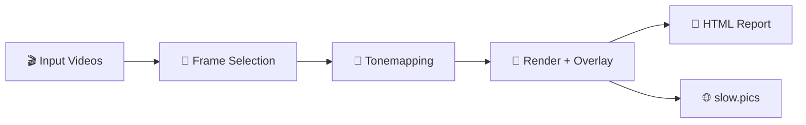

# Frame Compare

> **Deterministic video comparison pipeline**: frame selection, HDR→SDR tonemapping, overlays/reports, and publishable outputs.

[](#requirements)
[](LICENSE)
[](https://github.com/TJZine/frame-compare/actions/workflows/ci.yml)
[](#quality--verification)
[](#quality--verification)
[](CONTRIBUTING.md)

> [!NOTE]
> This repository contains Frame Compare's ground-up rebuild. The legacy implementation lives separately as `frame-compare-legacy`.

---

## ✨ Features at a Glance

| Feature | Description |
| ------- | ----------- |
| 🎯 **Deterministic Frame Selection** | Stable sorting, explicit seeds, reproducible results |
| 🎨 **HDR→SDR Tonemapping** | libplacebo-powered with 7 presets (BT.2390, Spline, Reinhard) |
| 🎵 **Audio Alignment** | Cross-correlation based synchronization for comparison clips |
| 📸 **Screenshot Rendering** | VapourSynth/FFmpeg with customizable overlays |
| 🌐 **slow.pics Publishing** | Opt-in uploads with retry logic and rate limiting |
| 📄 **HTML Reports** | Offline comparison viewer with slider, overlay, diff, and pair blink modes |
| 🔧 **Reproducible Docker Runtime** | Pinned container runtime for backend proof and CLI usage |

---

## 📑 Table of Contents

- [Pipeline Overview](#pipeline-overview)
- [Requirements](#requirements)
- [Installation](#installation)
- [Quick Start](#quick-start)
- [Usage](#usage)
- [Troubleshooting](#troubleshooting)
- [Documentation](#documentation)
- [Quality & Verification](#quality--verification)
- [Releases & Versioning](#releases--versioning)
- [Contributing](#contributing)

---

## Pipeline Overview



Frame Compare takes video files as input, selects frames deterministically (seeded
randomness where needed), tonemaps HDR→SDR when applicable, renders comparison
screenshots with configurable overlays, and produces both a static HTML report
viewer and optional slow.pics uploads.

**Key guarantees:**

- Same inputs → same outputs (stable sorting, explicit seeds, no guessing)
- Stable output naming and metadata for scripting and automation
- Machine-readable (JSON/metadata) + human-readable (HTML reports) dual output
- Offline-first with optional publishing integrations
- Reproducible verification gates

> **Where should I start?**
>
> - **First-time user** → [Quick Start](#quick-start)
> - **Contributor** → [Contributing](CONTRIBUTING.md)
> - **Understanding the codebase** → [Architecture](docs/current-architecture.md)

---

## Requirements

Requirements depend on the runtime route:

| Route | Host requirements | Runtime posture |
| --- | --- | --- |
| Windows portable | Windows 10/11 x64 and PowerShell | Most complete native route; the full bundle includes Python, FFmpeg, VapourSynth R76, plugins, VSPreview, and PyQt6 |
| Docker | Docker Desktop or Docker Engine with Compose | Recommended reproducible headless route for macOS and Linux |
| Native source | Python 3.13+, `uv` or pip, FFmpeg on `PATH`, VapourSynth R76, and L-SMASH-Works | Advanced route; the default renderer requires VapourSynth and its source plugin |

VSPreview is optional for interactive manual alignment. VapourSynth is not optional
for the default renderer: an FFmpeg-only route requires
`screenshots.use_ffmpeg = true`, and HDR frames that require tonemapping still need
the VapourSynth path.

---

## Installation

Choose one route and then follow its first-run sequence below.

| Route | Best for | Start here |
| --- | --- | --- |
| Docker | macOS/Linux users who want the reproducible backend runtime | [Docker Quick Start](#docker-recommended-for-macoslinux) |
| Windows portable | Windows users who want the complete native runtime and updater | [Windows Portable Guide](docs/windows-portable.md) |
| Native source | Advanced users with an existing FFmpeg/VapourSynth toolchain | [Native Source Quick Start](#native-source-advanced) |
| Contributor | Development, tests, and code changes | [Contributing](CONTRIBUTING.md) |

### Windows Portable

> [!IMPORTANT]
> **The portable bundle is the most complete distribution of Frame Compare** — it ships
> VSPreview + PyQt6 for interactive manual alignment, GPU-accelerated tonemapping, and
> the native installer/update flow. None of these are available in the Docker path.

Release bundles are the intended primary route. If the
[GitHub Releases page](https://github.com/TJZine/frame-compare/releases) does not yet
contain a `frame-compare-portable-win-x64-<tag>.zip`, use the source-build route in
the Windows guide.

From a published GitHub release zip:

```powershell
# Download and extract frame-compare-portable-win-x64-<tag>.zip, then:
.\install.cmd
```

Source builds produce `dist/frame-compare-portable-win-x64`; that bundle root is
not the repository root. The installed bundle keeps the default `config/` and
`comparison_videos/` directories in the bundle root, includes VSPreview + PyQt6,
and ships the `frame-compare-update apply` updater command.

Full details (source builds, directory layout, updater): **[Windows Portable Guide](docs/windows-portable.md)**

---

## Quick Start

> [!IMPORTANT]
> The full pipeline depends on external tools (FFmpeg, VapourSynth + plugins). The most reproducible way to run end-to-end commands is via **Docker**.

### Docker (Recommended for macOS/Linux)

Run these commands from the cloned repository. The host UID/GID variables make
the setup and runtime containers write bind-mounted files as the current user;
Compose falls back to `1000:1000` if they are unset. Pre-creating the directories
keeps their ownership predictable. Before the wizard, copy at least two supported
video files into `comparison_videos/`.
Supported extensions are `.mkv`, `.mp4`, `.avi`, `.m2ts`, and `.ts`
(case-insensitive).

```bash
export FRAME_COMPARE_HOST_UID="$(id -u)"
export FRAME_COMPARE_HOST_GID="$(id -g)"
mkdir -p config comparison_videos screenshots generated

# Build the shared runtime image.
docker compose build frame-compare-run

# Create or review config/config.toml. Only this service mounts config writable.
docker compose run --rm frame-compare-wizard

# Check required runtime dependencies and review any noncritical warnings.
docker compose run --rm frame-compare-run doctor

# Validate config, filenames, selection intent, and output intent without side effects.
docker compose run --rm frame-compare-run run --root /workspace --dry-run

# Run the pipeline. Config and media are read-only; outputs persist on the host.
docker compose run --rm frame-compare-run run --root /workspace
```

> [!NOTE]
> The wizard guides input, reference, and frame-selection setup, reviews the proposed
> changes, and writes only after confirmation. Existing settings and secrets are
> preserved and hidden. Publishing and TMDB setup remain available in TOML,
> environment variables, and presets rather than wizard prompts; prefer
> `FRAME_COMPARE_TMDB__API_KEY` instead of committing a TMDB key.

> [!TIP]
> First-use wizard output explicitly sets `slowpics.auto_upload = false` as a safe
> file baseline. Environment variables can override the file during a later run.
> Enable publishing deliberately in config, environment variables, or a preset.

With the default run-folder policy, screenshots and reports persist together beneath
`generated/`; `screenshots/` is used when run folders are disabled. Containerized
runs cannot directly open the host browser. If host Python is available, use the
exact report path printed by the run with:

```bash
python tools/open_docker_host_target.py "<report_path_from_run_output>"
```

Without host Python, replace the printed `/workspace/generated/` or
`/workspace/screenshots/` prefix with the corresponding `./generated/` or
`./screenshots/` host directory and open `report.html` normally.

See [Docker Environments](docs/docker-environments.md) for the service map, host
report opening, and optional Linux GPU/GUI profiles.

### Native Source (Advanced)

Run these commands from a clone after installing the native FFmpeg, VapourSynth R76,
and L-SMASH-Works prerequisites. `uv run --no-sync` executes the project from its
managed environment without requiring shell activation.

```bash
uv sync --no-dev --extra vspreview --frozen

# Put at least two supported clips in comparison_videos/, then:
uv run --no-sync frame-compare wizard
uv run --no-sync frame-compare doctor
uv run --no-sync frame-compare run --root . --dry-run
uv run --no-sync frame-compare run --root .
```

The `vspreview` extra supplies the repository-managed VapourSynth Python/VSPreview
dependency route; L-SMASH-Works must still be available to that runtime. For a
pip-managed source installation, create and activate a Python 3.13+ environment,
run `python -m pip install ".[vspreview]"`, and then use the same `frame-compare`
subcommands without the `uv run --no-sync` prefix. Contributor editable installs and
development dependencies are documented in [CONTRIBUTING.md](CONTRIBUTING.md).

---

## Usage

### Analysis Performance

Frame Compare exposes two analysis modes. Both use full-resolution luma
PlaneStats, honor source trims and the shared leading/trailing exclusion window,
and keep configured user/random frames eligible across the entire selectable
window.

| Mode | Metric coverage | Best for |
| --- | --- | --- |
| `quality` (default) | Every eligible frame | Highest-confidence automatic dark, bright, and motion selection |
| `performance` | 25% of eligible frames, rounded up to a whole frame, across up to eight deterministic contiguous bursts | Faster analysis when different automatic frame choices and missed brief events are acceptable |

Choose the mode in configuration:

```toml
[analysis]
performance_mode = "quality"  # quality or performance
```

`performance` is intentionally approximate: metric-based dark, bright, and
motion choices come only from sampled frames. Sampling is deterministic for the
same inputs and window, but it is not expected to reproduce `quality`
frame-for-frame.
See the [CLI contract](docs/current-cli-contract.md#config-only-analysis-surface)
for the full behavior and the
[benchmark history](docs/analysis-benchmark-history.md) for hardware-dependent
evidence.

### Webhook Notifications

After a successful slow.pics upload, Frame Compare can post the comparison URL
to a Discord-compatible incoming webhook. The webhook URL contains a secret, so
prefer an environment variable instead of committing it to `config.toml`:

```bash
export FRAME_COMPARE_SLOWPICS__AUTO_UPLOAD=true
export FRAME_COMPARE_SLOWPICS__WEBHOOK_URL="https://discord.com/api/webhooks/WEBHOOK_ID/WEBHOOK_TOKEN"
frame-compare run --root .
```

Frame Compare accepts manually authored `webhook_url` TOML values, but generated
configuration and preset files deliberately omit the secret, including output
from `run --write-config`, confirmed `wizard` rewrites, `preset save`, and
`preset apply`.

The payload is `{"content":"<slowpics_url>"}`. Delivery requires an external
HTTPS endpoint, follows no redirects, and remains warning-only if notification
delivery fails. Other webhook providers must accept that payload shape; Frame
Compare does not guess the provider from a secret URL. See the
[webhook contract](docs/current-cli-contract.md#slowpics-webhook-policy) for the
security and retry policy.

### Reports

| Aspect | Detail |
| ------ | ------ |
| **Format** | Static HTML — works offline, no server needed |
| **Image sources** | Relative-path by default; set `report.embed_images` to inline screenshots |
| **Viewer features** | Slider, overlay, diff, pair blink, frame/category navigation, pan + wheel zoom, info modal |
| **State persistence** | View mode, clip selection, viewport/zoom, reveal, and alignment state saved per report |

### Overlays

Set `screenshots.overlay_mode` to one of: `none` · `minimal` · `standard` · `diagnostic`

Overlay font rendering uses system/default fonts; appearance varies by OS.

### Docker Environments

The default Docker path is headless and deterministic (software Vulkan, CI parity).
For GPU acceleration, X11 GUI profiles, and platform-specific details, see
**[Docker Environments](docs/docker-environments.md)**.

---

## Troubleshooting

| Symptom | What to do |
| --- | --- |
| `frame-compare: command not found` after `uv sync` | Use `uv run --no-sync frame-compare ...`, activate `.venv`, or use `.venv/bin/frame-compare` directly. |
| `FC-1001` says the configuration file is missing | Run `frame-compare wizard` through the same native or Docker workspace route that will run the pipeline. |
| No videos are discovered | Put at least two `.mkv`, `.mp4`, `.avi`, `.m2ts`, or `.ts` files in the configured input directory, normally `comparison_videos/`, then rerun `run --dry-run`. |
| Doctor reports VapourSynth or L-SMASH-Works as missing | Use the Docker or Windows portable route, or repair the native VapourSynth R76/plugin installation before using the default renderer. |
| Doctor reports an optional/network warning | Doctor remains non-blocking, but review the warning against the intended workflow. Disabled integrations need no setup; FFmpeg-dependent workflows still require FFmpeg. |
| Docker cannot write config or output directories | Export `FRAME_COMPARE_HOST_UID="$(id -u)"` and `FRAME_COMPARE_HOST_GID="$(id -g)"`, create `config`, `comparison_videos`, `screenshots`, and `generated` as that host user, then rerun Compose. |
| A Docker run produced a report but did not open a browser | Run `python tools/open_docker_host_target.py "<report_path_from_run_output>"` on the host. |
| The Windows command is unavailable immediately after installation | Open a new terminal so the updated user `PATH` is loaded. |

For detailed Docker host/runtime limitations, see
[Docker Environments](docs/docker-environments.md). For portable installation,
update, and rollback issues, see the
[Windows Portable Guide](docs/windows-portable.md).

---

## 📚 Documentation

| Document | Description |
| -------- | ----------- |
| [Engineering Runbook](docs/ENGINEERING_RUNBOOK.md) | Canonical workflow, verification, and planning policy |
| [Current Architecture](docs/current-architecture.md) | Present-day runtime flow, boundaries, and hotspots |
| [CLI Contract](docs/current-cli-contract.md) | Canonical CLI command, flag, and persistence contract |
| [Decisions](docs/DECISIONS.md) | Architectural and process decision log |
| [API Reference](docs/api.md) | Generated API documentation |
| [Docker Environments](docs/docker-environments.md) | Docker capability matrix, GPU/GUI profiles |
| [Windows Portable](docs/windows-portable.md) | Portable bundle install, layout, updater |
| [Analysis Performance Validation](docs/analysis-performance-validation.md) | Reproducible Windows benchmarking workflow |
| [Analysis Benchmark History](docs/analysis-benchmark-history.md) | Curated analysis-mode decisions and retained evidence |

---

## Quality & Verification

The command set and verification policy live in the
[Engineering Runbook](docs/ENGINEERING_RUNBOOK.md).

Use the runbook to pick the right local, Docker, Windows portable, or release-path
verification for the change at hand.

---

## Releases & Versioning

### Versioning Policy

- Git tags follow [SemVer](https://semver.org/) with a `v` prefix (e.g., `v0.1.0`, `v1.0.0`)
- Pre-1.0 tags expected during rebuild while the public surface stabilizes

### Release Automation

- **Conventional Commits** enforced via PR titles + squash merge
- **Release Please** automates releases from `main`

---

## Contributing

See [CONTRIBUTING.md](CONTRIBUTING.md) for development setup, PR workflow,
commit format, and local quality checks.

---

## Security

See [SECURITY.md](SECURITY.md) for supported versions, vulnerability reporting,
and security considerations.

---

## License

This project is licensed under the **Apache License 2.0** — see [LICENSE](LICENSE) for details.

```text
Copyright 2025-2026 Tristan <zine96@proton.me>
```
