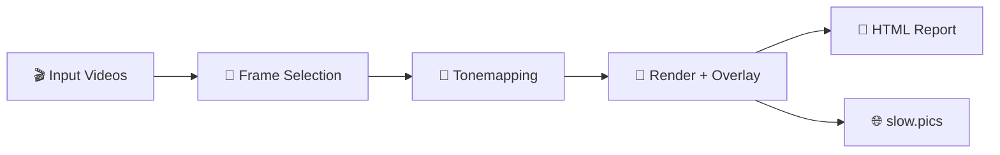

# Frame Compare

> Deterministic video comparison: frame selection, HDR→SDR tonemapping,
> screenshots, offline reports, and optional publishable outputs.

[](#requirements)
[](LICENSE)
[](https://github.com/TJZine/frame-compare/actions/workflows/ci.yml)

**[Read the documentation](docs/index.md)** to choose an installation route, run a
first comparison, and find searchable task-oriented guidance.

## Capabilities

- Deterministic random, dark, bright, and motion frame selection
- HDR→SDR tonemapping and configurable screenshot overlays
- Audio alignment with optional VSPreview interactive alignment
- Static offline HTML reports with comparison and review tools
- Deliberate slow.pics publishing and Discord-compatible webhook notification
- Reproducible Docker Runtime for headless backend use

## Pipeline overview



## Requirements

| Route | Recommended for | Requirements |
| --- | --- | --- |
| [Windows portable](docs/windows-portable.md) | Windows 10/11 x64 | PowerShell; the full bundle includes Python, FFmpeg, VapourSynth R79, plugins, VSPreview, and PyQt6 |
| [Docker](docs/getting-started/docker.md) | macOS/Linux reproducible headless use | Docker Desktop or Docker Engine with Compose |
| [Native source](docs/getting-started/native.md) | Advanced native setup | Python 3.13+, `uv` or pip, FFmpeg, VapourSynth R79, and L-SMASH-Works 1296 |

VSPreview is optional for interactive manual alignment. VapourSynth is not optional
for the default renderer: an FFmpeg-only route requires
`screenshots.use_ffmpeg = true`, and HDR frames that need tonemapping still require
VapourSynth, the selected `vs-placebo` plugin, and a working Vulkan loader/driver.
The Windows portable and Docker profiles bundle or install the selected plugin and
validate Vulkan separately; native installs must provide a compatible Vulkan runtime
for the active GPU in addition to matching the documented media-component versions.

### Windows portable orientation

The portable bundle is the most complete Windows distribution. Source builds create
`dist/frame-compare-portable-win-x64`, not the repository root. The bundle provides
the default `config/` and
`comparison_videos/` directories in the bundle root, includes VSPreview + PyQt6, and
supports `frame-compare-update apply`. Follow the
[Windows Portable Guide](docs/windows-portable.md) for install and update commands.

## Quick start

The complete explanations live in the [installation chooser](docs/getting-started/index.md)
and [first-comparison guide](docs/guides/first-comparison.md). These compact command
sequences preserve the safe setup order.

### Docker

From a clone, copy at least two clips into `comparison_videos/`, then run:

```bash
export FRAME_COMPARE_HOST_UID="$(id -u)"
export FRAME_COMPARE_HOST_GID="$(id -g)"
mkdir -p config comparison_videos generated
docker compose build frame-compare-run
docker compose run --rm frame-compare-wizard
docker compose run --rm frame-compare-run doctor
docker compose run --rm frame-compare-run run --root /workspace --dry-run
docker compose run --rm frame-compare-run run --root /workspace
```

Open a generated Docker report from the host with its exact printed path:

```bash
python tools/open_docker_host_target.py "<report_path_from_run_output>"
```

See the [Docker guide](docs/getting-started/docker.md) for directory ownership,
outputs, and the [advanced environment guide](docs/docker-environments.md) for
optional GPU/GUI profiles and their limits.

### Native source

After installing native FFmpeg, VapourSynth R79, and L-SMASH-Works 1296:

```bash
uv sync --no-dev --extra vspreview --frozen
uv run --no-sync frame-compare wizard
uv run --no-sync frame-compare doctor
uv run --no-sync frame-compare run --root . --dry-run
uv run --no-sync frame-compare run --root .
```

See the [native source guide](docs/getting-started/native.md) for `uv`, pip, and
optional VSPreview details.

## Project resources

- [Troubleshooting](docs/guides/troubleshooting.md)
- [CLI and configuration contract](docs/current-cli-contract.md)
- [Supported media runtime](docs/supported-media-runtime.md)
- [GitHub Releases](https://github.com/TJZine/frame-compare/releases)
- [Contributing](https://github.com/TJZine/frame-compare/blob/main/CONTRIBUTING.md)
- [Security policy](https://github.com/TJZine/frame-compare/blob/main/SECURITY.md)

The verification command set and quality policy are maintained in the
[Engineering Runbook](docs/ENGINEERING_RUNBOOK.md). Tags follow SemVer with a `v`
prefix. The guarded exact-commit workflow publishes every release; Release Please
handles normal version/changelog PRs after stable `v0.1.0` exists.

## License

Frame Compare is licensed under the
[GNU General Public License v3.0 only](https://github.com/TJZine/frame-compare/blob/main/LICENSE)
(`GPL-3.0-only`).

```text
Copyright 2025-2026 Tristan <zine96@proton.me>
```
