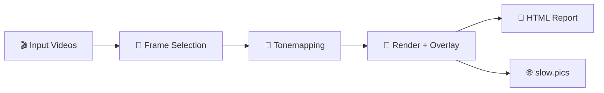

# Frame Compare

> **Deterministic video comparison pipeline**: frame selection, HDR→SDR tonemapping, overlays/reports, and publishable outputs.

[](#requirements)
[](LICENSE)
[](https://github.com/TJZine/frame-compare/actions/workflows/ci.yml)
[](#quality--verification)
[](#quality--verification)
[](CONTRIBUTING.md)

> [!NOTE]
> This repository contains Frame Compare's ground-up rebuild. The legacy implementation lives separately as `frame-compare-legacy`.

---

## ✨ Features at a Glance

| Feature | Description |
| ------- | ----------- |
| 🎯 **Deterministic Frame Selection** | Stable sorting, explicit seeds, reproducible results |
| 🎨 **HDR→SDR Tonemapping** | libplacebo-powered with 7 presets (BT.2390, Spline, Reinhard) |
| 🎵 **Audio Alignment** | Cross-correlation based synchronization for comparison clips |
| 📸 **Screenshot Rendering** | VapourSynth/FFmpeg with customizable overlays |
| 🌐 **slow.pics Publishing** | Opt-in uploads with retry logic and rate limiting |
| 📄 **HTML Reports** | Offline comparison viewer with slider, overlay, diff, and pair blink modes |
| 🔧 **Zero-Config Docker** | Reproducible container runtime for backend proof and CLI usage |

---

## 📑 Table of Contents

- [Pipeline Overview](#pipeline-overview)
- [Requirements](#requirements)
- [Installation](#installation)
- [Quick Start](#quick-start)
- [Usage](#usage)
- [Documentation](#documentation)
- [Quality & Verification](#quality--verification)
- [Releases & Versioning](#releases--versioning)
- [Contributing](#contributing)

---

## Pipeline Overview



Frame Compare takes video files as input, selects frames deterministically (seeded
randomness where needed), tonemaps HDR→SDR when applicable, renders comparison
screenshots with configurable overlays, and produces both a static HTML report
viewer and optional slow.pics uploads.

**Key guarantees:**

- Same inputs → same outputs (stable sorting, explicit seeds, no guessing)
- Stable output naming and metadata for scripting and automation
- Machine-readable (JSON/metadata) + human-readable (HTML reports) dual output
- Offline-first with optional publishing integrations
- Reproducible verification gates

> **Where should I start?**
>
> - **First-time user** → [Quick Start](#quick-start)
> - **Contributor** → [Contributing](CONTRIBUTING.md)
> - **Understanding the codebase** → [Architecture](docs/current-architecture.md)

---

## Requirements

| Requirement | Version | Notes |
| ----------- | ------- | ----- |
| Python | 3.13+ | Required |
| uv | Latest | Recommended (or pip) |
| FFmpeg | Any recent | Must be on `PATH` |
| VapourSynth | R76 | Optional, for primary renderer |

---

## Installation

> [!TIP]
> Prefer `uv` for reproducible environments.

### With uv (Recommended)

```bash
uv sync --group dev --frozen
```

### With pip

```bash
python3 -m venv .venv
source .venv/bin/activate
pip install -U pip
pip install -e .

# Dev tools (uv groups not supported by pip)
pip install pytest pytest-cov ruff pyright
```

### Windows Portable

> [!IMPORTANT]
> **The portable bundle is the most complete distribution of Frame Compare** — it ships
> VSPreview + PyQt6 for interactive manual alignment, GPU-accelerated tonemapping, and
> the native installer/update flow. None of these are available in the Docker path.

From a GitHub release zip:

```powershell
# Download and extract frame-compare-portable-win-x64-<tag>.zip, then:
.\install.cmd
```

Source builds produce `dist/frame-compare-portable-win-x64`; that bundle root is
not the repository root. The installed bundle keeps the default config/ and comparison_videos/ directories in the bundle root, includes VSPreview + PyQt6,
and ships the `frame-compare-update apply` updater command. For source builds
with the interactive preview stack, use:

```bash
uv sync --group dev --extra vspreview --frozen
```

Full details (source builds, directory layout, updater): **[Windows Portable Guide](docs/windows-portable.md)**

---

## Quick Start

> [!IMPORTANT]
> The full pipeline depends on external tools (FFmpeg, VapourSynth + plugins). The most reproducible way to run end-to-end commands is via **Docker**.

### Docker (Recommended)

```bash
docker build -t frame-compare:dev .

# Diagnostics
docker run --rm frame-compare:dev doctor --json

# Interactive wizard
docker run --rm -it \
  -v "$PWD":/workspace \
  -w /workspace \
  frame-compare:dev wizard

# Run the pipeline
docker run --rm -it \
  -v "$PWD/comparison_videos":/workspace/comparison_videos:ro \
  -v "$PWD/output":/workspace/screenshots \
  -w /workspace \
  frame-compare:dev run \
    --root /workspace \
    --input /workspace/comparison_videos
```

> [!NOTE]
> The wizard writes `config/config.toml` (gitignored) and may include secrets (e.g., a TMDB API key). Prefer setting
> TMDB keys via `FRAME_COMPARE_TMDB__API_KEY` instead of committing them to disk.

> [!TIP]
> slow.pics uploads are disabled by default. Enable `slowpics.auto_upload` in config when you want to publish screenshots.

### Local (if you have VapourSynth + FFmpeg)

```bash
uv sync --group dev --frozen
frame-compare doctor          # check for missing deps
frame-compare run --root . --input ./comparison_videos
```

---

## Usage

### Analysis Performance

The `[analysis]` config supports `performance_mode`:

```toml
[analysis]
performance_mode = "quality"  # quality or performance
```

`quality` is the default and preserves the current full-resolution analysis
behavior. `performance` is an approximate VapourSynth PlaneStats mode that can
reduce analysis work, but it may select different dark, bright, or motion frames.

### Reports

| Aspect | Detail |
| ------ | ------ |
| **Format** | Static HTML — works offline, no server needed |
| **Image sources** | Relative-path by default; set `report.embed_images` to inline screenshots |
| **Viewer features** | Slider, overlay, diff, pair blink, frame/category navigation, pan + wheel zoom, info modal |
| **State persistence** | View mode, clip selection, viewport/zoom, reveal, and alignment state saved per report |

### Overlays

Set `screenshots.overlay_mode` to one of: `none` · `minimal` · `standard` · `diagnostic`

Overlay font rendering uses system/default fonts; appearance varies by OS.

### Docker Environments

The default Docker path is headless and deterministic (software Vulkan, CI parity).
For GPU acceleration, X11 GUI profiles, and platform-specific details, see
**[Docker Environments](docs/docker-environments.md)**.

---

## 📚 Documentation

| Document | Description |
| -------- | ----------- |
| [Engineering Runbook](docs/ENGINEERING_RUNBOOK.md) | Canonical workflow, verification, and planning policy |
| [Current Architecture](docs/current-architecture.md) | Present-day runtime flow, boundaries, and hotspots |
| [CLI Contract](docs/current-cli-contract.md) | Canonical CLI command, flag, and persistence contract |
| [Decisions](docs/DECISIONS.md) | Architectural and process decision log |
| [API Reference](docs/api.md) | Generated API documentation |
| [Docker Environments](docs/docker-environments.md) | Docker capability matrix, GPU/GUI profiles |
| [Windows Portable](docs/windows-portable.md) | Portable bundle install, layout, updater |

---

## Quality & Verification

The command set and verification policy live in the
[Engineering Runbook](docs/ENGINEERING_RUNBOOK.md).

Use the runbook to pick the right local, Docker, Windows portable, or release-path
verification for the change at hand.

---

## Releases & Versioning

### Versioning Policy

- Git tags follow [SemVer](https://semver.org/) with a `v` prefix (e.g., `v0.1.0`, `v1.0.0`)
- Pre-1.0 tags expected during rebuild while the public surface stabilizes

### Release Automation

- **Conventional Commits** enforced via PR titles + squash merge
- **Release Please** automates releases from `main`

---

## Contributing

See [CONTRIBUTING.md](CONTRIBUTING.md) for development setup, PR workflow,
commit format, and local quality checks.

---

## Security

See [SECURITY.md](SECURITY.md) for supported versions, vulnerability reporting,
and security considerations.

---

## License

This project is licensed under the **Apache License 2.0** — see [LICENSE](LICENSE) for details.

```text
Copyright 2025-2026 Tristan <zine96@proton.me>
```
