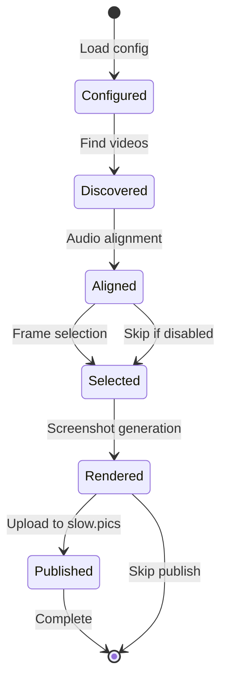

# Data Architecture

> **Module:** Architecture
> **Version:** 1.0

---

## 1. Data Model Overview

Frame Compare 2.0 uses a **file-based data model** centered on configuration, caching, and output artifacts. There is no traditional database; instead, structured files serve as the persistence layer.

---

## 2. Core Data Entities

### 2.1 Configuration Entities

#### RuntimeConfig

```yaml
Entity: RuntimeConfig
File: config/config.toml
Description: User configuration merged from file, env, CLI

Sections:
  # NOTE: Canonical field names are defined in config-module.md.
  # This is a reference view; implementation MUST follow config-module.md.

  paths:
    input_dir: str            # Video source directory (relative to root)
    screenshots_dir: str      # Screenshot output directory
    generated_dir: str        # Cache and generated files
    config_dir: str           # Config and presets directory

  analysis:
    frame_count: int          # Frames to select [1-100, default 10]
    random_seed: int          # Deterministic seed (default 42)
    selection_mode: enum      # quantile, motion, random, mixed
    save_frames_data: bool    # Persist selection metadata
    dark_quantile: float      # 0.0-0.5 (default 0.05)
    bright_quantile: float    # 0.5-1.0 (default 0.95)

  audio_alignment:
    enable: bool              # Enable audio sync
    sample_rate: int          # Audio sample rate [4000-48000]
    max_offset_seconds: float # Maximum search offset
    use_vspreview: bool       # Interactive confirmation
    cache_results: bool       # Cache alignment results

  screenshots:
    use_ffmpeg: bool          # Force FFmpeg renderer
    directory_name: str       # Output subdirectory
    overlay_mode: enum        # minimal, standard, diagnostic, none
    include_frame_number: bool
    png_compression: int      # [0-9]

  color:
    enable_tonemap: bool
    preset: str               # Tonemap preset name
    target_nits: int          # SDR target brightness [100-1000]
    tone_curve: str           # bt2390|spline|reinhard|mobius|linear
    gamma_lift: bool
    contrast_recovery: float  # [0.0-1.0]

  slowpics:
    auto_upload: bool         # Upload automatically
    visibility: enum          # public, unlisted, private
    delete_after_upload: bool
    timeout_seconds: float
    max_retries: int

  tmdb:
    api_key: str | None       # TMDB API key
    enabled: bool
    unattended: bool          # Skip prompts
    timeout_seconds: float

  report:
    enable: bool              # Generate HTML report
    output_dir: str | None    # None = use screenshots_dir
    default_mode: enum        # slider, overlay, diff, blink
    include_filmstrip: bool
    embed_images: bool

  dovi:
    enable: bool
    dovi_tool_path: Path | None
    cache_results: bool

  diagnostics:
    per_frame_nits: bool
    show_hdr_info: bool
    frame_timing: bool

  logging:
    level: str                # DEBUG|INFO|WARNING|ERROR
    format: str               # json|console
    file: str | None
```

### 2.2 Processing Entities

#### ClipPlan

```yaml
Entity: ClipPlan
Lifecycle: Created during discovery, enriched through pipeline
Description: Represents a single video file and its processing state

Fields:
  file_path: Path             # Absolute path to video
  label: str                  # Display name
  source_fps: Fraction        # Native frame rate
  applied_fps: Fraction       # After FPS override
  effective_fps: Fraction     # Final computed FPS
  source_num_frames: int      # Total frames in source
  source_width: int           # Native width
  source_height: int          # Native height
  trim_start: int             # Start frame trim (audio offset)
  trim_end: int | None        # End frame trim
  source_frame_props: dict    # HDR metadata from frame 0

Relationships:
  - Part of ClipPlan[] list in RunContext
  - Referenced by FrameSelection
  - Used by Screenshot rendering
```

#### FrameMetrics

```yaml
Entity: FrameMetrics
File: generated/cache.compframes (cached)
Description: Per-frame analysis results

Fields:
  version: int                # Cache schema version
  luminance: list[float]      # Per-frame Y values
  motion: list[float]         # Per-frame motion scores
  metadata:
    file_hash: str            # Content hash (optional)
    fps: Fraction
    frame_count: int
    config_fingerprint: str   # Config hash for invalidation
    clips: list[ClipIdentity]

ClipIdentity:
  path: str                   # Absolute path
  size: int                   # File size bytes
  mtime: float                # Modification time
  sha1: str | None            # Content hash if enabled
```

#### AlignmentResult

```yaml
Entity: AlignmentResult
File: generated/audio_offsets.toml (cached)
Description: Audio alignment offsets per clip

Fields:
  reference: str              # Reference clip label
  offsets:
    [clip_label]:
      frames: int             # Frame offset
      seconds: float          # Time offset
      correlation: float      # Confidence 0-1
  manual_overrides:
    [clip_label]: int         # VSPreview adjustments
```

### 2.3 Output Entities

#### Screenshot

```yaml
Entity: Screenshot
File: screenshots/*.png
Description: Rendered comparison frame

Naming: {label}_{frame:05d}.png

Metadata (embedded or sidecar):
  source_file: str
  frame_number: int
  resolution: tuple[int, int]
  hdr_metadata: dict | None
  tonemap_applied: bool
```

#### RunResultSnapshot

```yaml
Entity: RunResultSnapshot
File: .frame_compare.run.json
Description: Persistent run state for cache-only replay

Fields:
  version: str                # Schema version
  created_at: str             # ISO timestamp
  success: bool
  clips: list[ClipSummary]
  frames: list[int]
  screenshots: list[str]      # Relative paths
  slowpics_url: str | None
  sections: dict[str, SectionState]
  json_tail: dict             # Full telemetry
```

---

## 3. File Layout

### 3.1 Workspace Structure

```
<workspace_root>/
├── config/
│   └── config.toml           # User configuration
├── comparison_videos/        # Input videos
│   ├── source.mkv
│   ├── encode_a.mkv
│   └── encode_b.mkv
├── cache/                    # Generated cache
│   ├── probe/                # Clip probe snapshots
│   │   └── <cache_key>.json
│   └── metrics/              # Frame metrics
│       └── <cache_key>.json
├── generated/
│   ├── cache.compframes      # Metrics cache (v2 default)
│   └── audio_offsets.toml    # Audio offsets (v2 default)
├── .frame_compare.run.json   # Run snapshot
└── screenshots/              # Output
    ├── source_00001.png
    ├── encode_a_00001.png
    └── ...
```

### 3.2 Legacy Compatibility (v0.0.14)

For migration and parity workflows, Frame Compare 2.0 should be able to **read** (and optionally write) the legacy v0.0.14 cache filenames when present at the workspace root:

- `generated.compframes`
- `generated.audio_offsets.toml`

The v2 default locations remain under `generated/` for predictable cleanup and containment.

### 3.2 Configuration Location Resolution

```
Priority (highest to lowest):
1. --config CLI flag
2. FRAME_COMPARE_CONFIG env var
3. <workspace_root>/config/config.toml
4. Seed from template
```

---

## 4. Caching Strategy

### 4.1 Cache Types

| Cache | File | Key | TTL |
|-------|------|-----|-----|
| Frame Metrics | `generated/cache.compframes` | config hash + file identity | Infinite (invalidate on config/file change) |
| Audio Offsets | `generated/audio_offsets.toml` | Clip labels | Infinite (manual invalidate) |
| Clip Probes | `cache/probe/*.json` | File path + mtime + size | Infinite |
| Run Snapshot | `.frame_compare.run.json` | N/A | Overwritten each run |
| TMDB Responses | In-memory | Query string | Session-scoped |

### 4.2 Cache Invalidation Rules

```yaml
Frame Metrics:
  Invalidate when:
    - Config fingerprint changes
    - File identity changes (path, size, mtime)
    - Force --no-cache flag

Audio Offsets:
  Invalidate when:
    - Reference file changes
    - Explicit recompute request
    - Manual --no-cache flag

Clip Probes:
  Invalidate when:
    - File mtime changes
    - RuntimeConfig.force_reprobe set
```

### 4.3 Cache Schema Versioning

```python
CACHE_SCHEMA_VERSION = 2

def load_cache(path: Path) -> CacheLoadResult:
    data = json.load(path.open())
    if data.get("version") != CACHE_SCHEMA_VERSION:
        return CacheLoadResult(success=False, reason="schema_mismatch")
    # ...
```

---

## 5. Data Contracts

### 5.1 JSON Tail (Telemetry Output)

```json
{
  "version": "2.0.0",
  "timestamp": "2025-12-16T08:00:00Z",
  "success": true,

  "clips": [
    {
      "label": "Source",
      "path": "/path/to/source.mkv",
      "resolution": [3840, 2160],
      "fps": "24000/1001",
      "frame_count": 150000,
      "is_hdr": true,
      "trim_applied": 0
    }
  ],

  "frames": {
    "selected": [100, 500, 1000, 2000, 5000],
    "mode": "mixed",
    "seed": 42
  },

  "alignment": {
    "enabled": true,
    "reference": "Source",
    "offsets": {
      "Encode_A": {"frames": 3, "seconds": 0.125, "correlation": 0.92}
    }
  },

  "tonemap": {
    "enabled": true,
    "preset": "reference",
    "target_nits": 203,
    "source_peak": 1000
  },

  "screenshots": {
    "count": 15,
    "directory": "/path/to/screenshots",
    "renderer": "vapoursynth"
  },

  "publish": {
    "slowpics_url": "https://slow.pics/c/abc123",
    "shortcut_created": true
  },

  "cache": {
    "metrics_reused": true,
    "alignment_reused": true,
    "reason": "hit"
  }
}
```

### 5.2 Configuration Fingerprint

```python
def compute_config_fingerprint(config: AnalysisConfig) -> str:
    """Deterministic hash of analysis-relevant config values"""
    relevant = {
        "frame_count": config.frame_count,
        "random_seed": config.random_seed,
        "mode": config.mode.value,
        "thresholds": asdict(config.thresholds),
    }
    return hashlib.sha256(json.dumps(relevant, sort_keys=True).encode()).hexdigest()[:16]
```

---

## 6. Data Migration

### 6.1 v0.0.14 → v2.0 Migration

| Data Type | Migration Strategy |
|-----------|-------------------|
| `config.toml` | Load, validate, warn on deprecated keys |
| `generated/cache.compframes` | Schema v1 → v2: add `clips` identity array |
| `generated/audio_offsets.toml` | No changes, backward compatible |
| Screenshots | No migration, compatible format |

### 6.2 Deprecation Handling

```python
def migrate_config(raw: dict) -> tuple[dict, list[str]]:
    """Migrate deprecated config keys, return warnings"""
    warnings = []

    # Example: skip_head_seconds → ignore_head_seconds
    if "skip_head_seconds" in raw.get("analysis", {}):
        warnings.append("'skip_head_seconds' is deprecated, use 'ignore_head_seconds'")
        raw["analysis"]["ignore_head_seconds"] = raw["analysis"].pop("skip_head_seconds")

    return raw, warnings
```

---

## 7. State Management

### 7.1 RunContext

```python
@dataclass
class RunContext:
    """Carries state through pipeline phases"""

    # Config
    config: RuntimeConfig
    workspace_root: Path

    # Pipeline state
    plans: list[ClipPlan]
    alignment: AlignmentResult | None
    selection: FrameSelection | None

    # Outputs
    screenshots: list[Path]
    slowpics_url: str | None

    # Metadata
    metadata: dict[str, JSONValue]  # JSON-safe structured data

    # Services
    reporter: CLIOutputManager
```

### 7.2 State Transitions



---

## 8. Backup & Recovery

### 8.1 Critical Data

| Data | Backup Strategy | Recovery |
|------|-----------------|----------|
| `config.toml` | User responsibility | Seed from template |
| Cached metrics | Regenerate (CPU cost) | Re-run analysis |
| Audio offsets | Regenerate (CPU cost) | Re-run alignment |
| Screenshots | User responsibility | Re-run pipeline |

### 8.2 Corruption Handling

```python
def load_with_recovery(path: Path, loader: Callable) -> tuple[T | None, str]:
    """Attempt load with graceful corruption handling"""
    try:
        return loader(path), "ok"
    except json.JSONDecodeError:
        return None, "corrupt_json"
    except ValidationError as e:
        return None, f"invalid_schema: {e}"
    except Exception:
        return None, "unknown_error"
```
