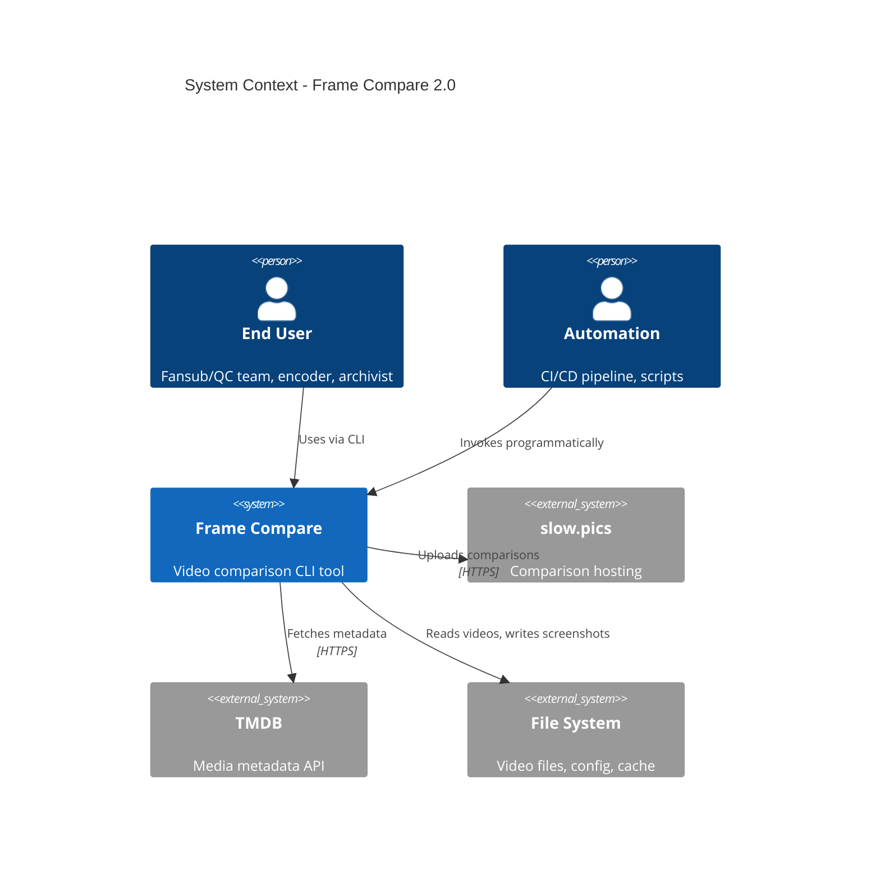
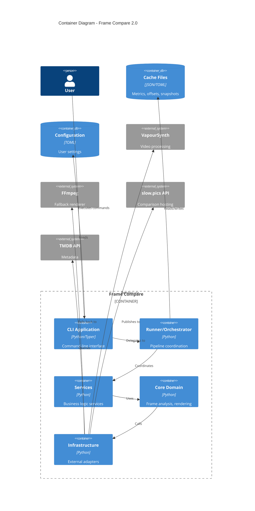
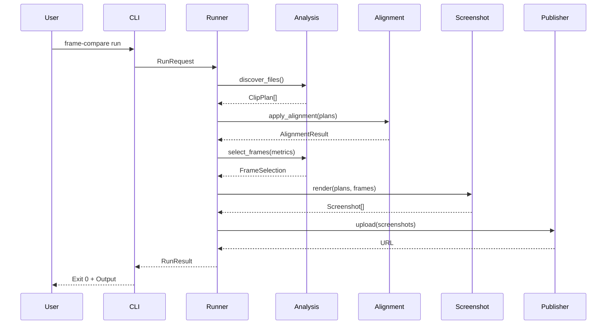
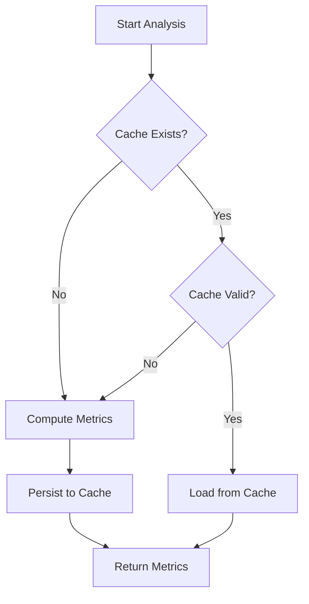
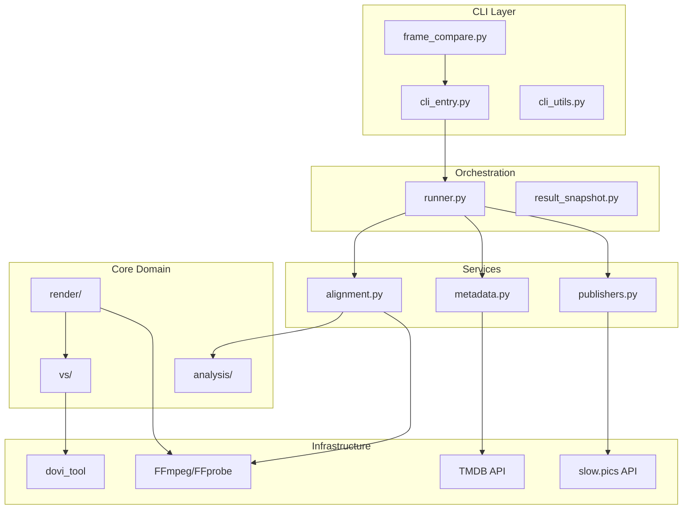

# System Architecture Design

> **Module:** Architecture
> **Version:** 1.0

---

## 1. Architecture Overview

Frame Compare 2.0 implements a **Layered Pipeline Architecture** with clear separation between presentation, orchestration, services, domain, and infrastructure concerns.

### 1.1 C4 Context Diagram



### 1.2 C4 Container Diagram



---

## 2. Layer Specifications

### 2.1 CLI Layer

**Purpose:** User interaction, argument parsing, output formatting

**Modules:**

- `frame_compare.py` — Entry point shim
- `cli_entry.py` — Typer command definitions (Click-powered)
- `cli_utils.py` — CLI helper functions
- `cli_runtime.py` — Runtime UI components (progress, output)

**Responsibilities:**

- Parse CLI arguments with Typer
- Load and merge configuration
- Format output with Rich
- Handle exit codes

**Constraints:**

- No direct business logic
- No VapourSynth imports
- Must be unit-testable without VS

### 2.2 Orchestration Layer

**Purpose:** Workflow coordination, state management

**Modules:**

- `runner.py` — Main execution coordinator
- `orchestration/` — Phase-based workflow
- `result_snapshot.py` — Run result persistence

**Key Types:**

```python
@dataclass
class RunRequest:
    root: Path | None
    config_path: Path | None
    input_dir: Path | None
    no_cache: bool
    quiet: bool
    # ... additional options

@dataclass
class RunResult:
    success: bool
    screenshots: list[Path]
    slowpics_url: str | None
    json_tail: dict
    # ... additional outputs

@dataclass
class RunDependencies:
    """Injectable service factories for testing"""
    metadata_resolver: MetadataResolver
    alignment_workflow: AlignmentWorkflow
    report_publisher: ReportPublisher
    slowpics_publisher: SlowpicsPublisher
```

**Responsibilities:**

- Sequence pipeline phases
- Manage run context
- Aggregate results
- Persist snapshots

### 2.3 Service Layer

**Purpose:** Domain services with clear interfaces

**Modules:**

- `services/alignment.py` — Audio alignment workflow
- `services/metadata.py` — TMDB and metadata resolution
- `services/publishers.py` — Publishing services
- `services/factory.py` — Service construction

**Service Pattern:**

```python
class AlignmentWorkflow:
    """Audio alignment service with injectable dependencies"""

    def apply(
        self,
        plans: list[ClipPlan],
        config: AudioAlignmentConfig,
        reporter: CLIOutputManager
    ) -> AlignmentResult:
        ...
```

**Responsibilities:**

- Encapsulate business operations
- Provide testable interfaces
- Handle cross-cutting concerns

### 2.4 Core Domain Layer

**Purpose:** Pure business logic, algorithms

**Modules:**

- `analysis/` — Frame metrics and selection
  - `cache_io.py` — Cache persistence
  - `metrics.py` — Luminance/motion calculation
  - `selection.py` — Frame selection algorithms
- `vs/` — VapourSynth operations
  - `env.py` — Environment setup
  - `source.py` — Video source handling
  - `props.py` — Frame property extraction
  - `color.py` — Color space operations
  - `tonemap.py` — HDR tonemapping
- `render/` — Screenshot rendering
  - `naming.py` — File naming conventions
  - `geometry.py` — Dimension calculations
  - `overlay.py` — Text overlay rendering
  - `encoders.py` — Image encoding
  - `orchestrator.py` — Multi-clip screenshot workflow

**Responsibilities:**

- Implement core algorithms
- Maintain purity (no I/O in pure functions)
- Provide composable operations

### 2.5 Infrastructure Layer

**Purpose:** External system adapters

**Modules:**

- External systems: VapourSynth, FFmpeg/FFprobe, slow.pics, TMDB, dovi_tool
- Adapters live in `services/*` (HTTP) and `utils/subproc.py` (subprocess)

**Adapter Pattern:**

```python
class SlowpicsClient:
    """Adapter for slow.pics API."""

    def __init__(self, client: httpx.AsyncClient) -> None:
        self._client = client

    async def upload_comparison(
        self,
        *,
        title: str,
        images: list[Path],
        visibility: str = "unlisted",
    ) -> ComparisonResult:
        ...
```

---

## 3. Data Flow

### 3.1 Main Pipeline Sequence



### 3.2 Cache Flow



---

## 4. Key Design Patterns

### 4.1 Dependency Injection

```python
# Services receive dependencies at construction
def default_run_dependencies(
    cfg: RuntimeConfig | None = None,
    reporter: CLIOutputManager | None = None,
    cache_dir: Path | None = None
) -> RunDependencies:
    return RunDependencies(
        metadata_resolver=MetadataResolver(cfg, reporter),
        alignment_workflow=AlignmentWorkflow(cfg, cache_dir),
        # ...
    )

# Runner uses provided or default dependencies
def run(request: RunRequest, dependencies: RunDependencies | None = None) -> RunResult:
    deps = dependencies or default_run_dependencies(request.config)
    # ...
```

### 4.2 Result Types

```python
@dataclass
class CacheLoadResult:
    """Discriminated union for cache operations"""
    success: bool
    metrics: FrameMetrics | None
    reason: str  # "hit", "miss", "invalid", "config_mismatch"
```

### 4.3 Strategy Pattern (Tonemapping)

```python
TONEMAP_PRESETS = {
    "reference": TonemapSettings(curve="bt2390", target_nits=203),
    "filmic": TonemapSettings(curve="spline", contrast=0.3),
    "bright_lift": TonemapSettings(gamma_lift=True, target_nits=250),
    # ...
}

def get_tonemap_settings(preset: str, overrides: dict) -> TonemapSettings:
    base = TONEMAP_PRESETS.get(preset, TONEMAP_PRESETS["reference"])
    return base.with_overrides(overrides)
```

### 4.4 Adapter Pattern (External Services)

```python
class TMDBAdapter:
    """Adapts TMDB API to domain interface"""

    def resolve(self, query: str) -> MediaMetadata | None:
        # HTTP call, response parsing, error handling
        ...

class SlowpicsAdapter:
    """Adapts slow.pics API to domain interface"""

    def publish(self, comparison: Comparison) -> str:
        # Multipart upload, retry logic
        ...
```

---

## 5. Module Dependency Graph



---

## 6. Technology Decisions

| Decision | Choice | Rationale | ADR |
|----------|--------|-----------|-----|
| Language | Python 3.13 | Ecosystem, VapourSynth binding | ADR-001 |
| CLI Framework | Typer (Click-based) | Typed options + modern UX | ADR-005 |
| Video Engine | VapourSynth | HDR pipeline, plugin ecosystem | ADR-003 |
| Tonemapping | libplacebo | Quality, configurability | ADR-003 |
| Type Checking | Pyright strict + Ruff | Correctness, IDE support | ADR-007 |
| Testing | pytest | Standard, fixtures, plugins | ADR-004 |
| Containerization | Docker | Reproducibility, VapourSynth bundling | ADR-002 |

---

## 7. Security Architecture

### 7.1 Trust Boundaries

```
┌─────────────────────────────────────────────────────────────┐
│ Untrusted Zone                                              │
│ ┌─────────────┐ ┌─────────────┐ ┌─────────────┐            │
│ │ User Input  │ │ Video Files │ │ Network     │            │
│ └─────────────┘ └─────────────┘ └─────────────┘            │
└─────────────────────────────────────────────────────────────┘
                           │
                    Validation Layer
                           │
                           ▼
┌─────────────────────────────────────────────────────────────┐
│ Application Core (Trusted)                                  │
│ ┌─────────────┐ ┌─────────────┐ ┌─────────────┐            │
│ │ Config      │ │ Processing  │ │ Publishing  │            │
│ └─────────────┘ └─────────────┘ └─────────────┘            │
└─────────────────────────────────────────────────────────────┘
```

### 7.2 Security Controls

| Threat | Control |
|--------|---------|
| Path Traversal | Workspace containment validation |
| Command Injection | `shell=False`, argv-only subprocess |
| Credential Leakage | Redacted logging, env var storage |
| XSS in HTML Report | Output sanitization |

---

## 8. Deployment Architecture

### 8.1 Docker Deployment

```dockerfile
# Multi-stage build
FROM python:3.13.1-slim-bookworm AS builder
# NOTE: The repo-root `Dockerfile` is the authoritative baseline for exact pins and build steps.
# Build VapourSynth + plugins from pinned sources (zimg, L-SMASH, L-SMASH-Works, libplacebo, vs-placebo, ffms2).

FROM python:3.13.1-slim-bookworm AS runtime
# Copy built artifacts
# Install Python package
ENTRYPOINT ["frame-compare"]
```

### 8.2 Development Environment

```yaml
# .devcontainer/devcontainer.json
{
  "image": "ghcr.io/tjzine/frame-compare-dev:latest",
  "customizations": {
    "vscode": {
      "extensions": ["ms-python.python", "ms-python.pylint"]
    }
  }
}
```
