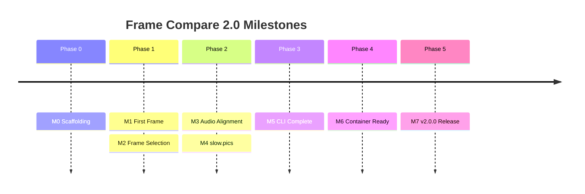

# Milestones

> **Module:** Roadmap  
> **Version:** 1.0

---

## Milestone Definition

Each milestone represents a significant, demonstrable achievement with clear verification criteria.

---

## M0: Project Scaffolding Complete

**Target:** End of Phase 0  
**Theme:** Development environment ready

### Verification Criteria

| Criterion | Command/Action | Expected Result |
|-----------|----------------|-----------------|
| Dependencies install | `uv sync` | Exit 0, all deps installed |
| Type checking passes | `.venv/bin/pyright --warnings` | 0 errors |
| Linting passes | `.venv/bin/ruff check` | 0 errors |
| Tests run | `.venv/bin/pytest -q` | Test framework initializes |
| DevContainer opens | VS Code command | Container builds and opens |

### Demonstrates

- Build system working
- CI pipeline operational
- Development workflow established

---

## M1: First Frame Rendered

**Target:** Week 2 of Phase 1  
**Theme:** Core rendering pipeline working

### Verification Criteria

| Criterion | Command/Action | Expected Result |
|-----------|----------------|-----------------|
| VS loads video | Python script | Clip properties extracted |
| Frame extraction works | Render single frame | PNG file created |
| Tonemapping applies | HDR → SDR | Visible luminance reduction |
| FFmpeg fallback works | Render without VS | PNG file created |

### Demonstrates

- VapourSynth integration working
- libplacebo tonemapping functional
- Fallback renderer operational

---

## M2: Automated Frame Selection

**Target:** End of Phase 1  
**Theme:** Analysis pipeline complete

### Verification Criteria

| Criterion | Command/Action | Expected Result |
|-----------|----------------|-----------------|
| Metrics calculated | Analyze test video | Luminance/motion arrays |
| Selection reproducible | Same seed twice | Identical frame lists |
| Cache persisted | Check generated files | Cache files present |
| Cache reloaded | Re-run analysis | "hit" in output |

### Demonstrates

- Frame selection algorithms working
- Cache system operational
- Reproducibility guaranteed

---

## M3: Audio Alignment Working

**Target:** Week 1 of Phase 2  
**Theme:** Multi-clip synchronization

### Verification Criteria

| Criterion | Command/Action | Expected Result |
|-----------|----------------|-----------------|
| Audio extracted | FFmpeg probe | WAV file created |
| Cross-correlation runs | Align two clips | Offset calculated |
| Offset reasonable | Known-shifted audio | Offset matches |
| Persistence works | Check audio_offsets.toml | Offsets saved |

### Demonstrates

- Audio processing pipeline
- Alignment algorithm accuracy
- Offset persistence

---

## M4: slow.pics Integration

**Target:** End of Phase 2  
**Theme:** Publishing workflow

### Verification Criteria

| Criterion | Command/Action | Expected Result |
|-----------|----------------|-----------------|
| Upload succeeds | Mock slow.pics | URL returned |
| Real upload (manual) | Test account | Live comparison created |
| Retry works | Inject failure | Backoff applied, success |
| Shortcut created | Check directory | .url file present |

### Demonstrates

- Network integration
- Error handling
- Full publishing workflow

---

## M5: CLI Feature Complete

**Target:** End of Phase 3  
**Theme:** User interface ready

### Verification Criteria

| Criterion | Command/Action | Expected Result |
|-----------|----------------|-----------------|
| Run command works | `frame-compare run` | Full pipeline completes |
| Wizard generates config | `frame-compare wizard` | config.toml created |
| Doctor reports status | `frame-compare doctor` | Dependency report |
| Help is useful | `frame-compare --help` | Clear command listing |
| Exit codes correct | Various error states | Documented codes |

### Demonstrates

- Complete CLI interface
- User-friendly experience
- Error handling

---

## M6: Container Deployment Ready

**Target:** End of Phase 4  
**Theme:** Zero-config deployment

### Verification Criteria

| Criterion | Command/Action | Expected Result |
|-----------|----------------|-----------------|
| Image builds | `docker build` | Image created |
| Container runs | `docker compose up` | Service starts |
| Pipeline works | Run comparison in container | Screenshots generated |
| DevContainer works | Open in VS Code | Full dev environment |
| Size acceptable | `docker images` | < 1.5GB |

### Demonstrates

- Container-first deployment achieved
- VapourSynth bundled successfully
- Developer experience streamlined

---

## M7: v2.0.0 Release

**Target:** End of Phase 5  
**Theme:** Production launch

### Verification Criteria

| Criterion | Command/Action | Expected Result |
|-----------|----------------|-----------------|
| Feature parity | Comparison matrix | All P0/P1 features pass |
| Tests pass | CI status | Green across matrix |
| Docs complete | Review | README, Quick Start, API |
| PyPI published | `pip install frame-compare` | Installs successfully |
| GitHub released | Check releases | v2.0.0 with artifacts |
| Security cleared | Audit report | No critical issues |

### Demonstrates

- Production-ready software
- Professional release process
- User-ready documentation

---

## Milestone Summary

---

## Go/No-Go Decision Points

| Milestone | Decision | No-Go Criteria |
|-----------|----------|----------------|
| M1 | Continue to selection | VapourSynth integration fails |
| M2 | Continue to services | Core algorithm issues |
| M4 | Continue to CLI | Network layer broken |
| M6 | Continue to launch | Container builds fail |
| M7 | Release | Critical bugs, security issues |
