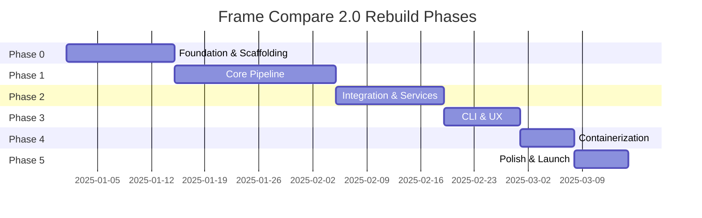
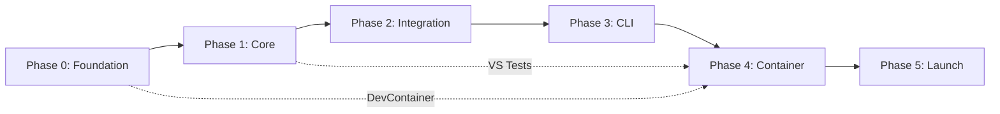

# Implementation Phases

> **Module:** Roadmap
> **Version:** 1.0

---

## Phase Overview

---

## Phase 0: Foundation & Scaffolding

**Duration:** 2 weeks
**Goal:** Establish project structure, tooling, and development environment

### Deliverables

| ID | Deliverable | Acceptance Criteria |
|----|-------------|---------------------|
| P0-D1 | Repository structure | Monorepo with src/, tests/, docs/ |
| P0-D2 | Build system | pyproject.toml, uv lockfile |
| P0-D3 | CI pipeline | GitHub Actions: lint, type-check, test |
| P0-D4 | Development environment | DevContainer with VS installed |
| P0-D5 | Base types | Core dataclasses, protocols |
| P0-D6 | Import contracts | import-linter configuration |

### Exit Criteria

- [ ] `uv sync` installs all dependencies
- [ ] `.venv/bin/pytest -q` runs (empty test suite OK)
- [ ] `.venv/bin/pyright --warnings` passes with 0 errors
- [ ] `.venv/bin/ruff check` passes
- [ ] DevContainer opens in VS Code

### Risk Factors

| Risk | Mitigation |
|------|------------|
| VapourSynth build in container | Pre-built base image, software rasterization |
| CI time exceeds budget | Cache dependencies, parallel jobs |

---

## Phase 1: Core Pipeline

**Duration:** 3 weeks
**Goal:** Implement core domain modules with tests

### Week 1: Analysis Module

| ID | Task | Priority |
|----|------|----------|
| P1-W1-T1 | Frame metrics calculation (luminance, motion) | P0 |
| P1-W1-T2 | Frame selection algorithms | P0 |
| P1-W1-T3 | Cache persistence layer | P0 |
| P1-W1-T4 | Unit tests for analysis | P0 |

### Week 2: VapourSynth Module

| ID | Task | Priority |
|----|------|----------|
| P1-W2-T1 | VS environment setup | P0 |
| P1-W2-T2 | Source loading, clip properties | P0 |
| P1-W2-T3 | HDR tonemapping (libplacebo) | P0 |
| P1-W2-T4 | Color space operations | P0 |
| P1-W2-T5 | VS-required tests | P0 |

### Week 3: Render Module

| ID | Task | Priority |
|----|------|----------|
| P1-W3-T1 | Screenshot rendering (VS) | P0 |
| P1-W3-T2 | FFmpeg fallback renderer | P0 |
| P1-W3-T3 | Overlay system | P1 |
| P1-W3-T4 | Naming conventions | P1 |
| P1-W3-T5 | Integration tests | P0 |

### Exit Criteria

- [ ] Frame selection works for sample videos
- [ ] Tonemapping produces correct output
- [ ] Screenshots render via VS or FFmpeg fallback
- [ ] 80% test coverage on core modules

---

## Phase 2: Integration & Services

**Duration:** 2 weeks
**Goal:** Implement services and external integrations

### Week 1: Audio Alignment

| ID | Task | Priority |
|----|------|----------|
| P2-W1-T1 | Audio extraction | P0 |
| P2-W1-T2 | Cross-correlation analysis | P0 |
| P2-W1-T3 | Offset persistence | P0 |
| P2-W1-T4 | VSPreview integration | P2 |
| P2-W1-T5 | Alignment tests | P0 |

### Week 2: External Services

| ID | Task | Priority |
|----|------|----------|
| P2-W2-T1 | slow.pics publisher | P0 |
| P2-W2-T2 | TMDB metadata resolver | P1 |
| P2-W2-T3 | HTML report generator | P1 |
| P2-W2-T4 | Network error handling | P0 |
| P2-W2-T5 | Mock-based service tests | P0 |

### Exit Criteria

- [ ] Audio alignment calculates correct offsets
- [ ] slow.pics uploads succeed (mock + real)
- [ ] TMDB resolves test queries
- [ ] HTML report generates correctly

---

## Phase 3: CLI & User Experience

**Duration:** 1.5 weeks
**Goal:** Complete CLI interface and configuration system

### Tasks

| ID | Task | Priority |
|----|------|----------|
| P3-T1 | Configuration loader | P0 |
| P3-T2 | CLI commands (run, wizard, doctor, preset) | P0 |
| P3-T3 | Progress reporting | P1 |
| P3-T4 | Exit codes and error messages | P0 |
| P3-T5 | Configuration migration | P1 |
| P3-T6 | CLI integration tests | P0 |

### Exit Criteria

- [ ] `frame-compare run` completes full pipeline
- [ ] `frame-compare wizard` generates valid config
- [ ] `frame-compare doctor` reports system status
- [ ] Exit codes match specification
- [ ] Legacy configs load with warnings

---

## Phase 4: Containerization

**Duration:** 1 week
**Goal:** Production Docker image and DevContainer

### Tasks

| ID | Task | Priority |
|----|------|----------|
| P4-T1 | Multi-stage Dockerfile | P0 |
| P4-T2 | VapourSynth + plugins build | P0 |
| P4-T3 | Docker Compose configuration | P0 |
| P4-T4 | DevContainer configuration | P0 |
| P4-T5 | Container CI (build, test) | P0 |
| P4-T6 | Image size optimization | P1 |

### Exit Criteria

- [ ] `docker compose up` starts Frame Compare
- [ ] Container runs full pipeline
- [ ] DevContainer opens with full tooling
- [ ] Image size < 1.5GB

---

## Phase 5: Polish & Launch

**Duration:** 1 week
**Goal:** Documentation, final testing, release

### Tasks

| ID | Task | Priority |
|----|------|----------|
| P5-T1 | User documentation (README, Quick Start) | P0 |
| P5-T2 | API documentation | P1 |
| P5-T3 | Security audit | P0 |
| P5-T4 | Performance profiling | P1 |
| P5-T5 | Feature parity validation | P0 |
| P5-T6 | Release automation | P0 |
| P5-T7 | PyPI publish | P0 |

### Exit Criteria

- [ ] All P0 features verified
- [ ] No critical security issues
- [ ] Documentation complete
- [ ] PyPI package installable
- [ ] GitHub release published

---

## Cross-Phase Dependencies

---

## Resource Allocation

| Phase | Effort (dev-weeks) | Primary Skills |
|-------|-------------------|----------------|
| Phase 0 | 2 | DevOps, Python packaging |
| Phase 1 | 3 | VapourSynth, video processing |
| Phase 2 | 2 | Network, audio processing |
| Phase 3 | 1.5 | CLI design, UX |
| Phase 4 | 1 | Docker, DevOps |
| Phase 5 | 1 | Documentation, testing |
| **Total** | **10.5** | |

---

## Parallel Track: Windows Portable Bundle (Distribution)

This track runs **in tandem** with the core rebuild so Windows users can have a tested native distribution at launch.

SSOT:

- `docs/OPUS_REBUILD_FRAME_COMPARE/07-windows-portable-bundle/00-overview.md`
- `docs/OPUS_REBUILD_FRAME_COMPARE/07-windows-portable-bundle/01-bundle-spec.md`
- `docs/OPUS_REBUILD_FRAME_COMPARE/07-windows-portable-bundle/03-user-interview.md`

Milestone expectations:

- After “real deps” stabilize (Docker gate is green): lock the Windows baseline artifact list (versions + hashes).
- Before release: Windows CI smoke checks for the portable bundle are green.
