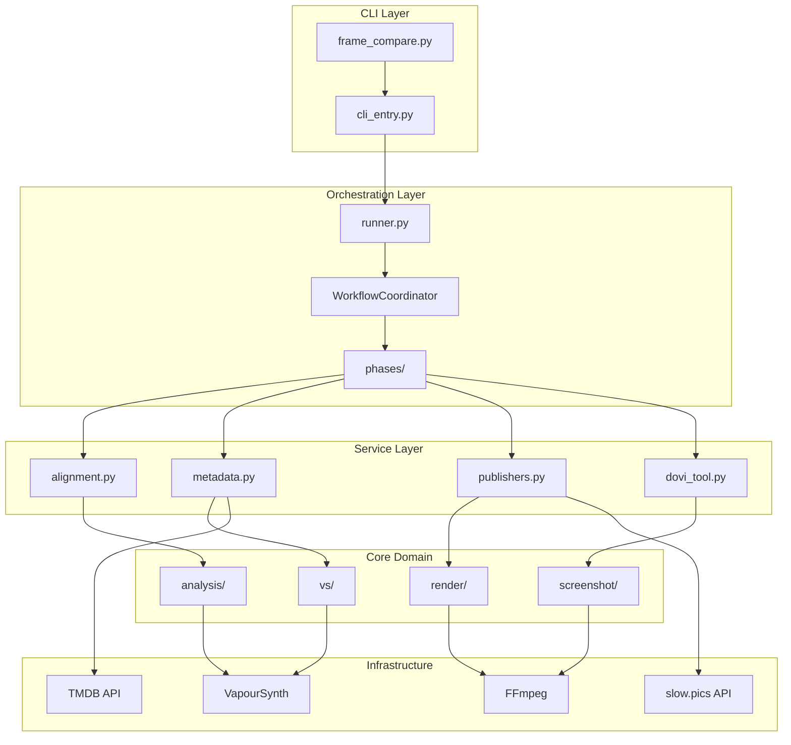

# Frame Compare — Comprehensive Project Documentation

> **Version:** 0.0.14 | **Python:** 3.13+ | **License:** MIT

This document consolidates findings from the codebase analysis, synthesizing architecture, features, testing infrastructure, and configuration details.

---

## Executive Summary

Frame Compare is a **Python CLI tool** for automated frame comparison and HDR tonemapping. It samples deterministic frames (luminance quantiles, motion scoring, seeded randomness), aligns audio across encodes, renders screenshots via VapourSynth or FFmpeg, and publishes to slow.pics with TMDB metadata.

**Target audiences:**

- Fansub/QC, boutique remaster teams, archivists
- Automation engineers needing programmatic hooks
- HDR/SDR hobbyists using tonemap presets

---

## Architecture Classification

### Layered Pipeline Architecture



### Layer Descriptions

| Layer | Key Modules | Responsibility |
|-------|-------------|----------------|
| **CLI** | `frame_compare.py`, `cli_entry.py` | Click wiring, argument parsing, entry points |
| **Orchestration** | `runner.py`, `orchestration/coordinator.py`, `phases/` | Pipeline coordination, state management |
| **Service** | `alignment.py`, `metadata.py`, `publishers.py`, `dovi_tool.py` | Domain services (audio, metadata, publishing) |
| **Core Domain** | `analysis/`, `vs/`, `render/`, `screenshot/` | Frame selection, VapourSynth processing, rendering |
| **Infrastructure** | VapourSynth, FFmpeg, slow.pics, TMDB | External systems & adapters |

---

## Technology Stack

### Core Dependencies

| Category | Technology | Purpose |
|----------|------------|---------|
| **Language** | Python 3.13+ | Core runtime |
| **Video Engine** | VapourSynth ≥72 | Primary renderer, tonemapping |
| **CLI Framework** | Click ≥8.1 | Command-line interface |
| **UI** | Rich | Progress bars, formatted output |
| **Audio** | NumPy, Librosa, SoundFile | Audio alignment (cross-correlation) |
| **Network** | httpx, requests | slow.pics uploads, TMDB API |
| **Parsing** | GuessIt, Anitopy | Filename metadata extraction |

### Development Dependencies

| Tool | Purpose |
|------|---------|
| `pytest`, `pytest-mock`, `requests-mock` | Testing |
| `ruff` | Linting (E, F, I, W rules) |
| `pyright` | Type checking (strict mode) |
| `black` | Formatting (line-length 100) |
| `import-linter` | Dependency contracts |

### Optional Extras

| Feature | Installation |
|---------|--------------|
| VSPreview alignment | `vspreview`, `PySide6` |
| Clipboard shortcuts | `pyperclip` |

---

## Core Features

### 1. Frame Discovery & Selection

**Location:** `src/frame_compare/analysis/`

- **Luminance quantiles:** Darkest/brightest frames
- **Motion scoring:** High-motion frames
- **Seeded randomness:** Reproducible random selection
- **Caching:** `generated.compframes` reused when hashes match

**Key modules:**

- `selection.py` — Frame selection algorithms
- `metrics.py` — Luminance/motion calculation
- `cache_io.py` — Cache read/write with versioning

### 2. Audio Alignment

**Location:** `src/frame_compare/services/alignment.py`, `alignment/`

- Cross-correlation (global offset; DTW is deferred)
- Per-clip offset calculation
- Interactive VSPreview confirmation (optional)
- Cached offsets in `generated.audio_offsets.toml`

**Configuration keys:**

- `[audio_alignment].enable`
- `[audio_alignment].use_vspreview`
- `[audio_alignment].sample_rate`

### 3. HDR Tonemapping

**Location:** `src/frame_compare/vs/tonemap.py`, `color.py`

- **Engine:** libplacebo via VapourSynth
- **Presets:** `reference`, `filmic`, `contrast`, `bt2390_spec`, `spline`, `bright_lift`, `highlight_guard`
- **Granular controls:** BT.2390 knee, gamma lift, smoothing, percentile, contrast recovery
- **Dolby Vision:** Optional DoVi metadata handling via `dovi_tool.py`

**CLI overrides:** `--tm-preset`, `--tm-curve`, `--tm-target`, `--tm-knee`, etc.

### 4. Screenshot Rendering

**Location:** `src/frame_compare/screenshot/`, `render/`

- **Primary:** VapourSynth (full HDR pipeline)
- **Fallback:** FFmpeg (set `[screenshots].use_ffmpeg = true`)
- **Geometry handling:** Auto-crop, padding, mod-2 fixes
- **Overlays:** Filename, frame number, diagnostic metrics
- **Formats:** PNG output

**Key modules:**

- `orchestrator.py` — Rendering coordination
- `render.py` — Frame extraction
- `geometry.py` — Dimension calculations
- `overlay.py` — Text overlay rendering

### 5. External Integrations

#### slow.pics

**Location:** `src/frame_compare/services/publishers.py`

- Automatic uploads with retry logic
- Shortcut URL creation
- Post-upload cleanup (configurable)
- Webhook support for notifications

**Configuration:** `[slowpics]` section

#### TMDB

**Location:** `src/frame_compare/tmdb_workflow.py`

- Metadata resolution via GuessIt/Anitopy labels
- Movie/TV show title matching
- `[tmdb].unattended` mode for automation

### 6. HTML Report Generation

**Location:** `src/data/report/`

- Offline viewer mirroring slow.pics
- Modes: slider, overlay, difference, blink
- Zoom/pan, filterable filmstrips

**Configuration:** `[report]` section

---

## Configuration Schema

**Primary file:** `config/config.toml` (seeded from `src/data/config.toml.template`)

### Key Sections

| Section | Purpose | Notable Keys |
|---------|---------|--------------|
| `[paths]` | Workspace paths | `input_dir`, `comparison_videos_dir` |
| `[analysis]` | Frame selection | `frame_count`, `random_seed`, `save_frames_data` |
| `[audio_alignment]` | Audio sync | `enable`, `use_vspreview`, `sample_rate` |
| `[screenshots]` | Rendering | `use_ffmpeg`, `directory_name`, `overlay_mode` |
| `[color]` | Tonemapping | `preset`, `tone_curve`, `target_nits`, `enable_tonemap` |
| `[slowpics]` | Upload config | `auto_upload`, `visibility`, `delete_screen_dir_after_upload` |
| `[tmdb]` | Metadata | `api_key`, `unattended` |
| `[report]` | HTML report | `enable`, `output_dir`, `default_mode` |
| `[diagnostics]` | Debug overlays | `per_frame_nits` |
| `[overrides]` | Per-source settings | Trims, FPS adjustments by filename |

### Environment Variables

| Variable | Purpose |
|----------|---------|
| `FRAME_COMPARE_ROOT` | Override workspace root |
| `FRAME_COMPARE_CONFIG` | Override config path |
| `FRAME_COMPARE_NO_WIZARD` | Disable auto-wizard |
| `VAPOURSYNTH_PYTHONPATH` | VapourSynth bindings path |

---

## CLI Interface

### Main Commands

| Command | Description |
|---------|-------------|
| `frame-compare run` | Execute full comparison pipeline |
| `frame-compare wizard` | Interactive guided setup |
| `frame-compare doctor` | Dependency diagnostics |
| `frame-compare preset list/apply` | Manage presets |

### Key Flags

| Flag | Description |
|------|-------------|
| `--root PATH` | Override workspace root |
| `--config PATH` | Specify config file |
| `--input PATH` | Override input directory |
| `--write-config` | Seed config and exit |
| `--diagnose-paths` | Print JSON diagnostics |
| `--no-cache` | Recompute (ignore cache) |
| `--from-cache-only` | Render from cached snapshot |
| `--quiet`, `--verbose`, `--no-color` | Output control |

### Exit Codes

| Code | Meaning |
|------|---------|
| `0` | Success |
| `2` | Preflight error |
| `3` | Runtime failure |
| `>3` | Module-specific errors |

---

## Programmatic API

### Core Imports

```python
from frame_compare import runner, RunRequest, RunResult, CLIAppError
from frame_compare import doctor, preflight
from frame_compare import config_writer, presets
```

### Key Surfaces

| Module | Exports |
|--------|---------|
| `runner` | `run()`, `RunRequest`, `RunResult` |
| `doctor` | `collect_checks()`, `emit_results()` |
| `preflight` | `prepare_preflight()`, `resolve_workspace_root()` |
| `config_writer` | `read_template_text()`, `write_config_file()` |
| `presets` | `list_preset_paths()`, `load_preset_data()` |

---

## Testing Infrastructure

### Test Organization

```
tests/
├── conftest.py           # Shared fixtures
├── helpers/
│   └── runner_env.py     # CLI harness, stubs, mocks
├── fixtures/             # Test media files
├── cli/                  # CLI-specific tests
├── runner/               # Runner/orchestration tests
├── services/             # Service layer tests
├── render/               # Rendering tests
├── net/                  # Network mocking tests
└── test_*.py             # Unit tests
```

### Pytest Configuration

**Markers:**

| Marker | Purpose |
|--------|---------|
| `@pytest.mark.vs_required` | Requires VapourSynth runtime |
| `@pytest.mark.integration` | End-to-end CLI tests |
| `@pytest.mark.unit` | Fast isolated tests |
| `@pytest.mark.slow` | Long-running tests |
| `@pytest.mark.network` | Requires network access |

### Key Fixtures (conftest.py)

| Fixture | Purpose |
|---------|---------|
| `cli_runner_env` | Click CLI test harness |
| `runner_vs_core_stub` | VapourSynth stub |
| `dummy_progress` | Rich progress stub |
| `vspreview_env` | VSPreview presence toggle |
| `which_map` | CLI tool presence mock |

---

## Key Design Decisions

### Modularity Strategy

- Extracted modules from monolithic files (e.g., `vs_core`, `analysis`, `render`, `doctor`, `runner`)
- Thin CLI shim (`frame_compare.py`) delegating to `cli_entry.py`
- Dependency Injection via `RunDependencies`, `RunContext`

### Type Safety

- `py.typed` marker for PEP 561 compliance
- Pyright strict mode for `src/frame_compare/`
- Stub files in `typings/`

### Import Contracts

- Enforced via `import-linter`
- CI checks prevent unauthorized cross-layer imports
- Public API via `frame_compare.*`, not `src.frame_compare.*`

### Caching Strategy

- Frame metrics: `generated.compframes` (hash-versioned)
- Audio offsets: `generated.audio_offsets.toml`
- Run snapshots: `.frame_compare.run.json`

---

## Known Constraints

### VapourSynth Dependency

- Complex installation across platforms
- `doctor` command assists with diagnostics
- FFmpeg fallback available

### Platform Support

| Platform | Status |
|----------|--------|
| Linux 64-bit | ✅ Supported |
| Windows 64-bit | ✅ Supported |
| macOS | ⚠️ Paused (VapourSynth toolchain issues) |

---

## Documentation Inventory

| Document | Location | Purpose |
|----------|----------|---------|
| README.md | `/` | User guide, getting started |
| CHANGELOG.md | `/` | Release history |
| DECISIONS.md | `/docs/` | Technical decision log |
| project_dissection.md | `/docs/` | Architecture overview |
| audio_alignment_pipeline.md | `/docs/` | Audio alignment details |
| geometry_pipeline.md | `/docs/` | Geometry handling |
| hdr_tonemap_overview.md | `/docs/` | HDR tonemapping guide |

---

## Summary

Frame Compare is a well-architected, modular CLI tool with:

- **Clear layered architecture** separating concerns
- **Comprehensive configuration** via TOML with CLI overrides
- **Strong type safety** with Pyright strict mode
- **Robust testing** with shared fixtures and markers
- **Extensive documentation** covering architecture, decisions, and usage
- **Programmatic API** for automation and integration

The codebase demonstrates best practices in Python project organization, dependency management, and developer experience.
