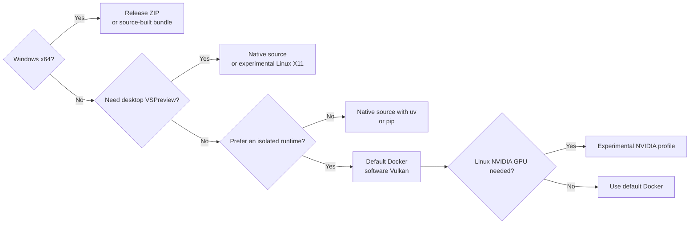

# Choose your installation

Frame Compare has one CLI and several ways to provide its Python and media runtime.
The best route depends mainly on your operating system, whether you need the
VSPreview desktop interface, and how much of the native media toolchain you want to
manage yourself.

## Short answer

| If you are... | Start here | Why |
| --- | --- | --- |
| On Windows 10/11 x64 | [Published Windows portable bundle](../windows-portable.md) | Easiest and most complete route. Python, FFmpeg, VapourSynth, required plugins, VSPreview, PyQt6, installer, and updater are included. |
| On macOS | [Default Docker route](docker.md) | Reproducible, headless setup without assembling a native media toolchain. |
| On Linux and want a predictable headless setup | [Default Docker route](docker.md) | Canonical software-Vulkan path and the closest match to runtime integration CI. |
| On Linux with NVIDIA or X11 requirements | [Advanced Docker environments](../docker-environments.md) | Optional, host-dependent GPU and desktop profiles with separate proof commands. |
| Comfortable managing FFmpeg and VapourSynth yourself | [Native source with `uv`](native.md#install-with-uv) | Locked Python environment with direct host integration. |
| Integrating into an existing Python environment | [Native source with pip](native.md#install-with-pip) | Flexible, but you own Python dependency resolution and the full native runtime. |
| Contributing code | [Contributor setup](https://github.com/TJZine/frame-compare/blob/main/CONTRIBUTING.md) | Includes development, test, lint, typing, and documentation dependencies. |

## Route comparison

### Setup and support profile

| Route | Host | Setup effort | Dependency ownership | Reproducibility | Support posture |
| --- | --- | ---: | --- | --- | --- |
| Windows release ZIP | Windows 10/11 x64 | Lowest | Bundle provides the runtime | High; release artifacts and runtime inputs are pinned | Recommended Windows route |
| Windows source build | Windows 10/11 x64 | Medium to high | Build script downloads and assembles pinned runtime inputs | High after a successful build | Supported, slower fallback |
| Docker default | macOS or Linux | Low to medium | Image provides Python and media dependencies | High; deterministic software-Vulkan baseline | Recommended headless macOS/Linux route |
| Docker NVIDIA | Compatible Linux NVIDIA host | High | Image plus host driver and NVIDIA Container Toolkit | Host-dependent | Experimental; separately verified |
| Docker X11 GUI | Linux X11 desktop | High | Image plus host display, permissions, and optional Xauthority | Host-dependent | Experimental; separately verified |
| Native source with `uv` | macOS, Linux, or an advanced Windows setup | High | Locked Python environment; you provide native media dependencies | High for Python, host-dependent for media libraries | Advanced |
| Native source with pip | Any compatible Python host | Highest | You provide and resolve Python and native dependencies | Lower; project requirements are minimum bounds | Advanced/integration-oriented |
| Contributor environment | Development hosts | High | Locked dev and runtime dependencies plus native tools | High for repository work | Development only |

“High reproducibility” does not mean identical pixels on every operating system.
Host GPU drivers, Vulkan implementations, and available fonts can affect rendering
details. Use the same route and runtime when bit-for-bit comparison is important.

### Included runtime

| Route | Python environment | FFmpeg | VapourSynth + loader plugins | VSPreview + PyQt6 | Installer/updater |
| --- | --- | --- | --- | --- | --- |
| Windows release ZIP | Included (Python 3.13.14 in the current bundle manifest) | Included, LGPL-only build | Included (VapourSynth R78, L-SMASH-Works 1296, and vs-placebo 2.0.4) | Included | Included |
| Windows source build | Built into the resulting bundle | Downloaded by the builder | Downloaded/installed by the builder | Installed by the builder | Included |
| Docker default | Included in image | Included | Included | Not in the default runtime target | Rebuild/pull the image |
| Docker NVIDIA | Included in image | Included | Included | Not by the GPU profile alone | Rebuild/pull the image |
| Docker X11 GUI | Included in GUI image target | Included | Included | Included in the optional GUI target | Rebuild/pull the image |
| Native source with `uv` | Created from `uv.lock` | Host-provided | Host-provided; `vspreview` extra supplies related Python packages | Optional extra | None |
| Native source with pip | Created/selected by you | Host-provided | Host-provided | Optional extra | None |

The repository currently documents Docker as a build-from-clone route; it does not
promise a prebuilt public container image. The pip route is also install-from-clone,
not a promise that a package has been published to PyPI.

See [Supported Media Runtime](../supported-media-runtime.md) for the coordinated
VapourSynth, source-plugin, tone-mapping, FFmpeg, cache/index, and licensing
contract used by the bundled routes.

### Feature availability

| Capability | Windows portable | Docker default | Docker NVIDIA | Docker X11 | Native source |
| --- | --- | --- | --- | --- | --- |
| Frame discovery, selection, analysis, and alignment | Yes | Yes | Yes | Yes | Yes, with required runtime |
| SDR screenshots and labeled comparison output | Yes | Yes | Yes | Yes | Yes, with required runtime |
| HDR tonemapping | Yes; uses host Vulkan stack | Yes; software Vulkan | Intended host GPU path | Yes; rendering remains host-dependent | Yes, with compatible VapourSynth/vs-placebo and Vulkan setup |
| Offline HTML report | Yes | Yes | Yes | Yes | Yes |
| Run folders, cache, and history commands | Yes | Yes; files remain on host mounts | Yes | Yes | Yes |
| slow.pics publishing and webhooks | Available; opt-in and network-dependent | Available; opt-in and network-dependent | Same as default Docker | Same as default Docker | Available; opt-in and network-dependent |
| Interactive VSPreview alignment | Included | No | No, not from GPU profile alone | Experimental, X11-only | Optional and host-managed |
| Automatically open report/slow.pics URL | Native host behavior | No; use host helper | No; use host helper | Host-dependent | Native host behavior |
| Clipboard integration | Native host behavior | Do not rely on container-to-host clipboard | Do not rely on container-to-host clipboard | Host-dependent | Native host behavior |
| Code-only signed updates and rollback | Windows release update assets only | No | No | No | No |

All routes keep slow.pics automatic upload disabled in the first-use configuration.
Local rendering and report generation do not require publishing. See
[Publishing and Webhooks](../guides/publishing-and-webhooks.md) before enabling any
network output.

## What each route is best at

### Windows release ZIP

Choose this for the least setup and the broadest tested feature set on Windows. It
contains the runtime needed by the application, supports VSPreview for interactive
manual alignment, and provides user-level install, update, backup, rollback, and
uninstall commands.

Tradeoffs:

- Windows x64 only;
- a larger download because the media and UI runtimes are bundled;
- GPU behavior still depends on the host Vulkan-capable graphics stack;
- verify the release ZIP against its published `.sha256` file before installing.

Follow [Windows Portable Install](../windows-portable.md).

### Windows source-built portable bundle

Choose this only when no suitable published bundle exists or when validating the
packaging path. It produces the same bundle layout and installed command as the
release ZIP, but needs Git, PowerShell, network access, build time, download cache
space, and access to every pinned upstream artifact.

Follow the [source-build section](../windows-portable.md#from-a-cloned-repo).

### Default Docker

Choose this for an isolated, reproducible, headless setup on macOS or Linux. The
default path uses software Vulkan, keeps media and configuration read-only during a
normal run, and writes reports and generated data through explicit host mounts.

Tradeoffs:

- build the image from the repository before first use;
- no Docker-based VSPreview workflow in the default profile;
- no native GPU acceleration on macOS Docker Desktop;
- a container cannot directly open the host browser or reliably use the host
  clipboard, so use the supplied host-open helper;
- optional GPU and GUI profiles are not covered by the default support claim.

Follow [Docker](docker.md).

### Docker NVIDIA

This optional Linux-only profile is for a compatible NVIDIA host. It needs the
NVIDIA Container Toolkit, a sufficiently recent Docker Compose implementation, and
a successful run of the dedicated GPU proof. It does not add VSPreview by itself.

Treat it as experimental until it passes on your actual host. See
[NVIDIA GPU Profile](../docker-environments.md#nvidia-gpu-profile).

### Docker X11 GUI

This optional Linux desktop profile supplies VSPreview/PyQt6 and forwards an X11
session. It needs a live `DISPLAY`, the X11 socket, matching host/container user
IDs, and sometimes an Xauthority cookie. Wayland-only, VNC, noVNC, and broad
`xhost +` workflows are outside the documented contract.

Treat it as experimental until the proof passes and a real manual launch succeeds
on your host. See
[Linux X11 GUI Profile](../docker-environments.md#linux-x11-gui-profile).

### Native source with `uv`

Choose this when you want native host behavior and can install the media toolchain.
`uv` reproduces the repository's locked Python dependency graph; you still provide
FFmpeg, VapourSynth R78, L-SMASH-Works 1296, vs-placebo 2.0.4, compatible Vulkan
support, and optionally VSPreview.

This is the preferred native-source route because its Python environment is locked.
Follow [Install with uv](native.md#install-with-uv).

### Native source with pip

Choose this when Frame Compare must live in an existing Python environment or `uv`
is unsuitable. The project declares minimum Python dependency versions, so pip may
resolve a newer combination than the repository's tested lockfile. Isolate the
installation in a virtual environment and run `frame-compare doctor` after every
install or upgrade.

Follow [Install with pip](native.md#install-with-pip).

## Important runtime rules

- Python 3.13 or newer is required for native-source routes.
- VapourSynth is required by the default renderer.
- `screenshots.use_ffmpeg = true` can select an FFmpeg-only screenshot path, but HDR
  frames that need tonemapping still require VapourSynth.
- VSPreview is optional unless you want interactive manual alignment.
- Docker default, Docker NVIDIA, and Docker X11 are distinct proof surfaces. Passing
  the default Docker check does not prove either optional profile.
- Run `frame-compare doctor` after installation, then perform a dry run before the
  first real comparison.

## Recommended first-run sequence

Regardless of route:

1. Put at least two supported clips (`.mkv`, `.mp4`, `.avi`, `.m2ts`, or `.ts`) in
   the route's `comparison_videos/` directory, or provide explicit inputs.
2. Run `frame-compare wizard` using the command prefix documented for your route.
3. Run `frame-compare doctor` and resolve failures relevant to your intended
   features.
4. Run `frame-compare run --root . --dry-run` to inspect inputs, paths, frame
   selection, and output intent without rendering.
5. Run `frame-compare run --root .`.
6. Open the generated local HTML report. Docker users should use the
   [host-open helper](../docker-environments.md#host-open-helper).
7. Enable slow.pics or webhook output only after reviewing the
   [publishing guide](../guides/publishing-and-webhooks.md).

Continue with [Your First Comparison](../guides/first-comparison.md) for a detailed
walkthrough.
