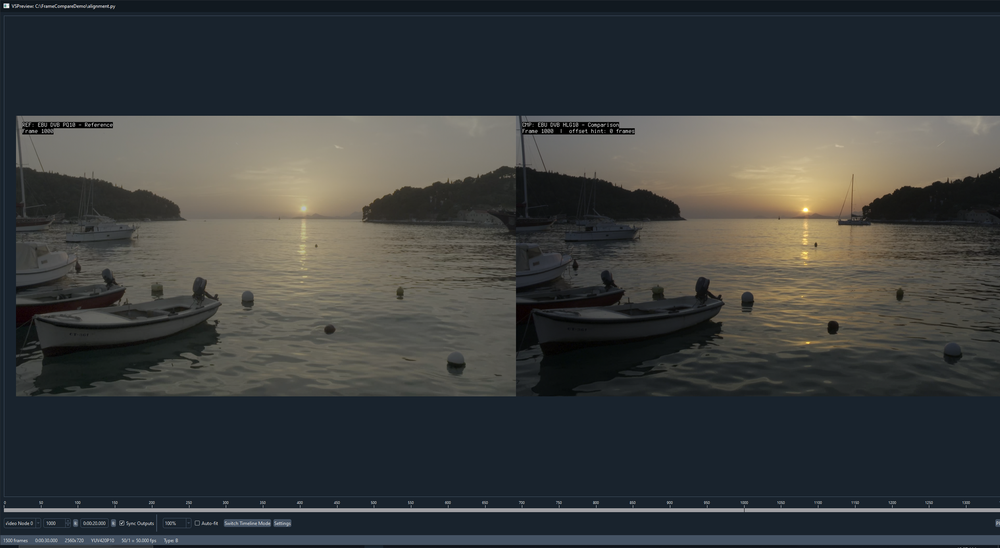

# Audio alignment and VSPreview

Frame Compare can estimate timing offsets between the reference and comparison sources,
reuse a previously accepted source relationship, and optionally open VSPreview for
manual verification. Alignment changes which source frames are compared; it does not
retime or rewrite the input files.

## When alignment helps

Alignment is useful when sources contain the same program but differ because of:

- leading studio logos or broadcaster slates;
- different container start times;
- source-specific trims;
- a constant audio/video offset;
- short additional or missing sections before the shared content.

It is not a general edit-matching system. Different cuts, replaced music, silence,
commentary tracks, or unrelated audio can make correlation ambiguous or invalid.

## Recommended workflow

1. Let automatic alignment compute an offset.
2. Review confidence and warnings.
3. Use VSPreview when the interactive route is available and the evidence needs manual
   confirmation.
4. Verify dialogue, cuts, and motion in the final report.
5. Reuse an accepted result only while the same source identities and alignment-affecting
   settings remain valid.

## Audio stream selection

The alignment service uses the selected audio streams and preprocessing strategy from
configuration. Confirm that the sources are using corresponding language, mix, and
content. A stereo theatrical mix and a commentary track can correlate poorly even when
the video is the same.

When automatic stream selection is unsuitable, use the audio-alignment configuration
surface documented in the
[CLI Behavioral Contract](../current-cli-contract.md#config-only-audio-alignment-surface).

## Previous offset reuse

Accepted computed or VSPreview-confirmed offsets can be stored in the shared alignment
reuse cache. Reuse is keyed by the source set, fingerprints, trims, effective FPS,
selected reference relationship, audio stream choices, alignment settings, and relevant
runtime identity.

A cache miss simply returns to normal alignment. Corrupt or unsupported reuse data is
ignored with a warning rather than treated as authoritative evidence.

Computed alignment may also classify bounded evidence across the source as stable,
possible drift, possible discontinuity, variable, or insufficient. This summary is
diagnostic only: Frame Compare always retains the selected constant offset and trims.
Material non-stable evidence produces one concise warning and should be verified at
multiple points. Stable and insufficient evidence do not warn. New cache entries can
retain the compact summary, while legacy entries without it remain reusable.

## Interactive verification with VSPreview

VSPreview is included in the Windows portable bundle and optional in native
installations. The default Docker route does not provide an interactive desktop
session.

<figure class="fc-doc-figure">
  
  <figcaption>The physical Windows proof places the EBU/DVB reference and comparison at frame 1000 with a zero-frame hint beside the timeline so alignment can be checked at multiple evidence points.</figcaption>
</figure>

During verification, inspect multiple evidence points:

- a hard cut near the beginning;
- dialogue with visible mouth movement;
- a motion-heavy sequence;
- a later point in the program to detect drift;
- the final shared section to confirm the sources still overlap.

An offset that looks correct at one frame can still be wrong for variable timing or a
different edit.

## Failure modes

| Symptom | Likely cause | Action |
| --- | --- | --- |
| Low or unstable correlation | Silence, replaced music, wrong stream, or different edit | Select corresponding audio, increase evidence, or verify manually |
| Good early match but later drift | FPS or timing mismatch | Recheck effective FPS and source structure; do not treat a constant offset as sufficient |
| VSPreview cannot launch | Missing optional UI dependencies or desktop/runtime issue | Run `doctor`, use Windows portable or a valid native VSPreview installation, or continue without interactive verification |
| Reused offset no longer looks correct | Source or runtime changed outside the reusable identity assumptions | Reject reuse, clear the alignment cache entry, and recompute |
| Selected frames disappear after alignment | Shared overlap is smaller than the initial reference-domain plan | Reduce trims or requested counts and review the warning/error context |

## Validation standard

Automatic correlation is a strong starting point, not a substitute for visual review.
For a publication-bound comparison, manually check the final report even when the
alignment cache hits and no warning is emitted.
