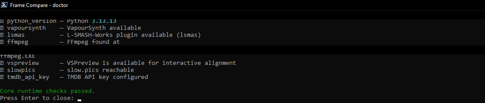
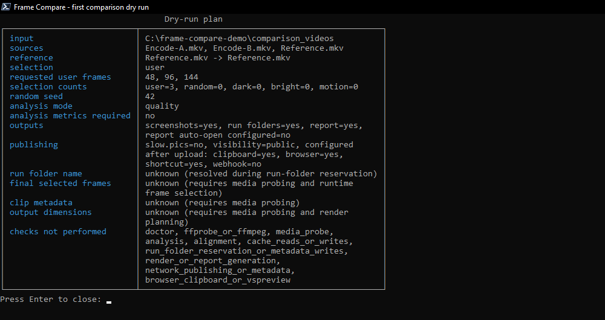
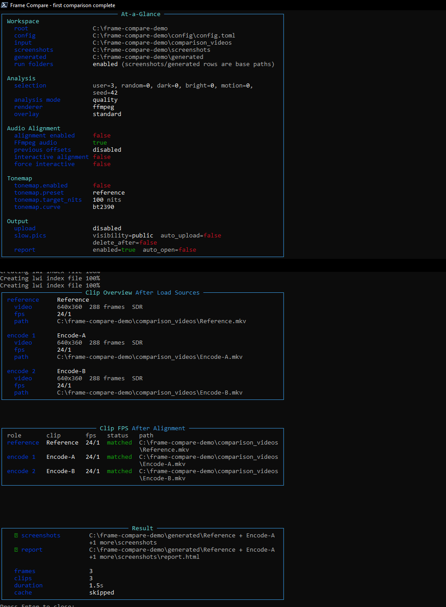

# Your first comparison

A safe first run has four stages: configure, diagnose, preview, then execute. Use the
same installation route and workspace for every stage so configuration and path
resolution remain consistent.

## Before you begin

Create or select a workspace with at least two supported files in its input directory.
For a publication-safe example, use names such as:

```text
comparison_videos/
├── Reference.mkv
├── Encode-A.mkv
└── Encode-B.mkv
```

Supported extensions are `.mkv`, `.mp4`, `.avi`, `.m2ts`, and `.ts`, matched
case-insensitively.

## Run the four stages

=== "Windows portable"

    ```powershell
    frame-compare wizard
    frame-compare doctor
    frame-compare run --dry-run
    frame-compare run
    ```

=== "Docker"

    ```bash
    export FRAME_COMPARE_HOST_UID="$(id -u)"
    export FRAME_COMPARE_HOST_GID="$(id -g)"
    mkdir -p config comparison_videos generated

    docker compose build frame-compare-run
    docker compose run --rm frame-compare-wizard
    docker compose run --rm frame-compare-run doctor
    docker compose run --rm frame-compare-run run --root /workspace --dry-run
    docker compose run --rm frame-compare-run run --root /workspace
    ```

=== "Native with uv"

    ```bash
    uv run --no-sync frame-compare wizard
    uv run --no-sync frame-compare doctor
    uv run --no-sync frame-compare run --root . --dry-run
    uv run --no-sync frame-compare run --root .
    ```

=== "Native with pip"

    ```bash
    frame-compare wizard
    frame-compare doctor
    frame-compare run --root . --dry-run
    frame-compare run --root .
    ```

## What each stage protects

### 1. Wizard

The wizard reviews workspace paths, source behavior, frame selection, rendering, and
publishing choices. It writes configuration only after confirmation. The first-use
configuration explicitly keeps `slowpics.auto_upload = false`.

### 2. Doctor

`doctor` checks the runtime used by the selected route. Resolve critical failures for
the features you intend to use. Optional integrations can remain disabled, but an
FFmpeg, VapourSynth, source-plugin, or Vulkan failure can block the corresponding
rendering or alignment path.

<figure class="fc-doc-figure">
  
  <figcaption>The doctor command confirms the portable runtime and optional integrations before the first comparison begins.</figcaption>
</figure>

### 3. Dry run

A dry run validates configuration, source discovery, reference and comparison order,
selection intent, and output intent without entering the rendering pipeline. Check:

- the expected reference is first;
- every intended comparison is present once;
- the generated-data root is correct;
- frame counts and analysis mode match your intent;
- publishing remains disabled unless deliberately enabled.

<figure class="fc-doc-figure">
  
  <figcaption>A dry run makes source order, frame selection, analysis mode, local output intent, and publishing state visible before any rendering starts.</figcaption>
</figure>

### 4. Run

The normal run reserves a fresh run folder, probes the clips, builds the frame plan,
performs analysis and alignment when required, renders screenshots, records metadata,
and writes the report. Network publication occurs only when the effective configuration
or command explicitly enables it.

<figure class="fc-doc-figure">
  
  <figcaption>The completed run summary links the report and screenshots to the matched source set and records the final frame count and duration.</figcaption>
</figure>

## Find the result

Each executed run gets a reserved directory beneath `paths.generated_dir`:

```text
generated/
├── cache/
└── <run-name>/
    ├── report.html
    ├── screenshots/
    ├── generated/
    ├── run_info.toml
    └── run_result.toml
```

Open `report.html` while keeping the run folder together. Relative screenshot links
continue to work when the entire folder is moved or archived. Docker users should use
the host-open helper or translate `/workspace/generated/` to the host `generated/`
directory.

## Confirm the comparison is trustworthy

Before sharing a result:

1. Review several frames in slider and diff modes.
2. Check source labels, resolution, HDR/SDR identity, and frame numbers.
3. Verify alignment around dialogue, cuts, and motion.
4. Look for crop, aspect-ratio, or tone-mapping differences that could make the
   comparison misleading.
5. Keep the result local until it looks correct.

Continue with:

- [Reports and Overlays](reports-and-overlays.md)
- [Sources, References, and Labels](sources-and-labels.md)
- [Frame Selection and Analysis](analysis-modes.md)
- [Audio Alignment and VSPreview](audio-alignment.md)
- [HDR and Tonemapping](hdr-tonemapping.md)
- [Troubleshooting](troubleshooting.md)
