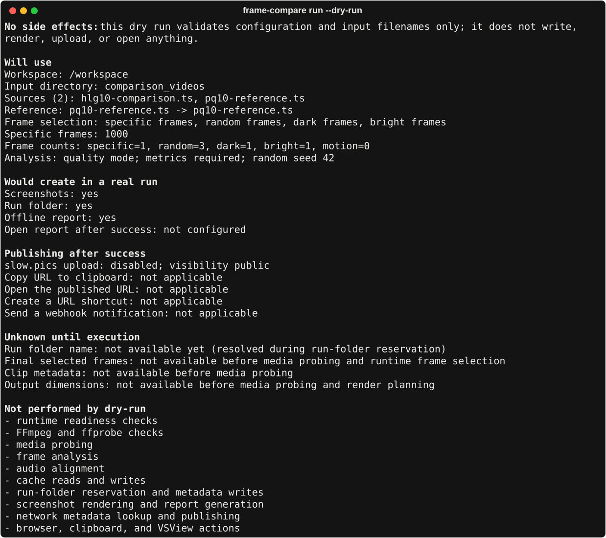
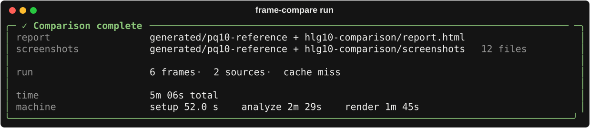

# Your first comparison

A safe first run has four stages: configure, diagnose, preview, then execute. Use the
same installation route and workspace for every stage so configuration and path
resolution remain consistent.

## Before you begin

Create or select a workspace with at least two supported files in its input directory.
For a publication-safe example matching the figures below, use two sources such as:

```text
comparison_videos/
├── pq10-reference.ts
└── hlg10-comparison.ts
```

Supported extensions are `.mkv`, `.mp4`, `.avi`, `.m2ts`, and `.ts`, matched
case-insensitively.

## Run the four stages

=== "Windows portable"

    ```powershell
    frame-compare wizard
    frame-compare doctor
    frame-compare run --dry-run
    frame-compare run
    ```

=== "Docker"

    ```bash
    export FRAME_COMPARE_HOST_UID="$(id -u)"
    export FRAME_COMPARE_HOST_GID="$(id -g)"
    mkdir -p config comparison_videos generated

    docker compose build frame-compare-run
    docker compose run --rm frame-compare-wizard
    docker compose run --rm frame-compare-run doctor
    docker compose run --rm frame-compare-run run --root /workspace --dry-run
    docker compose run --rm frame-compare-run run --root /workspace
    ```

=== "Native with uv"

    ```bash
    uv run --no-sync frame-compare wizard
    uv run --no-sync frame-compare doctor
    uv run --no-sync frame-compare run --root . --dry-run
    uv run --no-sync frame-compare run --root .
    ```

=== "Native with pip"

    ```bash
    frame-compare wizard
    frame-compare doctor
    frame-compare run --root . --dry-run
    frame-compare run --root .
    ```

## What each stage protects

### 1. Wizard

The wizard interactively sets the input directory, the generated-data location,
reference selection, and the frame-selection goal. It does not prompt for an upload
toggle or configure rendering and publishing; those remain configuration, environment,
and preset concerns. It writes configuration only after confirmation, and the first-use
configuration explicitly keeps `slowpics.auto_upload = false`. After a successful save,
or a no-op with nothing to change, it prints suggested `doctor`, `run --dry-run`, and
`run` commands for your resolved workspace and config file. It never runs them.

### 2. Doctor

`doctor` checks the runtime used by the selected route. Resolve critical failures for
the features you intend to use. Optional integrations can remain disabled, but an
FFmpeg, VapourSynth, source-plugin, or Vulkan failure can block the corresponding
rendering or alignment path.

### 3. Dry run

A dry run validates configuration, source discovery, reference and comparison order,
selection intent, and output intent without entering the rendering pipeline. It does
not probe media, contact the render or alignment runtime, or otherwise prove the
runtime is ready to render; run `doctor` to confirm runtime readiness. Check:

- the expected reference is first;
- every intended comparison is present once;
- the generated-data root is correct;
- frame counts and analysis mode match your intent;
- publishing remains disabled unless deliberately enabled.

<figure class="fc-figure">
  
  <figcaption>A dry run shows what a real run would use and create, without touching media or the network.</figcaption>
</figure>

### 4. Run

The normal run reserves a fresh run folder, probes the sources, builds the frame plan,
performs analysis and alignment when required, renders screenshots, records metadata,
and writes the report. Network publication occurs only when the effective configuration
or command explicitly enables it.

<figure class="fc-figure">
  
  <figcaption>The summary links the report and screenshots of the run folder you created.</figcaption>
</figure>

## Repeat comparisons

Once configuration and the runtime are established, most later comparisons only need
the preview and execute stages; you do not have to repeat the wizard or doctor for
every run.

=== "Windows portable"

    ```powershell
    frame-compare run --dry-run
    frame-compare run
    ```

=== "Docker"

    ```bash
    docker compose run --rm frame-compare-run run --root /workspace --dry-run
    docker compose run --rm frame-compare-run run --root /workspace
    ```

=== "Native with uv"

    ```bash
    uv run --no-sync frame-compare run --root . --dry-run
    uv run --no-sync frame-compare run --root .
    ```

=== "Native with pip"

    ```bash
    frame-compare run --root . --dry-run
    frame-compare run --root .
    ```

Revisit `wizard` when the input directory, generated-data location, reference, or
frame-selection goal changes. After a successful save, or a no-op, it prints suggested
`doctor`/`run --dry-run`/`run` commands for your resolved workspace and config file.
Run them through the same route that ran the wizard. In Docker, the printed paths are
container paths such as `/workspace`; use the Docker commands above from the host.
Revisit `doctor` after any change to the runtime: an application upgrade, a new
machine, a different Docker image, a graphics-driver or Vulkan update, or a
VSView/plugin change. A dry run only validates configuration and intent; it does not
probe media or prove the runtime is ready to render.

## Find the result

Each executed run gets a reserved directory beneath `paths.generated_dir`:

```text
generated/
├── cache/
├── clip_probe.toml
└── <run-name>/
    ├── report.html
    ├── screenshots/
    ├── alignment_diagnostics/
    ├── generated/
    ├── run_info.toml
    └── run_result.toml
```

See [Output layout](../reference/output-layout.md) for what each item holds.
`alignment_diagnostics/` exists only when audio alignment ran.

Open `report.html` while keeping the run folder together. Relative screenshot links
continue to work when the entire folder is moved or archived. Docker users should use
the host-open helper or translate `/workspace/generated/` to the host `generated/`
directory.

## Confirm the comparison is trustworthy

Before sharing a result:

1. Review several frames in slider and diff modes.
2. Check source labels, resolution, HDR/SDR identity, and frame numbers.
3. Verify alignment around dialogue, cuts, and motion.
4. Look for crop, aspect-ratio, or tonemapping differences that could make the
   comparison misleading.
5. Keep the result local until it looks correct.

Continue with:

- [Reports and overlays](reports-and-overlays.md)
- [Sources, references, and labels](sources-and-labels.md)
- [Frame selection and analysis](analysis-modes.md)
- [Audio alignment](audio-alignment.md)
- [VSView alignment review](vsview-review.md)
- [HDR and tonemapping](hdr-tonemapping.md)
- [Troubleshooting](troubleshooting.md)
