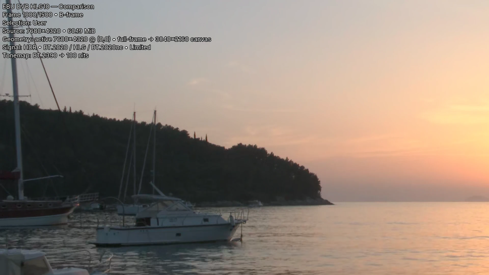

# HDR and tonemapping

Frame Compare can normalize HDR sources into SDR screenshots so sources with different
HDR metadata or delivery formats can be reviewed in the same browser report. The
selected VapourSynth and vs-placebo path performs tonemapping when the effective source
properties indicate it is required.

## What the pipeline does

1. Probe container metadata and source-frame properties.
2. Preserve explicit frame evidence and fill only missing or unspecified color facts.
3. Decide whether the frame requires HDR-to-SDR conversion.
4. Convert to the working color representation without unnecessary 8-bit reduction.
5. Apply the configured vs-placebo tonemapping preset and target luminance.
6. Render the screenshot and selected overlay.

Ambiguous transfer or primaries metadata remains unknown at the conservative FFmpeg
fallback boundary rather than being treated as ordinary SDR.

## Runtime requirements

HDR tonemapping requires:

- VapourSynth;
- the supported vs-placebo plugin;
- a compatible Vulkan implementation and driver;
- source loading through the selected supported runtime.

The Windows portable bundle includes the selected application and plugin stack but still
uses the host Vulkan-capable graphics environment. The default Docker route uses the
canonical software-Vulkan path. Native installations own their host setup.

Run `frame-compare doctor` after installation and after any graphics-driver, Vulkan,
VapourSynth, source-plugin, or vs-placebo change.

## Configure the result

The wizard does not configure tonemapping. Choose a preset in `[color]`, save it in a
preset, or override it for one run with `--tm-preset`, `--tm-target`, and `--tm-curve`.

The preset sets every value; `target_nits`, `tone_curve`, `gamma_lift`, and
`contrast_recovery` override it only when explicitly supplied in the configuration file
or environment variables. `--tm-target` and `--tm-curve` take precedence for one run;
`--tm-preset` replaces only the preset, and explicitly supplied configuration values
still override it (source: `src/frame_compare/render/prepare.py:37-74`).

| Preset | Curve | Target | Gamma lift |
| --- | --- | --- | --- |
| `reference` (default) | `bt2390` | 100 nits | Off |
| `bt2390_spec` | `bt2390` | 100 nits | Off |
| `filmic` | `spline` | 203 nits | Off |
| `spline` | `spline` | 203 nits | Off |
| `contrast` | `reinhard` | 203 nits | Off |
| `highlight_guard` | `spline` | 180 nits | Off |
| `bright_lift` | `bt2390` | 250 nits | On |

```toml
[color]
preset = "filmic"
target_nits = 160
```

This keeps the `filmic` curve and replaces only its target.

`enable_tonemap = false` renders HDR sources without conversion; the FFmpeg screenshot
path (`screenshots.use_ffmpeg = true`) requires it for HDR sources (source:
`src/frame_compare/render/prepare.py:283`, `src/frame_compare/vs/errors.py:63`).

Use one consistent target and preset for every source in a comparison unless the goal is
specifically to study different conversions. See the
[Configuration](../reference/configuration.md#color) reference.

## HDR versus SDR sources

Comparing an HDR source with an SDR source is valid only after deciding what question the
comparison should answer:

- **Encode fidelity after a common SDR presentation transform** — tonemap the HDR source
  and review both as SDR screenshots.
- **Native HDR mastering differences** — static SDR screenshots are insufficient; use
  HDR-aware playback and measurement outside this report workflow.
- **Metadata correctness** — use diagnostic overlays and recorded properties, but do not
  infer perceptual equivalence from metadata alone.

Frame Compare’s report is an SDR browser review artifact unless a future documented
output contract says otherwise.

## Dolby Vision considerations

The conservative supported presentation records source-level DV RPU presence on the
Signal line, exact selected-frame RPU presence in the Frame inspector when the
VapourSynth source exposes it, and a DV L5-derived active picture as `DV L5` in
geometry. It does not present L1, L2, or L6 values from a frame-0 probe snapshot as
though they came from the selected frame.

Dynamic L1/L2/L6 presentation remains gated on documented provider semantics, exact selected
source-frame access, correct types and units, independent frame-specific validation,
repeatability, clean negative cases, and bounded access without scanning. Insufficient
evidence closes the gate: absence is preferred to plausible but invented metadata. No
raw-RPU parser is included merely to populate the UI.

For publication-bound comparisons:

- record whether a compatible HDR10/base layer was used;
- inspect several dark and bright scenes;
- check for raised blacks, clipped highlights, hue shifts, and range mistakes;
- validate the result on the physical Windows/GPU environment intended for release.

## Overlays and measurements

`diagnostic` overlays can include observed mastering metadata, MaxCLL/MaxFALL, source
color evidence, source-level RPU presence, DV L5 geometry provenance, applied tonemap
settings, and selection context. Exact-frame RPU presence stays in the Frame inspector
to keep baked overlays concise. Dynamic Dolby Vision values require exact selected-frame
provenance. Missing values compose away without placeholders or fabricated defaults.

<figure class="fc-figure">
  
  <figcaption>A diagnostic overlay bakes the observed signal and the applied tonemap into the screenshot. The target nits describe the output transform, not measured luminance. Footage © EBU, CC BY 4.0.</figcaption>
</figure>

Selection scores are useful for explaining why a frame was chosen. They are not a
replacement for calibrated luminance measurement, VMAF, or a perceptual review. Frame
Compare does not derive pseudo-nits from selection scores. A tonemap target such as
100 or 203 nits is an applied output setting, not an observation about source-frame
luminance.

## Common problems

| Symptom | What to check |
| --- | --- |
| Tonemapping plugin unavailable | Run `doctor`; verify the selected vs-placebo plugin and runtime profile |
| Vulkan initialization fails | Update or repair the host Vulkan driver/runtime; use the supported software-Vulkan Docker path where appropriate |
| HDR frame is rendered as SDR without conversion | Inspect transfer, primaries, matrix, and range evidence; do not force a conclusion from partial metadata |
| Output looks washed out or crushed | Check full/limited range interpretation, source metadata, and target/preset choices |
| Different sources show inconsistent hue or brightness | Confirm both pass through the intended common transform and that one source is not being double-tonemapped |
| Docker output differs from Windows | Remember that the routes use different Vulkan implementations and may not be pixel-identical |

The authoritative component matrix and profile policy are in
[Supported media runtime](../supported-media-runtime.md).
