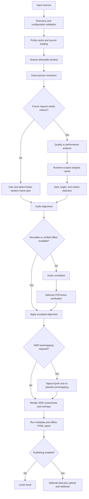

# How Frame Compare works

Frame Compare is a staged comparison pipeline rather than a screenshot loop. Each
stage owns a specific decision or artifact, and later stages consume the validated
result instead of independently reinterpreting the same media.

## 1. Discovery and validation

The CLI resolves the workspace and selected configuration, discovers supported media,
chooses the reference and comparison order, applies source overrides, and validates
write boundaries before expensive runtime work begins.

Use a dry run when you need to inspect this intent without probing and rendering the
full comparison.

## 2. Probing and selectable-window preparation

Frame Compare loads source properties through the configured media runtime and creates
a shared frame domain that every source can represent after explicit trims, effective
FPS policy, alignment constraints, and leading or trailing exclusions.

Active-picture resolution happens before metric analysis. Explicit rectangles have the
highest precedence; trusted static evidence, dimension/aspect-ratio inference, optional
content sampling, and full-frame fallback follow according to configuration.

## 3. Frame planning and analysis

Exact user frames and deterministic random frames do not require dense luminance or
motion metrics. Dark, bright, and motion requests do.

- `quality` analyzes every eligible frame in the prepared metric window.
- `performance` analyzes a deterministic sampled subset and may choose different
  automatic frames.

Metric caches are keyed by the source and runtime facts capable of changing the metric
arrays. Selection counts and quantile choices are applied after metrics are available.

## 4. Alignment

The selected source frames are normalized into the aligned comparison domain. Automatic
audio correlation can estimate offsets when sources begin at different times or contain
different trims. Previously accepted offsets can be reused, and an interactive route can
open VSPreview for manual verification.

Correlation is evidence, not certainty. Silence, replaced music, substantially different
edits, or unrelated audio streams can produce weak or misleading matches. Review motion,
cuts, and dialogue in the final report.

## 5. Rendering and tonemapping

Each aligned frame is mapped back to the corresponding source frame. SDR sources can be
rendered directly. HDR sources that need SDR output pass through the configured
VapourSynth and vs-placebo tonemapping path before screenshot encoding and overlay
composition.

The report viewer adds interactive labels and controls in the browser. Baked screenshot
overlays are part of the image itself and remain visible outside the report.

## 6. Report and optional publication

The canonical result is a static `report.html` in the reserved run folder beside its
screenshots and run records. It works without a server and can be moved as a complete
folder.

slow.pics upload and webhook notification are separate, explicit post-render actions.
A local comparison does not require either integration.

## Owned persistent artifacts

| Artifact | Purpose |
| --- | --- |
| Analysis cache | Reuse luminance and motion metrics when the relevant source, window, active picture, algorithm, and runtime identity still match |
| Probe cache | Reuse validated source properties for compatible sources and runtime identity |
| Alignment reuse cache | Reuse accepted computed or VSPreview-confirmed source offsets |
| Frame Compare-owned `.lwi` index | Isolate L-SMASH-Works indexes by selected runtime lineage instead of trusting ambiguous legacy sidecars |
| `run_info.toml` | Record the reserved run identity and runtime provenance |
| `run_result.toml` | Record the completed or failed lifecycle result used by history commands |
| `report.html` and `screenshots/` | Preserve the reviewable comparison |

For implementation ownership and exact phase boundaries, see
[Current Architecture](../current-architecture.md). For exact command, configuration,
and persistence behavior, see the [CLI Behavioral Contract](../current-cli-contract.md).
