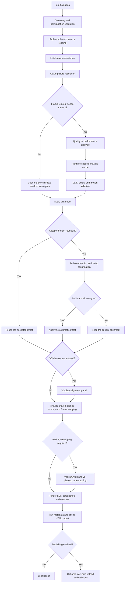

# How Frame Compare works

Frame Compare is a staged comparison pipeline rather than a screenshot loop. Each
stage owns a specific decision or artifact, and later stages consume the validated
result instead of independently reinterpreting the same media.

```mermaid
flowchart TD
    A["Input sources"] --> B["Discovery and configuration validation"]
    B --> C["Probe cache and source loading"]
    C --> D["Initial selectable window"]
    D --> E["Active-picture resolution"]
    E --> F{"Frame request needs metrics?"}
    F -->|No| G["User and deterministic random frame plan"]
    F -->|Yes| H["Quality or performance analysis"]
    H --> I["Runtime-scoped analysis cache"]
    I --> J["Dark, bright, and motion selection"]
    G --> K["Audio alignment"]
    J --> K
    K --> L{"Accepted offset reusable?"}
    L -->|Yes| M["Reuse the accepted offset"]
    L -->|No| N["Audio correlation and video confirmation"]
    N --> O{"Audio and video agree?"}
    O -->|Yes| Q["Apply the automatic offset"]
    O -->|No| P["Keep the current alignment"]
    M --> V{"VSView review enabled?"}
    Q --> V
    P --> V
    V -->|Yes| W["VSView alignment panel"]
    V -->|No| S["Finalize shared aligned overlap and frame mapping"]
    W --> S
    S --> T{"HDR tonemapping required?"}
    T -->|No| U["Render SDR screenshots and overlays"]
    T -->|Yes| X["VapourSynth and vs-placebo tonemapping"]
    X --> U
    U --> Y["Run metadata and offline HTML report"]
    Y --> Z{"Publishing enabled?"}
    Z -->|No| AA["Local result"]
    Z -->|Yes| AB["Optional slow.pics upload and webhook"]
```

## 1. Discovery and validation

The CLI resolves the workspace and selected configuration, discovers supported media,
chooses the reference and comparison order, applies source overrides, and validates
write boundaries before expensive runtime work begins.

Use a dry run when you need to inspect this intent without probing and rendering the
full comparison.

## 2. Probing and selectable-window preparation

Frame Compare loads source properties through the configured media runtime and creates
the initial selectable domain from source lengths, explicit trims, effective FPS policy,
and leading or trailing exclusions. Alignment later maps that plan into a final shared
overlap and may reduce the frames every source can represent.

Active-picture resolution happens before metric analysis. Explicit rectangles have the
highest precedence; trusted static evidence, dimension/aspect-ratio inference, optional
content sampling, and full-frame fallback follow according to configuration.

## 3. Frame planning and analysis

Exact user frames and deterministic random frames do not require dense luminance or
motion metrics. Dark, bright, and motion requests do.

- `quality` analyzes every eligible frame in the prepared metric window.
- `performance` analyzes a deterministic sampled subset and may choose different
  automatic frames.

Metric caches are keyed by the source and runtime facts capable of changing the metric
arrays. Selection counts and quantile choices are applied after metrics are available.

## 4. Alignment

The frame plan is mapped into the aligned comparison domain. Audio correlation proposes
an offset; Frame Compare applies it only when decoded video confirms the same frame
offset. Otherwise the candidate is shown as `NOT APPLIED` and the current alignment
stays.

An offset accepted in an earlier run is reused while the sources and settings still
match. With VSView review enabled, the panel opens after alignment unless a complete set
of previously confirmed offsets was reused. The panel works only from the same
environment as Frame Compare.

Correlation is evidence, not certainty. Silence, replaced music, substantially different
edits, or unrelated audio streams can produce weak or misleading matches. Review motion,
cuts, and dialogue in the final report.

For details, see [Audio alignment](audio-alignment.md) and
[VSView alignment review](vsview-review.md).

## 5. Rendering and tonemapping

Each aligned frame is mapped back to the corresponding source frame. SDR sources can be
rendered without HDR tonemapping. HDR sources that need SDR output pass through the
configured VapourSynth and vs-placebo tonemapping path before screenshot encoding and
overlay composition.

The report viewer adds interactive labels and controls in the browser. Baked screenshot
overlays are part of the image itself and remain visible outside the report.

## 6. Report and optional publication

The canonical result is a static `report.html` in the reserved run folder beside its
screenshots and run records. It works without a server and can be moved as a complete
folder.

slow.pics upload and webhook notification are separate, explicit post-render actions.
A local comparison does not require either integration.

## Owned persistent artifacts

| Artifact | Purpose |
| --- | --- |
| Analysis cache | Reuse luminance and motion metrics when the relevant source, window, active picture, algorithm, and runtime identity still match |
| Probe cache | Reuse validated source properties for compatible sources and runtime identity |
| Alignment reuse cache | Reuse accepted computed or confirmed offsets while sources and settings match |
| `alignment_diagnostics/` | Record each comparison's alignment evidence for review; never changes trims |
| Frame Compare-owned `.lwi` index | Isolate L-SMASH-Works indexes by selected runtime lineage instead of trusting ambiguous legacy sidecars |
| `run_info.toml` | Record the reserved run identity and runtime provenance |
| `run_result.toml` | Record the completed or failed lifecycle result used by history commands |
| `report.html` and `screenshots/` | Preserve the reviewable comparison |
| Native alignment result sidecar | Store the saved panel decision beside the generated VSView session; see [VSView alignment review](vsview-review.md) |

For implementation ownership and exact phase boundaries, see
[Current architecture](../current-architecture.md). For exact command, configuration,
and persistence behavior, see the [CLI behavioral contract](../current-cli-contract.md).
