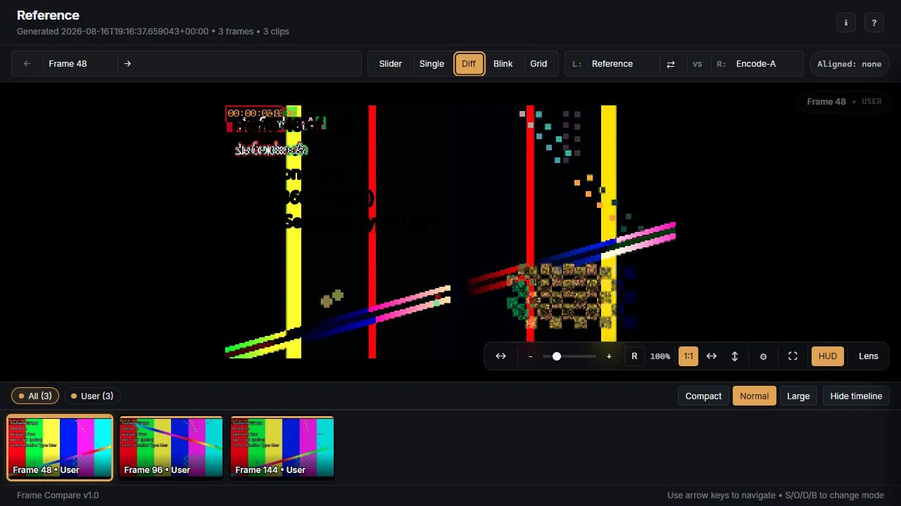

# Reports and overlays

Every completed comparison can produce a static HTML report that works without a web
server. The canonical `report.html` sits at the root of the reserved run folder beside
`screenshots/`; keeping that folder together preserves relative image loading when the
result is moved, archived, or opened on another machine.

Set `report.embed_images = true` only when a single larger HTML file is more useful than
the normal portable folder layout.

## Viewer modes

### Single

Single view shows one selected or active source.

Use this mode for source-specific inspection and quick checks before entering a dedicated
pair comparison.

### Slider

Slider mode reveals one source against another across a draggable divider. It is useful
for spatial differences such as crop, scaling, haloing, texture, denoising, grain, and
subtle tone changes.

### Diff

Diff mode emphasizes pixel differences between the selected pair. It is most useful as
a locator: identify where sources diverge, then switch back to slider or blink to judge
whether the difference is meaningful.

<figure class="fc-doc-figure">
  
  <figcaption>This controlled-pattern image is a changed-region locator, not representative source footage; switch back to slider or blink to judge a natural-image difference.</figcaption>
</figure>

### Pair blink

Blink alternates the selected pair. It is effective for grain structure, temporal
artifacts, small exposure changes, and differences that are difficult to see with a
stationary divider.

Use a comfortable interval and avoid treating browser timing as a frame-accurate video
playback measurement.

### Grid

Grid mode displays several sources together so outliers are easy to identify. Use it to
scan all encodes first, then choose a pair for detailed slider, diff, or blink review.

## Navigation and inspection

The viewer supports:

- frame and category navigation;
- a filmstrip for visual scanning;
- keyboard-oriented next/previous review;
- pan, zoom, fit, and viewport synchronization;
- source and pair selection;
- a metadata inspector;
- a lens for close inspection;
- browser-local review state and notes.

Report payload version 1.2 adds release-aware source presentation without changing
canonical source identity. Ordinary controls use compact, collision-safe release
descriptors; constrained grid and lens labels use shorter variants. Explicit source
labels remain authoritative. The Clips inspector and Report Information retain the
full primary identity and exact, wrapping filename, so shortened controls do not hide
the archival source name.

The v1.2 payload also preserves two distinct frame domains. The selected report frame
is the common comparison frame. Each visible image carries its own mapped, untrimmed
source frame, exact picture type, and exact-frame Dolby Vision RPU presence when the
renderer can prove them. The Frame inspector updates that source list with the current
Single, Slider, Diff, Blink, or Grid view; it does not present one reference-source
frame as universal truth.

The Clips inspector keeps archival source facts compact: complete file size, observed
signal, actual presentation state, and a non-full active picture when applicable. On
desktop it uses a wider responsive drawer; on narrower screens it overlays the stage.
Source names, filenames, and long signal/presentation values wrap without requiring a
document or Inspector horizontal scrollbar. Open Report Information for the Rendering
section. It always states whether tonemapping was applied and, when applied, provides
the full resolved settings in a closed-by-default advanced disclosure. No additional
report tab or permanent metadata panel is created.

Visible source HUD labels in Single, Slider, Diff, Blink, and Grid views append that
same complete file size when available. File size is decision context only: it is not
bitrate or evidence of visual quality, efficiency, or a comparison winner. Hiding the
HUD hides the size together with the source labels, including from Grid cell accessible
names.

The primary toolbar keeps frame navigation, view modes, and mode-specific context in
stable zones at desktop widths. It reflows to two rows and then a narrow stack as space
decreases, without changing keyboard order or replacing native controls.

Viewer state such as the current frame, mode, selected clips, reveal position, viewport,
and review notes can persist in the browser for that report. It does not rewrite the
HTML or run directory. Clearing browser storage or opening the report under a different
URL can remove that local state. Existing v1.1 reports remain self-contained and are not
migrated. Regenerated v1.2 reports start with fresh browser-local viewer and review state.
Review JSON is scoped to the exact report ID and payload version; it is not a migration
format.

## Screenshot overlays

Choose a baked screenshot overlay with the `--overlay` run option or
`screenshots.overlay_mode`:

| Mode | Use |
| --- | --- |
| `none` | No baked text; exact-frame facts remain available to the report |
| `minimal` | Source identity, then available comparison frame, picture type, and file size |
| `standard` | Minimal provenance plus one selection line, source resolution/size, and transformed output size when relevant |
| `diagnostic` | Standard context plus only observed signal, applied tonemap, HDR static, exceptional geometry, and proven exact-frame DV facts |

Frame numbering distinguishes the comparison frame from each mapped source frame when
they differ. The denominator, when shown, is the untrimmed source total. Picture type is
read from the exact selected original source frame; unknown values are simply omitted,
and screenshot generation still succeeds.

File size is the complete container storage cost, formatted with binary MiB/GiB/TiB
units. It does not rank quality, bitrate efficiency, or a comparison winner. Tonemap
target nits describe the configured output transform; they are not measured luminance
for the selected frame.

Overlay text is part of the rendered image. Viewer labels and controls are browser
presentation and can be hidden or changed without modifying the screenshots.
Frame Compare uses its bundled Inter Regular font for deterministic overlay typography
and glyph coverage across packaged Windows and Docker runtimes. The bundled font is
distributed under the SIL Open Font License 1.1.

The ordinary report is not a blind-comparison artifact: source identity can appear in
baked overlays, physical filenames, report metadata, and viewer labels.

## Recommended review sequence

1. Start in grid mode to identify obvious outliers.
2. Choose the reference and one comparison.
3. Use slider for spatial and texture differences.
4. Use diff to locate small changed regions.
5. Use blink to judge grain, exposure, and subtle presentation changes.
6. Inspect metadata and selection context when a frame looks suspicious.
7. Check several categories and both early and late aligned frames.
8. Record notes only after confirming source identity and alignment.

## Opening behavior

`report.auto_open = true` is the default for an interactive local run. Auto-open is
suppressed for JSON, quiet, and non-TTY output. A Docker container cannot open the host
browser; use the host helper and the exact path printed by the run.

## Archiving or sharing a local report

- Keep `report.html` and `screenshots/` together.
- Archive the complete run folder, not selected individual files.
- Prefer `report.embed_images = true` only when a single-file artifact is required.
- Review filenames and metadata before sharing; they may disclose source names.
- Browser-local notes are not automatically included in the run folder.
- Version 1.2 report metadata is archival raw evidence and resolved rendering state;
  moving the complete report folder does not turn local paths into identity data.

For exact opening precedence, persistence, and report-generation behavior, see the
[report contract](../current-cli-contract.md#report-auto-open-ownership) and
[Current Architecture](../current-architecture.md#report-viewer).
