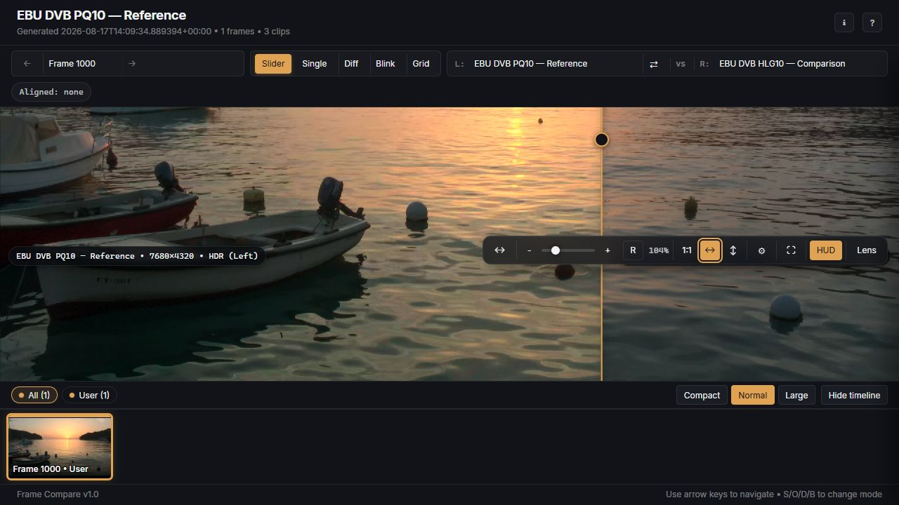
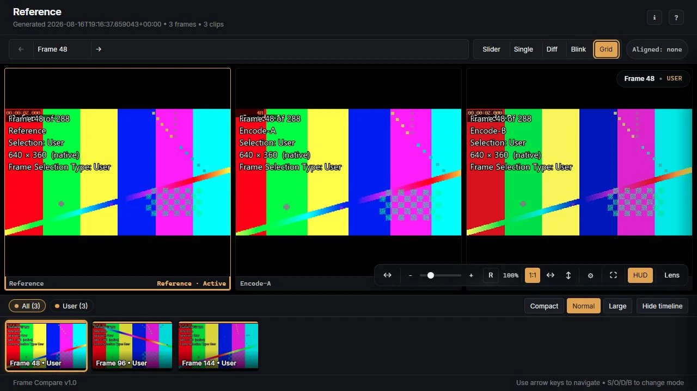
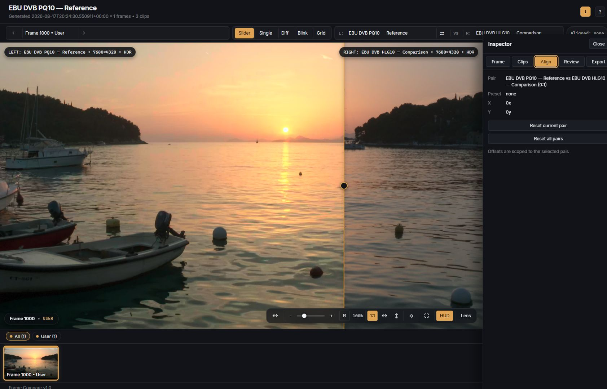

# Reports and overlays

Every completed comparison can produce a static HTML report that works without a web
server. The canonical `report.html` sits at the root of the reserved run folder beside
`screenshots/`; keeping that folder together preserves relative image loading when the
result is moved, archived, or opened on another machine.

Set `report.embed_images = true` only when a single larger HTML file is more useful than
the normal portable folder layout.

<figure class="fc-doc-figure">
  
  <figcaption>The canonical report view combines the natural EBU/DVB source pair, frame 1000 context, filmstrip navigation, and review controls.</figcaption>
</figure>

## Viewer modes

### Single and overlay

Single view shows one selected source. Overlay view places the selected pair in the same
viewport so opacity or presentation differences can be inspected without moving between
frames.

Use these modes for source-specific inspection, overlay diagnostics, and quick checks
before entering a dedicated pair comparison.

### Slider

Slider mode reveals one source against another across a draggable divider. It is useful
for spatial differences such as crop, scaling, haloing, texture, denoising, grain, and
subtle tone changes.

<figure class="fc-doc-figure">
  
  <figcaption>Move the divider away from center to inspect spatial, texture, crop, and scaling differences between the selected EBU/DVB pair.</figcaption>
</figure>

### Diff

Diff mode emphasizes pixel differences between the selected pair. It is most useful as
a locator: identify where sources diverge, then switch back to slider or blink to judge
whether the difference is meaningful.

<figure class="fc-doc-figure">
  
  <figcaption>This controlled-pattern image is a changed-region locator, not representative source footage; switch back to slider or blink to judge a natural-image difference.</figcaption>
</figure>

### Pair blink

Blink alternates the selected pair. It is effective for grain structure, temporal
artifacts, small exposure changes, and differences that are difficult to see with a
stationary divider.

Use a comfortable interval and avoid treating browser timing as a frame-accurate video
playback measurement.

### Grid

Grid mode displays several sources together so outliers are easy to identify. Use it to
scan all encodes first, then choose a pair for detailed slider, diff, or blink review.

<figure class="fc-doc-figure">
  
  <figcaption>Grid mode scans all three natural sources at the same selected frame; the Clips inspector keeps their full labels and HDR/SDR roles readable before pair review.</figcaption>
</figure>

## Navigation and inspection

The viewer supports:

- frame and category navigation;
- a filmstrip for visual scanning;
- keyboard-oriented next/previous review;
- pan, zoom, fit, and viewport synchronization;
- source and pair selection;
- a metadata inspector;
- a lens for close inspection;
- browser-local review state and notes.

<figure class="fc-doc-figure">
  
  <figcaption>The inspector keeps the selected pair and its alignment mapping visible without leaving the current report.</figcaption>
</figure>

Viewer state such as the current frame, mode, selected clips, reveal position, viewport,
and review notes can persist in the browser for that report. It does not rewrite the
HTML or run directory. Clearing browser storage or opening the report under a different
URL can remove that local state.

## Screenshot overlays

Choose a baked screenshot overlay with the `--overlay` run option or
`screenshots.overlay_mode`:

| Mode | Use |
| --- | --- |
| `none` | Clean image output when metadata is recorded elsewhere |
| `minimal` | Small source/frame identity |
| `standard` | Normal comparison labeling and context |
| `diagnostic` | Detailed color, HDR, selection, and source evidence when available |

Overlay text is part of the rendered image. Viewer labels and controls are browser
presentation and can be hidden or changed without modifying the screenshots.

The ordinary report is not a blind-comparison artifact: source identity can appear in
baked overlays, physical filenames, report metadata, and viewer labels.

## Recommended review sequence

1. Start in grid mode to identify obvious outliers.
2. Choose the reference and one comparison.
3. Use slider for spatial and texture differences.
4. Use diff to locate small changed regions.
5. Use blink to judge grain, exposure, and subtle presentation changes.
6. Inspect metadata and selection context when a frame looks suspicious.
7. Check several categories and both early and late aligned frames.
8. Record notes only after confirming source identity and alignment.

## Opening behavior

`report.auto_open = true` is the default for an interactive local run. Auto-open is
suppressed for JSON, quiet, and non-TTY output. A Docker container cannot open the host
browser; use the host helper and the exact path printed by the run.

## Archiving or sharing a local report

- Keep `report.html` and `screenshots/` together.
- Archive the complete run folder, not selected individual files.
- Prefer `report.embed_images = true` only when a single-file artifact is required.
- Review filenames and metadata before sharing; they may disclose source names.
- Browser-local notes are not automatically included in the run folder.

For exact opening precedence, persistence, and report-generation behavior, see the
[report contract](../current-cli-contract.md#report-auto-open-ownership) and
[Current Architecture](../current-architecture.md#report-viewer).
