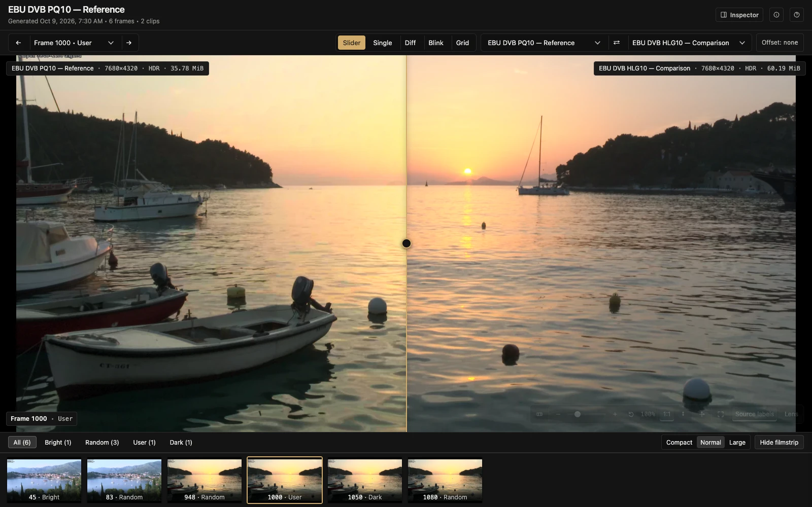
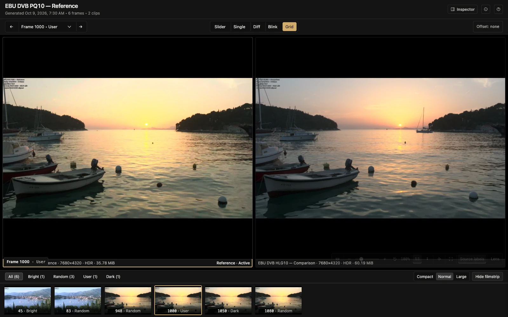
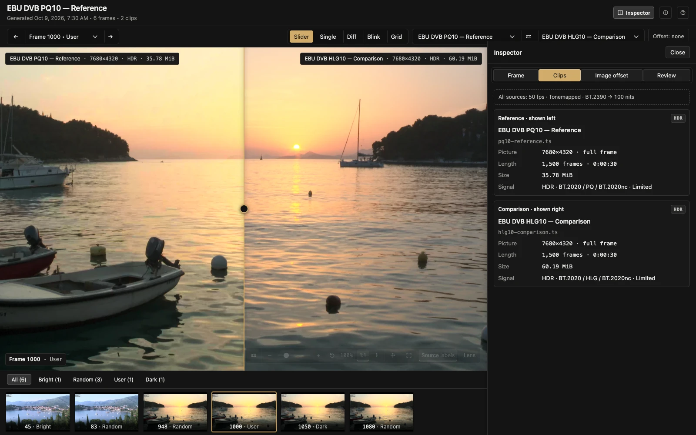
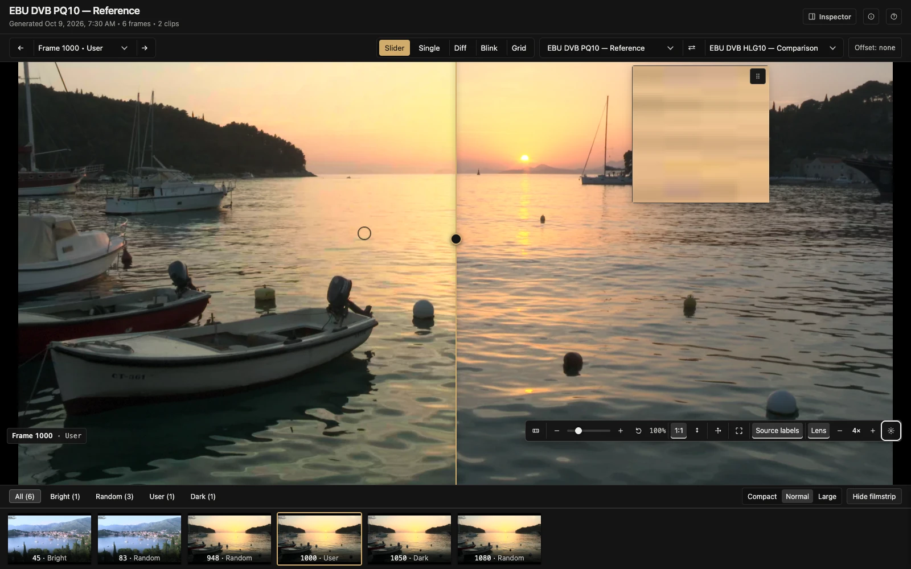
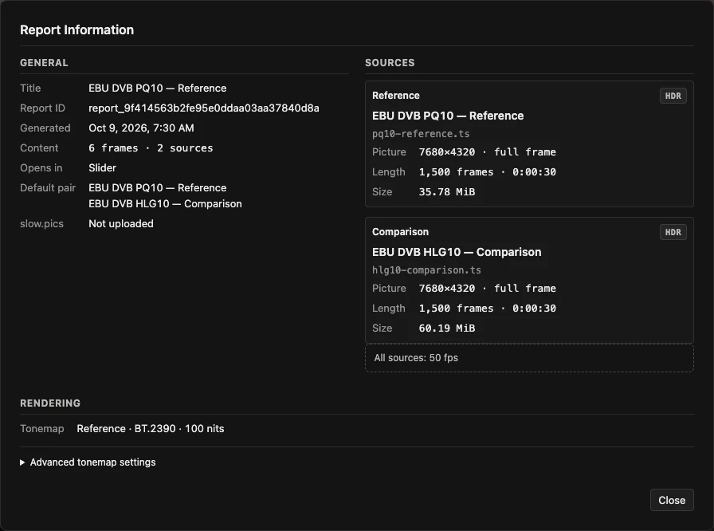

# Reports and overlays

The report is a static HTML page for comparing every rendered frame across your
sources; it opens in any current browser without a server.

<figure class="fc-figure">
  
  <figcaption>Slider mode reveals one source against another across the divider; source labels name each side. Footage © EBU, CC BY 4.0.</figcaption>
</figure>

## Open and keep a report

Every completed comparison can produce a static HTML report that works without a web
server. The canonical `report.html` sits at the root of the reserved run folder beside
`screenshots/`; keeping that folder together preserves relative image loading when the
result is moved, archived, or opened on another machine.

`report.auto_open = true` is the default for an interactive local run. Auto-open is
suppressed for JSON, quiet, and non-TTY output. A Docker container cannot open the host
browser; use the host helper and the exact path printed by the run.

Set `report.embed_images = true` when one HTML file is more convenient than a folder;
the file becomes much larger.

```toml
[report]
embed_images = true
```

## Views

`report.default_mode` sets the view a report opens in: `slider` (default), `overlay`
(Single), `diff`, or `blink`. Grid cannot be the default.

### Slider

Slider reveals one source against another across a draggable divider. Use it for spatial
differences such as crop, scaling, haloing, texture, denoising, grain, and subtle tone
changes.

### Single

Single shows one source at a time for source-specific checks.

### Diff

Diff highlights pixel differences between the selected pair. Use it to find where
sources diverge, then judge the difference in Slider or Blink.

### Blink

Blink alternates the selected pair, which reveals grain structure, small exposure
changes, and differences a stationary divider hides. Browser timing is not frame-accurate
playback.

### Grid

Grid shows every source together so outliers stand out. Scan here first, then pick a pair
for Slider, Diff, or Blink.

<figure class="fc-figure">
  
  <figcaption>Grid view keeps every source on screen; pick the outlier, then switch to Slider. Footage © EBU, CC BY 4.0.</figcaption>
</figure>

## Navigate and inspect

Move between frames with the frame selector, the arrow buttons, or the filmstrip, which
filters by category and has Compact, Normal, and Large sizes. Choose the pair with the
two source selectors and swap them with the button between them. The floating palette
over the image holds zoom, fit, viewport reset, fullscreen, **Source labels**, and
**Lens**. `report.include_filmstrip = false` hides the filmstrip, and `Offset: none` in
the toolbar refers to a spatial image offset, not to timing alignment.

Source selectors, the optional source labels, and baked overlays serve different
contexts. Selectors identify the source at the point of selection. Source labels stay
anchored to the viewport while zooming and panning, and are useful when baked text is
outside the visible area. Baked text stays with screenshots uploaded to slow.pics and is
unaffected by the source-labels toggle. When baked text already provides enough context,
hide source labels to reduce overlapping text; hiding them does not make the report blind
or anonymous, since source identity can remain in baked overlays, filenames, and report
metadata.

Source labels show each source's complete file size. File size is context, not bitrate or
a measure of quality. The header shows when the report was generated in your browser's
locale; hover it for the exact timestamp.

### Inspector

Open the Inspector with **Inspector** or <kbd>I</kbd>. Its **Frame** tab lists every
source's own frame number and picture type for the current comparison frame. **Clips**
shows each source's name, filename, picture size, length, file size, presentation, and
signal. **Image offset** shifts a source spatially and never changes timing. **Review**
holds bookmarks, tags, notes, and the preferred source.

<figure class="fc-figure">
  
  <figcaption>The Clips tab shows each source's identity, HDR signal, and how it was presented for review. Footage © EBU, CC BY 4.0.</figcaption>
</figure>

### Lens

Turn the lens on with **Lens** or <kbd>L</kbd> to magnify the area under the pointer.
Lens settings can add a caption naming the magnified source; in Diff it names both
sources. Drag the lens window's grip to move it.

<figure class="fc-figure">
  
  <figcaption>The lens magnifies the area under the pointer; drag its grip to move the window. Footage © EBU, CC BY 4.0.</figcaption>
</figure>

### Report information

The **Report information** button in the header opens the Report Information dialog: the
title, report ID, generated time, content, the **Opens in** view, the default pair, the
slow.pics link when uploaded, every source, and a Rendering section that states whether
tonemapping was applied and with which settings.

<figure class="fc-figure fc-figure--narrow">
  
  <figcaption>Report Information holds the report's metadata and rendering settings in one place. Footage © EBU, CC BY 4.0.</figcaption>
</figure>

### Keyboard shortcuts

| Action | Keys |
| --- | --- |
| Previous or next frame | <kbd>←</kbd> <kbd>→</kbd> |
| First or last frame | <kbd>Home</kbd> <kbd>End</kbd> |
| Cycle the source | <kbd>↑</kbd> <kbd>↓</kbd> |
| Select a source directly | <kbd>1</kbd>–<kbd>9</kbd> |
| Swap the pair | <kbd>X</kbd> |
| Slider, Single, Diff, Blink, Grid | <kbd>S</kbd> <kbd>O</kbd> <kbd>D</kbd> <kbd>B</kbd> <kbd>G</kbd> |
| Toggle source labels | <kbd>H</kbd> |
| Toggle the filmstrip | <kbd>F</kbd> |
| Toggle the Inspector | <kbd>I</kbd> |
| Toggle the lens | <kbd>L</kbd> |
| Pause Blink or change its speed | <kbd>Space</kbd> <kbd>[</kbd> <kbd>]</kbd> |
| Zoom in or out | <kbd>+</kbd> <kbd>-</kbd> |
| Reset the viewport | <kbd>R</kbd> or double-click |
| Open help | <kbd>?</kbd> |
| Close a panel or exit fullscreen | <kbd>Esc</kbd> |

## Review notes

Viewer state such as the current frame, mode, selected sources, reveal position, viewport,
and review notes can persist in the browser for that report. It does not rewrite the
HTML or run directory. Clearing browser storage or opening the report under a different
URL can remove that local state.

Exported review JSON applies only to the report it came from.

The Review tab holds the bookmark, tag, note, and **Preferred clip** fields alongside
**Export review JSON** and **Import review JSON**, the only ways to keep or transfer
notes outside the browser that made them. A persistent line states how many review
records are saved in this browser, and a fixed note beside it reminds that notes are
not stored in the report file. When browser storage is unavailable or a save fails, the
viewer says changes are kept only for that session instead of claiming a save that did
not happen; export review JSON while that message is showing to keep the notes. Import
previews additions, changes, and removals before merge or replace is applied, and an
import that cannot be validated or saved leaves existing records untouched.

## Screenshot overlays

Choose a baked screenshot overlay with the `--overlay` run option or
`screenshots.overlay_mode`:

| Mode | Use |
| --- | --- |
| `none` | No baked text; exact-frame facts remain available to the report |
| `minimal` | Source identity, then available comparison frame, picture type, and file size |
| `standard` | Minimal provenance plus one selection line, source resolution/size, and transformed output size when relevant |
| `diagnostic` | Standard context plus only observed signal, applied tonemap, HDR static, exceptional geometry, and proven exact-frame DV facts |

Bake the extra evidence into every screenshot:

```toml
[screenshots]
overlay_mode = "diagnostic"
```

`screenshots.include_frame_number = false` removes the frame number from baked overlays.

Frame numbering distinguishes the comparison frame from each mapped source frame when
they differ. The denominator, when shown, is the untrimmed source total. Picture type is
read from the exact selected original source frame; unknown values are omitted,
and screenshot generation still succeeds.

File size is the complete container storage cost, formatted with binary MiB/GiB/TiB
units. It does not rank quality, bitrate efficiency, or a comparison winner. Tonemap
target nits describe the configured output transform; they are not measured luminance
for the selected frame.

Overlay text is part of the rendered image. Viewer labels and controls are browser
presentation and can be hidden or changed without modifying the screenshots.
Frame Compare uses its bundled Inter Regular font for deterministic overlay typography
and glyph coverage across packaged Windows and Docker runtimes. The bundled font is
distributed under the SIL Open Font License 1.1.

## Recommended review sequence

1. Start in grid mode to identify obvious outliers.
2. Choose the reference and one comparison.
3. Use slider for spatial and texture differences.
4. Use diff to locate small changed regions.
5. Use blink to judge grain, exposure, and subtle presentation changes.
6. Inspect metadata and selection context when a frame looks suspicious.
7. Check several categories and both early and late aligned frames.
8. Record notes only after confirming source identity and alignment.

## Archive or share a report

- Keep `report.html` and `screenshots/` together.
- Archive the complete run folder, not selected individual files.
- Prefer `report.embed_images = true` only when a single-file artifact is required.
- Review filenames and metadata before sharing; they may disclose source names.
- Browser-local notes are not automatically included in the run folder.

The ordinary report is not a blind-comparison artifact: source identity can appear in
baked overlays, physical filenames, report metadata, and viewer labels.

For exact opening precedence, persistence, and report-generation behavior, see the
[report contract](../current-cli-contract.md#report-auto-open-ownership) and
[Current architecture](../current-architecture.md#report-viewer).
