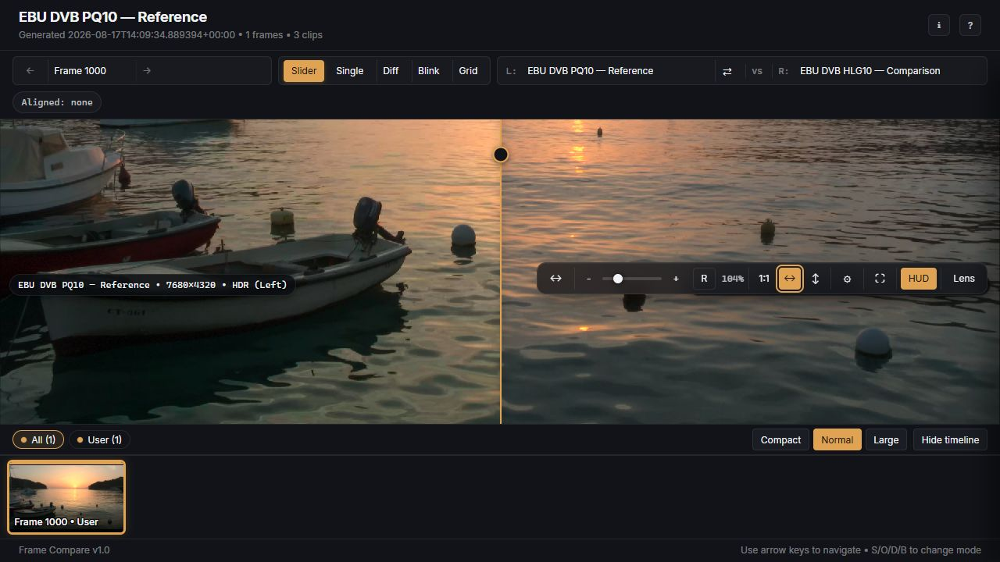

---
hide:
  - toc
---

<section class="fc-hero" markdown>

Deterministic video comparison

<h1 id="compare-sources-not-guesswork">
  Compare
  sources, not
  guesswork
</h1>

Select useful frames, align source timing, render HDR-aware screenshots, and review
every difference in a portable report.

[Choose an installation](getting-started/index.md){ .md-button .md-button--primary }
[View the report](guides/reports-and-overlays.md){ .fc-text-link }

<figure class="fc-hero-visual">
  
  <figcaption>One frame. Two sources. Every difference visible.</figcaption>
</figure>

</section>

## Start with the route that fits your system

Choose the supported package for your platform or bring your own media toolchain.

Windows 10/11 · Complete package

### Windows portable

The supported Python and media runtime, VSPreview, installer, updater, and rollback
tooling in one distribution.

[Install on Windows](windows-portable.md)

macOS + Linux · Reproducible

### Docker

The recommended headless route, with an isolated media toolchain and explicit host
mounts for reports and cache data.

[Start with Docker](getting-started/docker.md)

Advanced · Bring your own runtime

### Native source

For users who already manage FFmpeg, VapourSynth, source plugins, and a compatible
Vulkan implementation.

[Install from source](getting-started/native.md)

[Compare route capabilities and support posture](getting-started/route-comparison.md){ .fc-inline-cta }

## What a comparison gives you

### Frames worth inspecting

Reproducible user, random, dark, bright, and motion selection focused on shared
picture content.

### Sources that line up

Shared-window analysis, automatic audio alignment, trim handling, and optional
VSPreview review.

### Evidence you can share

HDR-aware screenshots and a portable offline report with slider, diff, blink, grid,
filmstrip, zoom, and inspection tools.

## Follow the workflow

<ol class="fc-steps">
  <li>
    01
    <h3>Understand the pipeline</h3>
    
See how probing, selection, alignment, rendering, caches, and optional network outputs fit together.

    <a href="guides/how-it-works/">How Frame Compare works</a>
  </li>
  <li>
    02
    <h3>Control the comparison</h3>
    
Choose the reference, label sources, handle trims or FPS metadata, and configure frame selection.

    <a href="guides/sources-and-labels/">Sources and labels</a>
     · 
    <a href="guides/analysis-modes/">Frame selection</a>
  </li>
  <li>
    03
    <h3>Review the result</h3>
    
Learn the viewer modes, keyboard-oriented workflow, metadata inspector, and portable report layout.

    <a href="guides/reports-and-overlays/">Reports and overlays</a>
  </li>
</ol>

## Find an answer

- [Configuration Recipes](guides/configuration-recipes.md) for common outcomes.
- [Troubleshooting](guides/troubleshooting.md) when a run fails.
- [Commands and Configuration](reference/commands-and-configuration.md) for command discovery.
- [CLI Behavioral Contract](current-cli-contract.md) for exact precedence, persistence, JSON, stream, and exit behavior.
- [Contributing](https://github.com/TJZine/frame-compare/blob/main/CONTRIBUTING.md) and the [Engineering Runbook](ENGINEERING_RUNBOOK.md) for project work.

