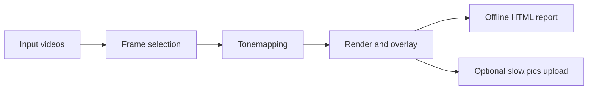

# Frame Compare

Frame Compare is a deterministic video-comparison pipeline that selects frames,
tonemaps HDR sources when needed, renders labeled screenshots, and produces an
offline HTML comparison report. Publishing to slow.pics is available as an explicit
opt-in.

**[Get started](getting-started/index.md)** ·
[Run a first comparison](guides/first-comparison.md)

## Choose a route

- **Windows portable** — the most complete Windows distribution, including
  VSPreview, PyQt6, and the native updater. [Install on Windows](windows-portable.md).
- **Docker** — the recommended reproducible, headless backend route for macOS and
  Linux. [Start with Docker](getting-started/docker.md).
- **Native source** — the advanced route for users who already manage Python,
  FFmpeg, VapourSynth, and L-SMASH-Works. [Install from source](getting-started/native.md).

## What it does

- Selects reproducible random frames or quality-oriented dark, bright, and motion
  frames.
- Aligns comparison clips using audio correlation, with optional interactive
  alignment where VSPreview is available.
- Tonemaps HDR sources and renders configurable screenshot overlays.
- Builds a static report that works offline, with slider, diff, blink, grid,
  navigation, zoom, and review tools.
- Can publish a completed comparison to slow.pics and notify a Discord-compatible
  webhook when you deliberately enable those integrations.

## How it works

## Find help

- Follow the [first-comparison guide](guides/first-comparison.md).
- Diagnose a problem with [Troubleshooting](guides/troubleshooting.md).
- Look up exact flags, configuration, and persistence behavior in the
  [CLI and configuration contract](current-cli-contract.md).
- Download published builds from [GitHub Releases](https://github.com/TJZine/frame-compare/releases).
