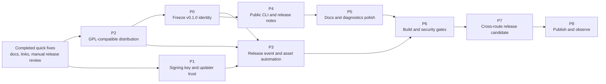

---
search:
  exclude: true
---

Status: Active
Scope: Initial public release readiness and production-review remediation
Owner: Maintainer

# Initial Release Production Remediation Plan

## Purpose

This plan converts the July 25, 2026 production-readiness review into bounded,
sequenced work packages for the first public Frame Compare release. It does not
authorize a release by itself. Each release blocker must be closed with the evidence
defined below before the first production tag is published.

The review baseline was branch `stage1` at commit
`eb88cbdb09099ee10e238da365c3d995d3eed20f`. Revalidate findings against the current
head before implementation if that baseline changes materially.

## Decision record and current status

Decisions recorded July 26, 2026:

| Area | Decision | Status |
| --- | --- | --- |
| First public version | Release as `v0.1.0` | Approved; bootstrap implementation remains |
| Initial squash title | Use a Conventional Commit such as `feat: prepare initial public release`; keep the detailed release inventory in the commit/PR body | Approved; a version-only title would not give Release Please a release type |
| Release review | Release Please PRs require human review; no automatic merge | Implemented with a workflow contract test |
| Support posture | Windows portable is the primary, most feature-complete route; default Docker is the primary headless macOS/Linux route; native source is advanced; NVIDIA/X11 remain experimental | Documented |
| Windows updates | Signed code-only updates are required for the first public Windows release | Approved; key generation, secret setup, and end-to-end proof remain |
| Release authentication | Configure `RELEASE_PLEASE_TOKEN` as a fine-grained PAT or GitHub App token so release-created events can trigger the Windows asset workflow | Approved; repository secret setup and proof remain |
| Licensing | Align Frame Compare with PyQt6 under `GPL-3.0-only`; do not purchase or depend on a commercial PyQt license | Repository relicensing implemented; exact-artifact compliance remains |
| User checksum guidance | Teach users to verify the published Windows ZIP against its `.sha256` asset | Implemented and strictly built |
| VSPreview recovery links | Point doctor hints to the canonical native-source Zensical guide | Implemented with focused adapter/CLI tests |

The current pre-release `main` head is
`d4dd09821d9503a583049b173df6210153912390`. If the entire `stage1` workstream is
squash-merged as the first public-release preparation commit, that `main` commit is
the intended one-time Release Please `bootstrap-sha`: it is the commit immediately
before the first changelog commit to include. Recalculate this value if `main`
advances before the squash merge.

## Scope

### Accepted findings

| ID | Finding | Type | Severity | Confidence | Release effect |
| --- | --- | --- | --- | --- | --- |
| F-01 | Windows release public key is still a placeholder | Confirmed defect | S1 | High | Blocks official Windows bundle and update release |
| F-02 | Release-event authentication may not trigger the Windows asset workflow | Insufficient deployment data / conditional defect | S1 | High in mechanism; environment unknown | Blocks automatic release assets unless a PAT or GitHub App token is configured |
| F-03 | First-release version and Release Please bootstrap history are ambiguous | Inferred release risk | S2 | High | Could publish an unintended `v0.2.0` or an oversized/misleading changelog |
| F-04 | PyQt6 redistribution under the project’s intended license posture lacks a recorded compatible-license disposition | Confirmed license mismatch requiring maintainer disposition | S1 | High | Blocks public Windows binary distribution until the project and artifact license posture is aligned |
| F-05 | Top-level and command-specific CLI help is too sparse for first-time users | Confirmed UX defect | S2 | High | Does not block mechanics, but materially harms first-use quality |
| F-06 | `CHANGELOG.md` read as internal phase/scaffold history instead of a public first-release changelog | Confirmed docs/release defect | S2 | High | Resolved with a concise user-facing alpha changelog; re-review the generated release PR |
| F-07 | Published Windows `.sha256` assets lacked user verification instructions | Confirmed docs defect | S3 | High | Resolved in the documentation package associated with this plan |
| F-08 | A doctor remediation hint points to a stale README installation anchor | Confirmed UX/docs defect | S3 | High | Resolved by linking to the native-source Zensical guide |
| F-09 | No clean Apple Silicon Docker proof was available during review | Verification gap | S2 | Medium | Do not claim Apple Silicon confidence until separately proved |
| F-10 | Optional Linux NVIDIA and X11 routes remain host-dependent and unproved in baseline CI | Known verification limitation | S3 | High | Keep labeled experimental; does not block supported default route |
| F-11 | Dependency vulnerability status was not independently audited for the release graph/bundle | Verification gap | S2 | Medium | Requires a release-time dependency/security audit |
| F-12 | Distribution build was not an explicit CI gate, despite clean archive build succeeding locally | Inferred build/release gap | S2 | Medium | Resolved with a required clean build, artifact inspection, fresh wheel install, and CLI smoke job |
| F-13 | Overlay font fallback can vary across hosts | Known determinism limitation | S3 | High | Document/test tolerance; do not claim cross-platform pixel identity |
| F-14 | Docker base image and system package inputs are not fully digest/snapshot pinned | Supply-chain hardening opportunity | S3 | Medium | Track after first-release blockers unless threat model elevates it |
| F-15 | Release-candidate asset installation and end-to-end use have not been rehearsed from the exact published artifacts | Verification gap | S1 | High | Blocks final go/no-go |

### Finding evidence and closure proof

| ID | Evidence | Risk mechanism | Closure proof |
| --- | --- | --- | --- |
| F-01 | `tools/windows_portable/update_public_key.xml` contains replacement markers and a non-release modulus; release/manual builds pass `-RequireReleasePublicKey` | The release path validates a key that cannot qualify as a real release key, so the official Windows build fails closed | Committed real public key validates; matching protected private key signs an update that the installed client accepts |
| F-02 | `.github/workflows/release-please.yml` falls back to `github.token`; `.github/workflows/windows-portable.yml` listens for a separate release event | GitHub suppresses new workflow runs caused by events created with `GITHUB_TOKEN`, so the release can exist without triggering asset creation | Confirm non-`GITHUB_TOKEN` credential and observe a disposable Release Please prerelease trigger the Windows workflow |
| F-03 | There are no prior release tags while `pyproject.toml` and `.release-please-manifest.json` already say `0.1.0`; the branch contains extensive feature history | Release Please may interpret `0.1.0` as already released and calculate a later version from all visible history | Previewed release PR/tag/changelog exactly match the maintainer-approved bootstrap version and commit boundary |
| F-04 | The Windows builder installs PyQt6/PyQt6-Qt6 into the public bundle; at the review baseline PyQt6 package metadata was `GPL-3.0-only` or commercial while the repository was Apache-2.0; the project is now `GPL-3.0-only` | Redistributing the combined release without inspecting the exact artifact’s license inventory and corresponding-source path could still leave compliance gaps | Inspect the exact artifact’s licenses, notices, and corresponding-source path after the completed project relicensing |
| F-05 | Generated CLI help shows command names and options with little or no explanatory text for key first-run surfaces | New users cannot infer safe command intent, defaults, or route-specific invocation from the CLI itself | Human-reviewed top-level and per-command help with focused contract tests |
| F-06 | `CHANGELOG.md` contains repeated internal phase/scaffold history and obsolete implementation detail | Release notes obscure actual user value and limitations and can misrepresent the initial release | First-release changelog reviewed as a concise user-facing capability/limitation record |
| F-07 | Workflow publishes `.sha256` assets, while the prior Windows guide only instructed users to download and execute the ZIP | Integrity data exists but users are not told how to use it | Published guide includes copy/paste verification and a fail-closed mismatch instruction |
| F-08 | A doctor recovery hint uses the old README `#installation` location while installation authority moved into Zensical guides | Diagnostic remediation sends users to stale or missing guidance | Focused diagnostic test asserts a live Zensical installation URL/anchor |
| F-09 | Linux amd64 Docker CI passed; the review host was Apple Silicon but its Docker daemon was unavailable | Architecture-specific image/plugin/runtime problems could remain undetected behind the broad macOS claim | Clean Apple Silicon Docker build, doctor, dry-run, SDR, and HDR proof—or a narrowed support claim |
| F-10 | NVIDIA and X11 profiles have dedicated host proof scripts but no compatible baseline CI hardware/session | Default Docker success does not establish GPU passthrough or desktop GUI behavior | Compatible-host proof plus manual GUI/GPU acceptance; otherwise retain experimental/unverified labels |
| F-11 | Dependabot and static security checks exist, but the review did not run a release-graph vulnerability audit | Known vulnerable transitive dependencies could ship despite source-code scans passing | Policy-defined audit of locked Python, container, and Windows bundle inputs with calibrated exceptions |
| F-12 | Clean archive `uv build` passed locally, but CI has no explicit wheel/sdist build-install job | Packaging-only regressions can merge even when source tests pass | CI builds both artifacts from clean checkout, inspects contents, installs the wheel fresh, and smokes the CLI |
| F-13 | Overlay code falls back through available system fonts | Font selection and metrics can vary by host, changing labels or pixels | Documented non-bit-determinism plus cross-route tolerance tests; bundle a controlled font only if product requirements demand it |
| F-14 | Docker versions are constrained in several places, but the base image and apt repository state are not fully immutable | Rebuilds at different times can consume changed upstream system inputs | Recorded decision and owner; if approved, digest/snapshot pinning plus a tested refresh process |
| F-15 | PR checks prove source/workflow paths, not a clean install and full workflow from the exact public downloads | Archive layout, signing, extraction, PATH, first-use, report, update, or uninstall defects can escape repository-level tests | Downloaded RC assets pass the complete platform acceptance matrix before the production tag |

### Excluded findings

- A failed `uv build` from one local dirty worktree is excluded as a repository
  defect. Untracked `.venv-r76-*` directories polluted that local source archive;
  the clean `git archive` build produced both wheel and sdist successfully.
- Large cohesive owners are architecture watch items, not release defects. No
  decomposition is authorized solely because of file length.
- Optional live TMDB, slow.pics, webhook, NVIDIA, and X11 behavior is not promoted to
  a default-route release blocker when it remains explicitly opt-in or experimental.

### Assumptions

- The first public release should present a conservative alpha-quality support
  contract.
- Windows portable and default headless Docker are intended first-class routes.
- Native source is an advanced route.
- PyPI and a public container registry are not promised release channels unless
  separately approved and implemented.
- No automatic upload or telemetry is introduced; slow.pics and webhooks remain
  explicit opt-ins.

### Constraints

- Preserve CLI/config/output contracts unless a package explicitly changes and
  documents them.
- Release and Windows portable changes are high risk under the engineering runbook.
- Signed updater verification requires protected external secret state and a Windows
  runner.
- Private signing key material must never enter the repository, task transcript,
  command line, CI logs, or release artifacts.
- The maintainer explicitly approved `GPL-3.0-only` on July 26, 2026. Preserve
  third-party license texts and do not expand that approval into dual licensing,
  copyright assignment, a CLA, or a commercial-license path.
- Only one active plan should exist for this workstream.

### Non-goals

- Broad architecture rewrites.
- Publishing to PyPI or a public container registry.
- Promoting NVIDIA or X11 profiles from experimental to generally supported.
- Guaranteeing bit-identical screenshots across operating systems and host fonts.
- Adding speculative compatibility layers or fallback update mechanisms.

## Evidence baseline

### Passed review gates

| Gate | Result at review baseline |
| --- | --- |
| Pyright strict warnings gate | Passed: 0 errors, 0 warnings |
| Ruff | Passed |
| Bandit, medium severity and above | Passed: no medium/high findings |
| Full pytest suite | Passed, with expected platform/runtime skips |
| Branch coverage | 89.87%, above the 80% floor |
| Import Linter | Passed: 2 contracts kept, 0 broken |
| Generated API docs check | Passed |
| Traceability validation | Passed |
| Clean archive wheel and sdist build | Passed |
| `git diff --check` | Passed |
| Current-head GitHub CI, docs, Docker, and Windows PR checks | Passed |

These results establish a strong code-quality baseline but do not prove release
orchestration, secrets, legal permission, optional hardware routes, or the final
published artifacts.

### Positive controls to preserve

- Workspace path containment and symlink defenses.
- Atomic writes, locks, and explicit run lifecycle records.
- Upload disabled by default and webhook secrets excluded from persisted TOML.
- SSRF controls and redaction around external integrations.
- Structured subprocess arguments rather than shell command construction.
- Hash-pinned Windows runtime downloads and commit-pinned GitHub Actions.
- Offline HTML reporting with no telemetry found in the review.
- Signed-update design with file hashing, dependency fingerprint checks, backups,
  rollback, and fail-closed behavior.

## Plan summary

Overall approach: make release identity and legal/signing prerequisites explicit
first; repair automation next; improve user-facing release surfaces; add missing
build/security gates; then perform an exact-artifact release-candidate rehearsal.

Highest-risk package: P1, because the real public/private key relationship and its
protected secret handling define whether Windows updates can be trusted.

Verification strategy: every package has a focused proof, then the repository-wide
gate is rerun before the release candidate. The final gate tests downloaded
artifacts rather than workspace outputs.

Recommended sequence:

## Package overview

| Package | Findings | Risk reduced | Scope size | Exit gate |
| --- | --- | --- | --- | --- |
| P0: Freeze first-release identity | F-03 | Wrong version/tag/changelog baseline | Small, decision-heavy | Dry-run Release Please output matches intended first tag |
| P1: Establish Windows signing trust | F-01 | Broken release build or untrusted updates | Medium, security-sensitive | Manual signed update verifies and applies using committed public key |
| P2: Resolve binary redistribution posture | F-04 | Ambiguous/incompatible public bundle license posture | Decision plus metadata/distribution changes | Explicit GPL decision and exact-artifact license/source inspection |
| P3: Prove release-to-asset automation | F-02, F-15 | Tag published without downloadable Windows assets | Medium, release workflow | Disposable prerelease triggers asset workflow and attaches expected assets |
| P4: Polish public CLI and changelog | F-05, F-06, F-08 | Poor first-use and misleading release notes | Medium | Help snapshots/contracts and public changelog review pass |
| P5: Complete user install guidance | F-07, F-10, F-13 | Unsafe download handling or inflated support claims | Small | Strict Zensical build and route-doc review |
| P6: Add release build/security gates | F-11, F-12, F-14 | Undetected package/dependency/supply-chain regression | Medium | Clean package job and documented security audit pass |
| P7: Rehearse exact release candidate | F-09, F-10, F-15 | Untested first-use experience or platform regression | Large verification package | Exact-asset acceptance matrix passes or unsupported routes are relabeled |
| P8: Publish and observe | All closed findings | Release execution/rollback risk | Small, operational | Assets, checksums, docs, notes, and smoke tests verified after publication |

## Packages

### P0: Freeze first-release identity

Accepted finding IDs: F-03.

Goal: produce the approved first public tag `v0.1.0` and make Release Please consider
only the intended squash-merged release-preparation commit.

Risk reduced: unintended SemVer, enormous generated release notes, or a release PR
that treats unreleased development history as already released.

Scope:

- Use `0.0.0` as the pre-release package/manifest baseline and explicitly set the
  one-time Release Please target to `0.1.0`.
- Set top-level `bootstrap-sha` to the full commit immediately before the initial
  release-preparation squash. Use
  `d4dd09821d9503a583049b173df6210153912390` only if `main` has not advanced.
- Use a Conventional Commit squash title such as
  `feat: prepare initial public release`; put the comprehensive change inventory in
  the commit/PR description.
- Keep Release Please PRs human-reviewed. Automatic merge has already been removed
  and is protected by a focused workflow test.
- Preview the resulting release PR title, version files, and changelog content.
- Remove the one-time `bootstrap-sha` and forced `release-as` setting immediately
  after the successful `v0.1.0` release so later versions return to normal
  Conventional Commit calculation.

Out of scope: changing the project’s long-term SemVer policy.

Primary files/symbols:

- `.release-please-manifest.json`
- `release-please-config.json`
- `.github/workflows/release-please.yml`
- `pyproject.toml`
- `src/frame_compare/__init__.py`
- `CHANGELOG.md`

Expected behavior change: the first release PR proposes exactly the approved tag and
only the intended public release history.

Implementation approach:

1. Reconfirm the current `main` head immediately before the squash merge.
2. Align the three version sources at `0.0.0`, configure that commit as
   `bootstrap-sha`, and force the one-time target `release-as` to `0.1.0`.
3. Squash-merge with a Conventional Commit title.
4. Let Release Please open—but never automatically merge—the `0.1.0` release PR.
5. Review every version and changelog mutation before merging it.
6. Remove one-time bootstrap/forced-version configuration after the release.

Verification:

- Release Please dry run or disposable branch/repository proof.
- Confirm version agreement across `pyproject.toml`,
  `.release-please-manifest.json`, generated tag, and release notes.
- Confirm no unexpected historical commits appear.

Rollback / safety notes: keep the release PR unmerged until its output is accepted.
Do not delete or rewrite shared history to solve bootstrap configuration.

Dependencies: none.

Risks: changing version metadata without matching Release Please state can create
repeated or skipped release PRs.

Open questions: none. Recalculate `bootstrap-sha` if `main` advances.

Suggested owner role: maintainer plus release-workflow implementer.

### P1: Establish Windows signing trust

Accepted finding IDs: F-01.

Goal: replace the placeholder update public key with the public half of a protected
release keypair and prove the complete signed-update lifecycle.

Risk reduced: official Windows builds currently fail release-key validation, and an
incorrect key relationship would make legitimate updates unverifiable.

Scope:

- Add a maintainer-only PowerShell key-generation script with explicit public and
  private output paths and no logging of private parameters.
- Generate a release RSA keypair using an approved offline process.
- Commit only the public key with a real key ID and generation date.
- Store the private key XML as the protected
  `WINDOWS_UPDATE_SIGNING_KEY_XML` Actions secret.
- Validate the public key with the repository script.
- Build, sign, verify, apply, and roll back a code-only update on Windows.
- Record key custody, backup, rotation, and compromise-response ownership outside
  the repository’s public source.

Out of scope: committing private key material or redesigning the updater.

Primary files/symbols:

- `tools/windows_portable/update_public_key.xml`
- `tools/windows_portable/validate_update_public_key.ps1`
- `tools/windows_portable/sign_update.ps1`
- `tools/windows_portable/shim/frame-compare-update.ps1`
- `.github/workflows/windows-portable.yml`

Expected behavior change: release/manual bundle builds accept the committed public
key, signed update assets contain a valid signature, and installed clients verify
that signature before applying changes.

Implementation approach:

1. Add and test the maintainer key-generation procedure without creating a real
   private release key in the repository or task environment.
2. The maintainer generates and backs up the real keypair on a trusted Windows
   machine outside CI logs and the repository.
3. Replace the placeholder public key and metadata.
4. Configure the private key as `WINDOWS_UPDATE_SIGNING_KEY_XML`.
5. Use `workflow_dispatch` to exercise the protected signing path.
6. Download the artifact, verify it offline, apply it to a test bundle, and roll
   back.

Verification:

- `validate_update_public_key.ps1` passes.
- `build_portable.ps1 -RequireReleasePublicKey` passes on Windows.
- Workflow output reports `signed=true`.
- `update-manifest.sig` exists.
- Tampering with the manifest or payload is rejected.
- Valid update apply and rollback both succeed.
- Logs and uploaded artifacts contain no private key material.

Rollback / safety notes: never rotate the committed public key without a migration
decision for already-installed clients. Revoke/stop release immediately if private
key exposure is suspected.

Dependencies: P0 for versioned artifact naming.

Risks: secret formatting, newline encoding, or mismatched key halves can cause a
false sense of readiness if only the build—not client verification—is tested.

Open questions:

- Which maintainer-controlled encrypted store owns the offline backup?
- What documented event triggers rotation or release suspension?

Suggested owner role: maintainer and security-aware Windows release implementer.

### P2: Resolve binary redistribution posture

Accepted finding IDs: F-04.

Goal: align the project and Windows distribution with PyQt6’s
`GPL-3.0-only` terms without buying commercial licenses.

Status: repository relicensing is complete; exact Windows artifact and
corresponding-source verification remain.

Risk reduced: public distribution without satisfying applicable GPL/commercial and
Qt obligations.

Scope:

- Retain the completed GPLv3 project-license, package metadata, badge, user
  documentation, contributor terms, and bundle project-license output changes.
- Inventory the exact PyQt6, PyQt6-Qt6, Qt, and related packages shipped.
- Preserve every applicable third-party license and notice; Apache-2.0 components
  retain their original notices within the GPLv3 distribution.
- Make complete corresponding source and build/install scripts available beside or
  clearly linked from every Windows binary release.
- Update bundle licenses/notices and user documentation to match the chosen outcome.

Out of scope: purchasing commercial licenses, replacing VSPreview/PyQt6, or
presenting this engineering plan as legal advice.

Primary files/symbols:

- `uv.lock`
- `pyproject.toml`
- `tools/windows_portable/build_portable.ps1`
- bundled `licenses/` output
- `docs/windows-portable.md`

Expected behavior change: project licensing and distribution metadata change to
`GPL-3.0-only`; runtime behavior and the feature-complete Windows bundle remain
unchanged.

Implementation approach: preserve the approved repository license change and freeze
public Windows distribution until the exact bundle/source pair passes the license
inventory.

Verification:

- Exact bundle software bill of materials reviewed.
- Required license texts, notices, and source/offers are present.
- Clean extracted artifact is inspected rather than relying on build inputs.
- Written maintainer approval records the chosen `GPL-3.0-only` basis.

Rollback / safety notes: if unresolved, do not publish the Windows binary. Continue
with source-only routes only if their own distribution posture is separately clear.

Dependencies: none; run in parallel with P0/P1.

Risks: removing PyQt6 may change the “most complete distribution” promise and require
same-pass user documentation updates.

Open questions:

- What exact release asset or repository link is the canonical corresponding-source
  location for each Windows binary tag?

Suggested owner role: maintainer with focused open-source license-compliance review.

### P3: Prove release-to-asset automation

Accepted finding IDs: F-02 and the automation portion of F-15.

Goal: ensure a Release Please-created GitHub release reliably triggers the Windows
portable workflow and attaches every intended asset.

Risk reduced: a successful tag/release with no Windows binary because GitHub
suppresses workflow chaining from events created with `GITHUB_TOKEN`.

Scope:

- Confirm `RELEASE_PLEASE_TOKEN` exists and is a PAT or GitHub App token with the
  minimum required repository permissions.
- Confirm branch protections and token identity permit release PR creation/merge.
- Verify a release created by that identity produces a `release: published` event.
- Make the Windows workflow fail closed when required release assets or signing
  prerequisites are absent.
- Require a signed code-only update asset and checksum for every public Windows
  release.

Out of scope: broad changes to repository permissions unrelated to release.

Primary files/symbols:

- `.github/workflows/release-please.yml`
- `.github/workflows/windows-portable.yml`
- repository Actions secrets/settings

Expected behavior change: published releases deterministically launch the asset
workflow, and release completion clearly fails when mandatory assets are missing.

Implementation approach:

1. Audit secret presence and token permissions without exposing the token.
2. Create a disposable prerelease or RC tag through the actual Release Please path.
3. Observe the release event and Windows workflow.
4. Require the portable ZIP and checksum, plus the signed update ZIP and checksum,
   for every public Windows release and release-like manual rehearsal.

Verification:

- Release Please run identifies the intended token path.
- Windows workflow starts from the release event without manual intervention.
- Checkout resolves the exact tag.
- Versioned portable ZIP and `.sha256` attach to the GitHub release.
- Signed update ZIP and `.sha256` attach for every public Windows release.
- A deliberately missing required secret or asset produces an explicit failure.

Rollback / safety notes: use a prerelease and delete only the disposable release/tag
after capturing evidence. Do not test workflow chaining for the first time on the
official stable tag.

Dependencies: P0, P1, and P2.

Risks: a token can create the release PR yet still lack a permission needed later.

Open questions: should release publication be separated from asset readiness to
avoid a temporary empty release?

Suggested owner role: release-workflow implementer.

### P4: Polish public CLI and changelog

Accepted finding IDs: F-05, F-06, and F-08.

Status: the doctor link and public-alpha changelog are complete; CLI command and
option help remain.

Goal: make the CLI self-explanatory and the first public changelog concise,
user-oriented, and accurate.

Risk reduced: users cannot discover commands/options from `--help`, encounter a dead
diagnostic link, or see internal development scaffolding presented as release notes.

Scope:

- Add descriptions to top-level `run`, `wizard`, `doctor`, history, and updater
  surfaces as applicable.
- Add concise help for public `run` options, including effects, defaults, and
  persistence where relevant.
- Preserve stdout/stderr, exit-code, JSON, and lazy-import contracts.
- Preserve the completed doctor-link fix to the canonical native-source Zensical
  guide.
- Rewrite the unreleased/first-release changelog around user capabilities,
  limitations, security/privacy posture, install routes, and known issues.

Out of scope: renaming commands or redesigning configuration.

Primary files/symbols:

- `src/frame_compare/cli/entry.py`
- diagnostic check owners that produce the stale link
- CLI help/contract tests
- `docs/current-cli-contract.md`
- `CHANGELOG.md`

Expected behavior change: `frame-compare --help` and command help provide actionable
descriptions; diagnostics link to a live page; the changelog reads as a public alpha
release.

Implementation approach:

- Treat help text as a public contract.
- Keep descriptions short enough to scan in a terminal.
- Add focused tests for command descriptions and essential option semantics.
- Separate end-user changes from internal refactors in the changelog.

Verification:

- Capture and review `frame-compare --help`.
- Capture and review help for every documented command.
- Run CLI contract tests and full verification.
- Build Zensical strictly and check every diagnostic documentation link.
- Have a first-time user review the changelog and quickstart language.

Rollback / safety notes: help-only changes should not alter callbacks, defaults, or
option parsing. Inspect generated help and JSON modes for accidental output drift.

Dependencies: P0 for final version/release-note framing.

Risks: Typer annotations can alter parsing behavior if descriptions are added through
the wrong declaration shape.

Open questions: which known limitations belong in the changelog versus the
installation chooser and troubleshooting guide?

Suggested owner role: CLI implementer with documentation review.

### P5: Complete user install guidance

Accepted finding IDs: F-07, F-10, and F-13.

Goal: give users one accurate installation decision surface without overstating
experimental or cross-platform behavior.

Risk reduced: choosing an unsuitable route, trusting an unverified ZIP, assuming
optional Docker profiles are supported by default, or expecting bit-identical
cross-platform overlays.

Scope:

- Maintain the route comparison, decision graph, runtime matrix, and feature matrix
  in `docs/getting-started/index.md`.
- Maintain Windows checksum instructions.
- Keep Docker NVIDIA/X11 labeled host-dependent and separately verified.
- State that native pip and Docker are build/install-from-clone routes until public
  registries exist.
- State that host fonts/GPU/runtime can affect rendered details.

Out of scope: changing actual platform support or publishing new distribution
channels.

Primary files/symbols:

- `docs/getting-started/index.md`
- `docs/windows-portable.md`
- `docs/getting-started/docker.md`
- `docs/getting-started/native.md`
- `docs/docker-environments.md`
- `zensical.toml`

Expected behavior change: documentation only.

Implementation approach: keep one summary authority and link to route-specific
procedures rather than duplicating commands across pages.

Verification:

- `uv run --no-sync zensical build --clean --strict`
- Manual desktop/mobile review of wide tables and Mermaid rendering.
- Link check through the strict build.
- Compare claims against Dockerfiles, Compose files, Windows manifest, and
  `pyproject.toml`.

Rollback / safety notes: revert individual claims that cannot be traced to code,
workflow, or a successful host proof.

Dependencies: none; documentation baseline delivered with this plan.

Risks: capability matrices become stale when bundle contents or profiles change.
Update them in the same pass as those release surfaces.

Open questions: none for the current documented support posture.

Suggested owner role: documentation owner.

### P6: Add release build and security gates

Accepted finding IDs: F-11, F-12, and F-14.

Status: the distribution build/install/inspection CI gate is complete. Dependency
audit policy, the Windows bundle inventory, and the Docker pinning decision remain.

Goal: catch distribution and dependency problems before merge or release and record
the remaining container pinning decision.

Risk reduced: unbuildable wheel/sdist, vulnerable locked dependencies, or mutable
system inputs changing release behavior unexpectedly.

Scope:

- Add a clean-tree wheel/sdist build job.
- Inspect wheel and sdist contents and install the wheel in a fresh environment.
- Run an appropriate Python dependency vulnerability audit against the locked graph.
- Produce/review a Windows bundle software bill of materials or equivalent exact
  dependency inventory.
- Decide whether Docker base images should be digest-pinned and whether apt inputs
  need a snapshot strategy.
- Configure update ownership for audit findings and pin refreshes.

Out of scope: replacing every dependency because a scanner emits an uncalibrated
warning.

Primary files/symbols:

- `.github/workflows/ci.yml`
- `scripts/verify_distribution.py`
- `pyproject.toml`
- `uv.lock`
- `Dockerfile`
- Windows bundle manifests/build outputs

Expected behavior change: CI rejects broken distributions and policy-defined
vulnerabilities; Docker input pinning may become stricter if approved.

Implementation approach:

1. Reproduce the already-passing clean archive build in CI.
2. Validate artifact contents and fresh installation.
3. Select an audit tool and severity/exception policy.
4. Calibrate every result; record owner and expiry for accepted exceptions.
5. Decide Docker digest/snapshot pinning separately from the build-gate change.

Verification:

- Build wheel and sdist from a clean checkout.
- Install wheel in a new Python 3.13 environment; run version/help smoke tests.
- Inspect archive paths for local virtualenvs, caches, secrets, and generated output.
- Dependency audit passes or only documented, time-bounded exceptions remain.
- Docker integration gate passes after any pinning change.

Rollback / safety notes: do not silently loosen audit thresholds to make CI green.
Separate unavailable upstream fixes from false positives and accepted risk.

Dependencies: P2 informs bundle dependency policy; P5 captures current user claims.

Risks: digest/snapshot pinning increases maintenance and may reduce automated security
updates unless paired with an update process.

Open questions:

- Which vulnerability database/tool is the release authority?
- What severity blocks an alpha release?
- Who owns recurring base image and system package refreshes?

Suggested owner role: build/release engineer with security review.

### P7: Rehearse the exact release candidate

Accepted finding IDs: F-09, F-10, and F-15.

Goal: test what users will actually download or build, on the supported host matrix,
before publishing the official tag.

Risk reduced: “works in the repository” but fails after download, extraction,
installation, first configuration, rendering, report use, update, or uninstall.

Scope:

- Produce a prerelease/RC through the real release path.
- Test Windows portable from the downloaded ZIP.
- Test default Docker on Linux amd64 and Apple Silicon/macOS if that support claim is
  retained.
- Test native `uv` from a clean clone.
- Smoke the pip route in a fresh virtual environment.
- Test optional live integrations only with disposable credentials/content.
- Run optional NVIDIA/X11 proofs only on compatible hosts; otherwise retain
  experimental/unverified labels.

Out of scope: claiming support for unavailable hardware.

Primary artifacts:

- Versioned GitHub release ZIPs and checksums
- Source archive/clean clone
- Built Docker image from the tagged source
- Generated reports and run records

Expected behavior change: none unless failures are found; failures return to the
owning package before release.

Manual Windows acceptance:

1. Download ZIP and `.sha256`; verify before extraction.
2. Run `install.cmd` from a clean user profile or disposable VM.
3. Open a new terminal and run version/help.
4. Run wizard, doctor, and dry-run.
5. Complete one SDR and one HDR comparison.
6. Exercise VSPreview/manual alignment.
7. Open the offline report; check overlays, navigation, run history, and paths.
8. Apply a signed code-only update, reject a tampered update, and roll back.
9. Run uninstall and confirm user media/output is retained.

Docker/native acceptance:

1. Follow only the published guide from a clean clone.
2. Run wizard, doctor, dry-run, SDR, and HDR workflows.
3. Open the report using the documented host helper for Docker.
4. Confirm generated files are host-owned and persist after container removal.
5. Confirm slow.pics remains disabled until explicitly enabled.

Verification:

- Full repository gate passes at the release commit.
- Documentation strict build passes.
- Linux amd64 Docker integration passes.
- Apple Silicon/macOS default Docker first-run passes or the support claim is narrowed.
- Windows exact-asset checklist passes.
- Native `uv` and pip smoke checks pass.
- No blocker or unexplained warning remains.

Rollback / safety notes: use disposable media, accounts, webhooks, and credentials.
Delete/revoke test integrations after the rehearsal. Never promote an RC tag or
asset in place; fix and cut a new RC.

Dependencies: P0 through P6.

Risks: optional network services can change independently; record date, region, and
service response without treating them as deterministic local gates.

Open questions:

- Which maintainers/testers own Windows, Linux amd64, and Apple Silicon acceptance?
- What sample clips may be redistributed or used privately for repeatable SDR/HDR
  checks?

Suggested owner role: release manager with platform testers.

### P8: Publish and observe

Accepted finding IDs: all findings after their owning packages close.

Goal: publish the official first release only after the release candidate evidence is
accepted, then verify the public experience.

Risk reduced: incomplete assets, stale docs, incorrect latest-release pointers, or
silent first-hour failures.

Scope:

- Merge the reviewed release PR.
- Observe the tag, GitHub release, Windows workflow, and docs deployment.
- Verify public asset names, checksums, release notes, and links.
- Repeat lightweight download/install smoke tests from the public release.
- Define an issue template/label and response owner for alpha testers.
- Record known limitations and rollback/yank criteria.

Out of scope: adding features during release execution.

Expected behavior change: the approved release becomes publicly available.

Verification:

- Tag and displayed version match P0.
- Every mandatory asset and checksum is attached.
- Windows signature and checksum verify after public download.
- Documentation points to the correct release and routes.
- A fresh user can reach a local report using only public instructions.
- Security contact and issue-reporting links work.

Rollback / safety notes: if a security/signing/licensing blocker appears, stop
distribution and clearly mark affected assets/releases. Prefer a corrective release
over mutating an already-used tag.

Dependencies: P7 accepted with no open release blockers.

Risks: GitHub/docs propagation delays; distinguish delays from failed workflows.

Open questions: define the exact stop-distribution and hotfix decision owners before
merging the release PR.

Suggested owner role: maintainer/release manager.

## Sequencing and concurrency

| Sequence | Work | Parallelism |
| --- | --- | --- |
| 0 | User install docs, checksum instructions, stale VSPreview links, and release auto-merge removal | Completed baseline; retain tests and strict docs proof |
| 1 | Finish P2 exact-artifact license inventory and corresponding-source proof | Repository relicensing is complete; finish before P0/P3 release rehearsal |
| 2 | P1 signing-key tooling and maintainer key generation | May begin alongside P2 when documentation files do not overlap |
| 3 | P0 `v0.1.0` bootstrap configuration | Starts after P2 settles `pyproject.toml`; recalculate `bootstrap-sha` immediately before merge |
| 4 | P4 remaining CLI help and final generated-release-note review | Public alpha changelog is complete; confirm Release Please output after P0 |
| 5 | P3 release authentication and exact event-chain proof | Starts only after P0/P1/P2 have usable release state |
| 6 | P6 dependency audit policy, Windows inventory, and Docker pinning decision | Distribution build/install/inspection CI gate is complete |
| 7 | P7 exact RC rehearsal | Only after every prior blocker package exits |
| 8 | P8 official publish | Only after explicit maintainer go/no-go |

Do not combine P1 signing changes, P2 licensing changes, and P4 CLI cleanup in one
pull request. They have different reviewers, rollback strategies, and proof surfaces.

## Verification matrix

| Gate | P0 | P1 | P2 | P3 | P4 | P5 | P6 | P7/P8 |
| --- | --- | --- | --- | --- | --- | --- | --- | --- |
| `git diff --check` | Yes | Yes | Yes | Yes | Yes | Yes | Yes | Yes |
| Pyright/Ruff/Bandit/pytest/import-linter | If executable config changes | Yes | If bundle/build changes | Yes | Yes | Docs-only minimum otherwise | Yes | Yes |
| API docs drift check | If public API docs touched | No | No | No | Yes | Yes | Yes | Yes |
| Strict Zensical build | If release docs touched | If docs touched | Yes | If docs touched | Yes | Yes | If docs touched | Yes |
| Windows portable build/smoke | No | Required | Required if bundle changes | Required | No | No | If bundle inputs change | Required |
| Signed update apply/rollback/tamper | No | Required | If updater composition changes | Required | No | No | No | Required |
| Default Docker integration | No | No | No | No | No | Docs-only claim audit | Required if Docker changes | Required |
| Optional NVIDIA/X11 proof | No | No | No | No | No | Only on compatible hosts | If profiles change | Best effort; otherwise keep experimental |
| Clean wheel/sdist + fresh install | Version check | No | No | No | Yes | No | Required | Required |
| Dependency/license inventory | No | Windows key tooling only | Required | No | No | No | Required | Confirm final artifacts |

## Review gates

### Gate A: Decisions recorded

- First tag/version and Release Please bootstrap approved.
- Windows update key owner and custody process approved.
- PyQt6/Qt redistribution disposition approved.
- Mandatory first-release asset list approved.

Failure condition: any decision is implied only by code or an agent assumption.

### Gate B: Automation proved

- Actual token identity can trigger downstream workflows.
- Signed update and portable bundle build from the tagged source.
- Missing mandatory prerequisites fail explicitly.

Failure condition: any required path is only inferred from a pull-request check.

### Gate C: Public surfaces polished

- CLI help is complete.
- Changelog is user-oriented.
- Install chooser and checksum instructions are accurate.
- No stale recovery links remain.

Failure condition: a first-time user needs repository-internal knowledge to complete
the quickstart.

### Gate D: Release candidate accepted

- Exact downloaded artifacts pass platform checklists.
- All first-class route claims have current evidence.
- Experimental routes remain clearly labeled where evidence is unavailable.
- No open S1 or S2 release blocker remains.

Failure condition: unresolved signing, licensing, asset automation, supported-host,
or exact-artifact issue.

## Release go/no-go checklist

### No-go conditions

- Placeholder or mismatched Windows public key.
- Missing/untested private signing secret when signed updates are promised.
- No written PyQt6/Qt distribution disposition.
- Release Please cannot demonstrably trigger the Windows release workflow.
- Intended first tag/version is unresolved.
- Exact Windows release ZIP has not passed clean-install acceptance.
- A first-class platform route fails its documented doctor/dry-run/render path.
- Mandatory checksums or assets are absent.

### Go conditions

- Gates A through D are signed off.
- Full verification passes on the release commit.
- RC notes and artifact contents match the user documentation.
- Rollback and security-contact owners are available.
- The maintainer explicitly approves publication.

## Parking lot

These items warrant follow-up but do not block the first release under the current
support contract:

- Promote NVIDIA GPU support only after repeatable proof on maintained hardware.
- Promote Docker X11 only after repeatable manual GUI acceptance; do not broaden to
  Wayland/VNC without a separate design.
- Evaluate a public container registry after ownership, tagging, scanning, and
  update policy are defined.
- Evaluate PyPI publication only after native dependency expectations and package
  support policy are suitable for users installing without the repository.
- Consider bundled/project-controlled fonts only if cross-platform overlay
  determinism becomes a product requirement.
- Revisit full Docker digest/apt snapshot pinning after measuring maintenance cost
  and defining update ownership.
- Continue monitoring cohesive architecture hotspots; split only when a distinct
  responsibility and contract emerge.

## Handoff record

For each package, the implementation handoff must record:

- current commit and accepted finding IDs;
- exact files and public contracts in scope;
- decisions already made and open questions requiring maintainer input;
- focused and regression commands executed;
- platform/runtime paths that were not available;
- artifact names and hashes for any release proof;
- rollback action;
- residual risk and whether documentation/support claims changed.

When this workstream closes, change the metadata to `Status: Historical` in the same
merge that records the final release evidence.

## Official references

- [GitHub Actions `GITHUB_TOKEN` event behavior](https://docs.github.com/en/actions/concepts/security/github_token)
- [Release Please GitHub credentials](https://github.com/googleapis/release-please-action#github-credentials)
- [Release Please manifest bootstrapping](https://github.com/googleapis/release-please/blob/main/docs/manifest-releaser.md#bootstrapping)
- [PyQt6 package license metadata](https://pypi.org/project/PyQt6/)
- [Riverbank commercial licensing FAQ](https://riverbankcomputing.com/commercial/license-faq)
