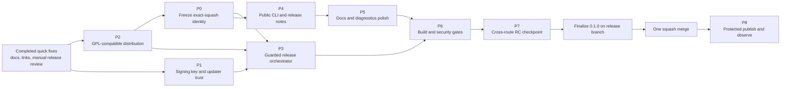

---
search:
  exclude: true
---

Status: Active
Scope: Initial public release readiness and production-review remediation
Owner: Maintainer

# Initial Release Production Remediation Plan

## Purpose

This plan converts the July 25, 2026 production-readiness review into bounded,
sequenced work packages for the first public Frame Compare release. It does not
authorize a release by itself. Each release blocker must be closed with the evidence
defined below before the first production tag is published.

The Windows-specific implementation and verification sequence is expanded in the
[Windows Initial-Release Handoff](2026-07-27-windows-release-handoff.md). That file
is a supporting handoff, not a second active plan.

The original review baseline was branch `stage1` at commit
`eb88cbdb09099ee10e238da365c3d995d3eed20f`. R-00 revalidated the plan on July 28,
2026 at `c07e07f1c9d655c83c840562bf274fb148c2d9dc`. Revalidate the branch, head,
worktree, and intervening commits again before relying on either snapshot.

## Approved single-merge initial-release architecture

Approved July 28, 2026. This section supersedes the former P0/P3 approach wherever
older text conflicts with it.

The final squash merge from the reviewed release-candidate branch into `main` is
the source commit for `v0.1.0`. There is no preparatory commit on `main` followed
by a generated Release Please version-bump commit. The authoritative lifecycle is:

1. Prepare and test the release on `cleanup` or a short-lived release branch.
2. When P3 through P6 are ready, align all version sources and the changelog at a
   PEP 440 RC version such as `0.1.0rc1`, then exercise tag `v0.1.0-rc.1`
   through the same guarded artifact-and-publication orchestrator used for stable.
3. On the release branch, finalize `pyproject.toml`,
   `src/frame_compare/__init__.py`, `.release-please-manifest.json`, the root
   editable `frame-compare` package in `uv.lock`, and `CHANGELOG.md` at `0.1.0`.
   Remove the temporary `bootstrap-sha` and `release-as` fields at this point.
4. Squash-merge exactly once into `main`.
5. Dispatch the existing **Windows portable** workflow with operation `release`,
   version `0.1.0`, tag `v0.1.0`, and the exact `main` squash SHA. The workflow
   must reject any other `main` head,
   existing tag/release, prerelease version/tag, version-source disagreement, or
   missing changelog entry.
6. Build, sign, verify, and inventory every mandatory asset before creating a
   draft release targeted at that exact SHA. Attach and verify the complete asset
   set while the release is draft; publish only as the final operation.
7. Keep Release Please dormant until the published stable `v0.1.0` release exists.
   Later pushes to `main` may then open or update human-reviewed version/changelog
   PRs, but the guarded workflow remains the only tag/release publisher.

The pre-existing Windows workflow path is the PR/manual/guarded-release entrypoint
so GitHub can dispatch an RC from the candidate branch before the final merge. It
calls exact-commit reusable release and build/sign/verification boundaries and no
longer publishes in response to an already-public release event.

Stable publication uses the protected GitHub `production` environment. The
maintainer must configure required reviewers, prevent self-review where supported,
and restrict deployment branches/tags to the approved `main`/stable policy before
P8. Live RC creation, stable tag creation, stable publication, protected-environment
approval, remote release/tag deletion, and the final squash merge are
MAINTAINER-ONLY.

Rollback is fail-closed:

- Before publication, delete only a disposable draft RC release/tag after the
  maintainer verifies the exact target. Never reuse or move an RC tag.
- If build, signing, checksum, inventory, source, license, version, or asset proof
  fails, leave stable unpublished and fix the release branch.
- If the stable draft exists but publication has not completed, do not publish it;
  maintainer-only cleanup may remove the draft/tag after evidence capture.
- Never rewrite `main`, move `v0.1.0`, or mutate an already-used public stable tag.
  A post-publication defect requires an explicit stop-distribution decision and a
  corrective release.

### Current implementation verification record

```text
VERIFICATION_RECORD
RISK: high
PRIMARY_MODE: workflow
RATIONALE: Initial release identity, signed Windows artifacts, tag placement, and
public release visibility are security- and supply-chain-sensitive control-plane
surfaces.
TEST_DECISION: update
COMMANDS_AND_EXPECTED_OUTCOMES:
- Focused workflow and Windows portable tests pass with zero Windows/PowerShell skips.
- Release/version contract tests reject SHA, version, channel, collision, draft,
  asset, permission, concurrency, and Release Please guard regressions.
- Release Please configuration validates against the official schema.
- Disposable-key signing/apply/tamper/rollback tests pass; no real key is accessed.
- uv lock --check, workflow YAML parse, clean full repository gate, clean
  distribution build/fresh verification, strict docs build, and git diff checks pass.
UNAVAILABLE_OR_DOCUMENTED_ONLY_PROOF:
- Live GitHub RC creation/publication and production-environment approval are
  MAINTAINER-ONLY and remain unavailable until the P7 checkpoint is approved.
- The official v0.1.0 tag/release and final squash merge are explicitly outside
  this implementation task.
```

## Decision record and current status

Decisions recorded July 26, 2026:

| Area | Decision | Status |
| --- | --- | --- |
| First public version | Release as `v0.1.0` at the exact final squash commit | Approved; guarded single-merge implementation in progress |
| Initial squash title | Use a Conventional Commit such as `feat: prepare initial public release`; keep the detailed release inventory in the commit/PR body | Approved; this is the sole `main` release-preparation commit |
| Release review | Release Please PRs require human review; no automatic merge | Implemented with a workflow contract test |
| Support posture | Windows portable is the primary, most feature-complete route; default Docker is the primary headless macOS/Linux route; native source is advanced; NVIDIA/X11 remain experimental | Documented |
| Windows updates | Signed code-only updates are required for the first public Windows release | Key-generation tooling and a real 3072-bit public key are committed; protected-secret existence, the matching private half, real-key signing/apply/rollback, and guarded-orchestrator proof remain external gates |
| Initial release publication | Explicit guarded workflow dispatch with exact version/tag/SHA, draft-first complete assets, and protected `production` approval | Approved; replaces Release Please-generated initial version commit and release-event workflow chaining |
| Later release authentication | Configure `RELEASE_PLEASE_TOKEN` as a fine-grained PAT or GitHub App token for post-`v0.1.0` Release Please version-PR behavior; guarded publication remains separate | Approved; repository secret setup remains |
| Licensing | Align Frame Compare with PyQt6 under `GPL-3.0-only`; do not purchase or depend on a commercial PyQt license | Repository relicensing implemented; exact-artifact compliance remains |
| User checksum guidance | Teach users to verify the published Windows ZIP against its `.sha256` asset | Implemented and strictly built |
| VSPreview recovery links | Point doctor hints to the canonical native-source Zensical guide | Implemented with focused adapter/CLI tests |

Do not copy an authoring-time `main` or `cleanup` SHA into the stable dispatch.
Record both remote heads at preflight, recheck them before the RC checkpoint and
again before the final squash, and stop if either moves in a way that invalidates
the reviewed candidate boundary.

## Scope

### Accepted findings

| ID | Finding | Type | Severity | Confidence | Release effect |
| --- | --- | --- | --- | --- | --- |
| F-01 | Windows signing trust is incomplete beyond the committed real public key | External verification gap | S1 | High | Blocks official Windows update release until the protected matching private key and complete signed-update lifecycle are proved |
| F-02 | The release-event chain can expose a release before mandatory Windows assets exist | Confirmed orchestration defect | S1 | High | Blocks stable publication until one guarded draft-first orchestrator owns build through publication |
| F-03 | First-release version and source-commit authority are ambiguous | Inferred release risk | S2 | High | Could publish the wrong version or tag a generated commit instead of the approved squash |
| F-04 | PyQt6 redistribution under the project’s intended license posture lacks a recorded compatible-license disposition | Confirmed license mismatch requiring maintainer disposition | S1 | High | Blocks public Windows binary distribution until the project and artifact license posture is aligned |
| F-05 | Top-level and command-specific CLI help is too sparse for first-time users | Confirmed UX defect | S2 | High | Does not block mechanics, but materially harms first-use quality |
| F-06 | `CHANGELOG.md` read as internal phase/scaffold history instead of a public first-release changelog | Confirmed docs/release defect | S2 | High | Resolved with a concise user-facing alpha changelog; re-review the generated release PR |
| F-07 | Published Windows `.sha256` assets lacked user verification instructions | Confirmed docs defect | S3 | High | Resolved in the documentation package associated with this plan |
| F-08 | A doctor remediation hint points to a stale README installation anchor | Confirmed UX/docs defect | S3 | High | Resolved by linking to the native-source Zensical guide |
| F-09 | No clean Apple Silicon Docker proof was available during review | Verification gap | S2 | Medium | Do not claim Apple Silicon confidence until separately proved |
| F-10 | Optional Linux NVIDIA and X11 routes remain host-dependent and unproved in baseline CI | Known verification limitation | S3 | High | Keep labeled experimental; does not block supported default route |
| F-11 | Dependency vulnerability status was not independently audited for the release graph/bundle | Verification gap | S2 | Medium | Requires a release-time dependency/security audit |
| F-12 | Distribution build was not an explicit CI gate, despite clean archive build succeeding locally | Inferred build/release gap | S2 | Medium | Resolved with a required clean build, artifact inspection, fresh wheel install, and CLI smoke job |
| F-13 | Overlay font fallback can vary across hosts | Known determinism limitation | S3 | High | Document/test tolerance; do not claim cross-platform pixel identity |
| F-14 | Docker base image and system package inputs are not fully digest/snapshot pinned | Supply-chain hardening opportunity | S3 | Medium | Track after first-release blockers unless threat model elevates it |
| F-15 | Release-candidate asset installation and end-to-end use have not been rehearsed from the exact published artifacts | Verification gap | S1 | High | Blocks final go/no-go |

### Finding evidence and closure proof

| ID | Evidence | Risk mechanism | Closure proof |
| --- | --- | --- | --- |
| F-01 | `tools/windows_portable/update_public_key.xml` now contains a non-placeholder 3072-bit public key with only `Modulus` and `Exponent`, key ID `frame-compare-update-2026-01`, and UTC generation metadata; repository evidence cannot prove the protected secret or matching private half | A syntactically real public key alone does not establish that CI holds its matching private key or that installed clients accept updates signed by it | Validate the committed public key on Windows; confirm the protected secret exists without exposing it; prove the matching private key signs an update that the installed client accepts; prove tamper rejection, apply, rollback, and guarded-orchestrator asset production |
| F-02 | The current Windows workflow listens for an already-published release event and attaches assets afterward | Stable can become public without its mandatory binary, signed update, or checksums | A disposable RC proves exact-SHA build/sign, draft creation, complete asset verification, and publish-last behavior through the guarded orchestrator |
| F-03 | There are no prior release tags while temporary bootstrap configuration remains and the branch contains extensive feature history | A generated initial version commit would violate the approved exact-squash tag boundary | Final release-branch versions/changelog agree, temporary fields are absent, the single squash is `main` head, and guarded dispatch targets it exactly |
| F-04 | The Windows builder installs PyQt6/PyQt6-Qt6 into the public bundle; at the review baseline PyQt6 package metadata was `GPL-3.0-only` or commercial while the repository was Apache-2.0; the project is now `GPL-3.0-only` | Redistributing the combined release without inspecting the exact artifact’s license inventory and corresponding-source path could still leave compliance gaps | Inspect the exact artifact’s licenses, notices, and corresponding-source path after the completed project relicensing |
| F-05 | Generated CLI help shows command names and options with little or no explanatory text for key first-run surfaces | New users cannot infer safe command intent, defaults, or route-specific invocation from the CLI itself | Human-reviewed top-level and per-command help with focused contract tests |
| F-06 | `CHANGELOG.md` contains repeated internal phase/scaffold history and obsolete implementation detail | Release notes obscure actual user value and limitations and can misrepresent the initial release | First-release changelog reviewed as a concise user-facing capability/limitation record |
| F-07 | Workflow publishes `.sha256` assets, while the prior Windows guide only instructed users to download and execute the ZIP | Integrity data exists but users are not told how to use it | Published guide includes copy/paste verification and a fail-closed mismatch instruction |
| F-08 | A doctor recovery hint uses the old README `#installation` location while installation authority moved into Zensical guides | Diagnostic remediation sends users to stale or missing guidance | Focused diagnostic test asserts a live Zensical installation URL/anchor |
| F-09 | Linux amd64 Docker CI passed; the review host was Apple Silicon but its Docker daemon was unavailable | Architecture-specific image/plugin/runtime problems could remain undetected behind the broad macOS claim | Clean Apple Silicon Docker build, doctor, dry-run, SDR, and HDR proof—or a narrowed support claim |
| F-10 | NVIDIA and X11 profiles have dedicated host proof scripts but no compatible baseline CI hardware/session | Default Docker success does not establish GPU passthrough or desktop GUI behavior | Compatible-host proof plus manual GUI/GPU acceptance; otherwise retain experimental/unverified labels |
| F-11 | Dependabot and static security checks exist, but the review did not run a release-graph vulnerability audit | Known vulnerable transitive dependencies could ship despite source-code scans passing | Policy-defined audit of locked Python, container, and Windows bundle inputs with calibrated exceptions |
| F-12 | Clean archive `uv build` passed locally, but CI has no explicit wheel/sdist build-install job | Packaging-only regressions can merge even when source tests pass | CI builds both artifacts from clean checkout, inspects contents, installs the wheel fresh, and smokes the CLI |
| F-13 | Overlay code falls back through available system fonts | Font selection and metrics can vary by host, changing labels or pixels | Documented non-bit-determinism plus cross-route tolerance tests; bundle a controlled font only if product requirements demand it |
| F-14 | Docker versions are constrained in several places, but the base image and apt repository state are not fully immutable | Rebuilds at different times can consume changed upstream system inputs | Recorded decision and owner; if approved, digest/snapshot pinning plus a tested refresh process |
| F-15 | PR checks prove source/workflow paths, not a clean install and full workflow from the exact public downloads | Archive layout, signing, extraction, PATH, first-use, report, update, or uninstall defects can escape repository-level tests | Downloaded RC assets pass the complete platform acceptance matrix before the production tag |

### Excluded findings

- A failed `uv build` from one local dirty worktree is excluded as a repository
  defect. Untracked `.venv-r76-*` directories polluted that local source archive;
  the clean `git archive` build produced both wheel and sdist successfully.
- Large cohesive owners are architecture watch items, not release defects. No
  decomposition is authorized solely because of file length.
- Optional live TMDB, slow.pics, webhook, NVIDIA, and X11 behavior is not promoted to
  a default-route release blocker when it remains explicitly opt-in or experimental.

### Assumptions

- The first public release should present a conservative alpha-quality support
  contract.
- Windows portable and default headless Docker are intended first-class routes.
- Native source is an advanced route.
- PyPI and a public container registry are not promised release channels unless
  separately approved and implemented.
- No automatic upload or telemetry is introduced; slow.pics and webhooks remain
  explicit opt-ins.

### Constraints

- Preserve CLI/config/output contracts unless a package explicitly changes and
  documents them.
- Release and Windows portable changes are high risk under the engineering runbook.
- Signed updater verification requires protected external secret state and a Windows
  runner.
- Private signing key material must never enter the repository, task transcript,
  command line, CI logs, or release artifacts.
- The maintainer explicitly approved `GPL-3.0-only` on July 26, 2026. Preserve
  third-party license texts and do not expand that approval into dual licensing,
  copyright assignment, a CLA, or a commercial-license path.
- Only one active plan should exist for this workstream.

### Non-goals

- Broad architecture rewrites.
- Publishing to PyPI or a public container registry.
- Promoting NVIDIA or X11 profiles from experimental to generally supported.
- Guaranteeing bit-identical screenshots across operating systems and host fonts.
- Adding speculative compatibility layers or fallback update mechanisms.

## Evidence baseline

### Passed review gates

| Gate | Result at review baseline |
| --- | --- |
| Pyright strict warnings gate | Passed: 0 errors, 0 warnings |
| Ruff | Passed |
| Bandit, medium severity and above | Passed: no medium/high findings |
| Full pytest suite | Passed, with expected platform/runtime skips |
| Branch coverage | 89.87%, above the 80% floor |
| Import Linter | Passed: 2 contracts kept, 0 broken |
| Generated API docs check | Passed |
| Traceability validation | Passed |
| Clean archive wheel and sdist build | Passed |
| `git diff --check` | Passed |
| Current-head GitHub CI, docs, Docker, and Windows PR checks | Passed |

These results establish a strong code-quality baseline but do not prove release
orchestration, secrets, legal permission, optional hardware routes, or the final
published artifacts.

### Positive controls to preserve

- Workspace path containment and symlink defenses.
- Atomic writes, locks, and explicit run lifecycle records.
- Upload disabled by default and webhook secrets excluded from persisted TOML.
- SSRF controls and redaction around external integrations.
- Structured subprocess arguments rather than shell command construction.
- Hash-pinned Windows runtime downloads and commit-pinned GitHub Actions.
- Offline HTML reporting with no telemetry found in the review.
- Signed-update design with file hashing, dependency fingerprint checks, backups,
  rollback, and fail-closed behavior.

## July 28 remediation implementation program

R-00 reconciled the accepted production-remediation findings below with current
`stage1`. These packages are part of this active plan and precede the remaining
release-candidate gates. Each package must remain independently revertible, receive
focused proof and diff inspection, and pass the wave integration gate before the
next wave begins.

| Package | Accepted finding and bounded remedy | Required closure proof |
| --- | --- | --- |
| R-01 | The Windows uninstaller recursively removes the install root and can destroy persistent configuration or unknown files. Remove only exact managed PATH/file entries; remove `bin`, `state`, or the root only when each is empty; preserve `state/config.toml` and unknown files; do not add purge behavior. | Non-skipped Windows install → edit config → uninstall → reinstall E2E preserves exact config bytes and unknown files. |
| R-02 | Generated TOML can persist `tmdb.api_key`. Strip it through the existing central persistence owner for every generated-file path while continuing to accept manually authored TOML and environment keys at runtime. Do not add provenance, encryption, migration, or a general secret framework. | Generated files, logs, and errors never contain the key; direct TOML and environment loading still work. |
| R-03 | Run timing mixes naive wall time with elapsed-duration calculation. Use aware UTC only for `started_at`/`completed_at` and an injected monotonic timer for preflight, loading, phases, success/failure totals, and persisted `duration_seconds`; preserve existing schemas and avoid a timing service. | Forward and backward wall-clock jumps leave monotonic phase and persisted durations correct. |
| R-04 | slow.pics `Retry-After` parsing can resolve unsafe delays. Keep policy in `services/publishers.py` and constrain every resolved delay to a finite `0..60` seconds. Do not add shared/configurable retry infrastructure. | Negative, NaN, both infinities, huge, past/future date, malformed, and missing-header cases pass. |
| R-05 | The real VapourSynth metric test is outside the Docker zero-skip selection and analysis-owner changes do not trigger the workflow. Relocate the existing test without changing behavior and add `src/frame_compare/analysis/**` to the workflow triggers. | Docker zero-skip gate selects and runs the real metric proof; Docker workflow contract covers the trigger. |
| R-06 | Optional coverage omits every `*/types.py`. Remove that blanket omission without adding mandatory coverage CI or padding tests. | Optional coverage includes those files and records the honest result; the prior diagnostic was approximately 90.046%. |
| R-07 | Direct build tools are not deterministically versioned. Pin one exact tested uv version across workflows and exact tested Hatchling version; do not add transitive hash-refresh machinery absent reproduced drift. | Clean isolated wheel/sdist build, inspection, fresh install, and installed CLI smoke pass. |
| R-08 | Offline reports lack a real-browser initialization proof. Add one generated-report smoke on explicit Ubuntu 24.04 using the preinstalled Chrome/Chromium, with a clear binary preflight and no browser framework/download dependency. | Browser observes post-initialization DOM plus representative active and ARIA state. |
| R-09 | Viewer tests contain source-spelling assertions whose behavioral value is unclear. Create a deletion ledger and remove an assertion only when mapped to the Node harness, R-08 browser proof, or a documented no-behavior conclusion; retain unmatched security, embedding, dependency-order, accessibility, CSS, and behavioral assertions. | Every deletion has equal-or-stronger mapped proof; stop if replacement proof is larger or weaker. |
| R-10 | Subprocess execution uses an async → thread → second event loop → blocking join bridge. Replace it with synchronous `subprocess.run`, preferring stdlib result/error types while preserving validation, byte streams, timeout cleanup, `check`, shell avoidance, and FFmpeg translation. | Already-running-event-loop use plus FFmpeg, alignment, Docker, and Windows-sensitive proof passes. |
| R-11 | Logging uses a large stderr proxy, unused singleton, and an unused `**kwargs` format bridge. Reduce it to the smallest late-bound write/flush stream and use the explicit `log_format` keyword. | Current `sys.stderr` capture, repeated configuration, shutdown, JSON stdout purity, levels, and renderers remain correct. |
| R-12 | `cli/entry.py` retains confirmed-unused private aliases/imports. Remove only exact dead aliases, preserving `_RunnerProxy`, lazy imports, meaningful Protocols, and explicit CLI/config mappings. | Focused CLI/lazy-import tests and the full gate pass with a recorded physical LOC delta. |

### R-09 viewer assertion deletion ledger

The R-09 cleanup reduced the source-shape test surface from 709 to 585 physical
lines: `test_report_viewer_assets_js_contracts.py` changed from 402 to 282 and
`test_report_viewer_assets_css.py` from 307 to 303. The 124 removed lines are
mapped below. The original cleanup relied on the existing executable harnesses.
The July 28 follow-up extended the viewer state harness with an explicit
alignment-popover Escape ordering assertion.

| Deleted source-shape group | Equal-or-stronger proof | Assertions deliberately retained |
| --- | --- | --- |
| Alignment popover method names and Escape-handler body/order | `viewer_state_harness.js` executes popover-target and global Escape paths, proves the popover handler prevents global shortcut fallthrough, and proves the alignment popover closes before the inspector while legacy modal precedence remains intact; `test_report_viewer_state.py` asserts `escapeOrder`. | Document and popover keydown registration plus alignment-before-keyboard binding order remain as dependency-wiring contracts. |
| Viewport restore spellings for left/right/active clips, filmstrip, inspector, blink interval, palette orientation, current frame, normalized pair alignments, pair loading, and filter normalization | `viewer_state_harness.js` executes restore/persist paths for all of these states; `test_report_viewer_state.py` asserts the restored selection, pair keys, filmstrip fallback, inspector/tab/blink state, and palette orientation. | Exact report-scoped storage key, JSON-load seam, unmatched overlay restore, pan/overlay persistence, and flattened-alignment exclusions remain. |
| Viewport persistence spellings for current frame, mode, filmstrip state/size, inspector state/tab, blink interval, palette orientation, and pair alignments | The same executable viewport harness reads the persisted document and asserts these values, including exclusion of paused blink state and flattened pair alignment. | Unmatched pan/overlay fields and exact negative schema assertions remain source contracts. |
| Grid activation, render/preload routing, constants, page construction, pan mapping, zoom anchoring, focus preservation, role cues, and public-default spelling checks | `grid_view_harness.js` exercises the real owner lifecycle, layouts, page limits, retries, pan normalization, focus retention, and reference/active cues. `viewer_state_harness.js` proves public payload rejection and internal stored-grid restoration. | Grid-before-viewer asset order plus create/bind composition remain dependency-order contracts. |
| Viewer-chrome selector/guard placements and deferred lens-touch routing spellings | `viewer_state_harness.js` invokes wheel, double-click, slider drag, pan drag, and lens-touch paths; its wrapper asserts browser-chrome isolation and deferred-touch ownership. `lens_harness.js` separately exercises real lens pointer behavior. | Lens shortcut, pointer-event registration, and unmatched pinch mechanics remain. |
| Review-controller field/method names, model-call names, import-token spelling, render short-circuit spelling, obsolete-name negatives, and object-URL cleanup spelling | `review_state_harness.js` proves schema bounds, round-trip, and atomic rollback. `review_controller_harness.js` proves stale-preview isolation, stable render, announcements, and download/revoke lifecycle. The viewport harness proves lazy create-once behavior. | Review-before-viewer order, exact limits/messages, report-scoped storage key, and the live-region hook remain security, dependency, and accessibility contracts. |
| Direct lens refresh/sync calls after zoom, pan, alignment, and image state plus the empty-state transient-clear spelling | `viewer_state_harness.js` behaviorally proves refresh after touch pan, pinch zoom, and alignment, no obsolete context sync, and empty-state alignment/lens cleanup. | Pointer registration, image readiness, request-animation-frame ordering, and unmatched empty-state behavior remain. |
| Four negative CSS assertions naming removed legacy lens selectors | These asserted only absence of obsolete implementation spelling and protected no rendered behavior. | All positive CSS, offline URL/import, responsive, reduced-motion, coarse-target, accessibility, and layout assertions remain because neither fake-DOM harnesses nor DOM dumping computes CSS. |

No renderer-markup assertion was removed: the R-08 browser smoke complements but
does not replace security, raw embedding, offline asset, static ARIA, or dependency
contracts. Modal focus trapping, source-load order, event registration, and async
image ordering were also considered and retained because the available behavioral
proof is narrower.

### Remediation execution and integration gates

1. R-00 plan reconciliation and the separate explorer-role commit.
2. Wave 1: R-01 through R-04 on disjoint owners, then independent integration
   review and the full repository gate.
3. Wave 2: R-05 and R-06, then serialized R-07, R-08, and R-09, followed by
   independent integration review, the full gate, and Docker verification.
4. Wave 3: R-10 and R-11, then R-12, followed by independent integration review,
   the full gate, and all applicable runtime proof.
5. Proceed to the existing P0-P8 release-candidate gates only after every applicable
   remediation gate passes. Windows-only, GitHub-only, protected-secret, and
   guarded-orchestrator evidence must remain explicit external gates when unavailable.

After every wave run:

```bash
uv run --no-sync pyright --warnings
uv run --no-sync ruff check .
uv run --no-sync bandit -c pyproject.toml -r src --severity-level medium
uv run --no-sync pytest -q
uv run --no-sync lint-imports --config importlinter.ini
git diff --check
```

Run `bash tools/verify_docker_integration.sh` for VapourSynth, FFmpeg, alignment,
tonemap, or Docker-sensitive changes. Run API-doc drift and strict documentation
checks when their surfaces change. The Windows portable workflow remains required
for R-01 and R-10 even when local macOS proof passes. Record physical before/after
LOC for cleanup packages R-09 through R-12; LOC is evidence, not a quota.

Touch-triggered opportunities are deliberately not standalone packages: consolidate
duplicate input discovery only while changing its preparation owner and only when a
single deterministic snapshot is measurably simpler; remove alignment or tonemap
private aliases only while those owners are already touched and proof remains at
least as strong.

Metadata-creation POST idempotency remains a parked residual risk because no
official slow.pics idempotency guarantee is known. Do not invent request IDs or
deduplication. Revisit only with an official contract or maintainer decision; the
conservative future option is no response-status retry for that metadata POST.
Also preserve the 93 public config fields, the
`RunCliRawArgs -> RunCliOptions -> RunRequest` conversion, phase-output ownership,
strict result parsing/redaction, webhook address pinning, raw offline embedding,
lazy imports, CLI stream/exit/JSON contracts, and Windows/Docker behavior.

## Plan summary

Overall approach: make release identity and legal/signing prerequisites explicit
first; repair automation next; improve user-facing release surfaces; add missing
build/security gates; then perform an exact-artifact release-candidate rehearsal.

Highest-risk package: P1, because the real public/private key relationship and its
protected secret handling define whether Windows updates can be trusted.

Verification strategy: every package has a focused proof, then the repository-wide
gate is rerun before the release candidate. The final gate tests downloaded
artifacts rather than workspace outputs.

Recommended sequence:



## Package overview

| Package | Findings | Risk reduced | Scope size | Exit gate |
| --- | --- | --- | --- | --- |
| P0: Freeze first-release identity | F-03 | Wrong version/tag/changelog/source commit | Small, decision-heavy | Stable dispatch contract matches the exact final squash |
| P1: Establish Windows signing trust | F-01 | Broken release build or untrusted updates | Medium, security-sensitive | Manual signed update verifies and applies using committed public key |
| P2: Resolve binary redistribution posture | F-04 | Ambiguous/incompatible public bundle license posture | Decision plus metadata/distribution changes | Explicit GPL decision and exact-artifact license/source inspection |
| P3: Prove guarded release orchestration | F-02, F-15 | Public release before exact mandatory assets | Medium, release workflow | Disposable RC completes exact-SHA draft-first orchestrator |
| P4: Polish public CLI and changelog | F-05, F-06, F-08 | Poor first-use and misleading release notes | Medium | Help snapshots/contracts and public changelog review pass |
| P5: Complete user install guidance | F-07, F-10, F-13 | Unsafe download handling or inflated support claims | Small | Strict Zensical build and route-doc review |
| P6: Add release build/security gates | F-11, F-12, F-14 | Undetected package/dependency/supply-chain regression | Medium | Clean package job and documented security audit pass |
| P7: Rehearse exact release candidate | F-09, F-10, F-15 | Untested first-use experience or platform regression | Large verification package | Exact-asset acceptance matrix passes or unsupported routes are relabeled |
| P8: Publish and observe | All closed findings | Release execution/rollback risk | Small, operational | Assets, checksums, docs, notes, and smoke tests verified after publication |

## Packages

### P0: Freeze first-release identity and publication authority

Accepted finding IDs: F-03.

Goal: make the final reviewed squash commit the exact source of `v0.1.0`, with one
explicit guarded publication owner and no generated initial version-bump commit.

Risk reduced: unintended SemVer, enormous generated release notes, or a release PR
that treats unreleased development history as already released.

Scope:

- Keep `0.0.0` as the pre-release package/manifest/lock baseline while P3 through
  P6 are incomplete. Use an agreeing PEP 440 `0.1.0rcN` state only for the
  explicitly approved P7 rehearsal.
- Finalize all four version sources and the changelog at `0.1.0` on the release
  branch only after the RC evidence is accepted.
- Remove the temporary top-level `bootstrap-sha` and `release-as` fields during
  that same final preparation.
- Use a Conventional Commit squash title such as
  `feat: prepare initial public release`; put the comprehensive change inventory in
  the commit/PR description.
- Keep Release Please dormant until the published stable `v0.1.0` release exists.
  Preserve human review and normal Conventional Commit calculation afterward,
  while disabling its GitHub-release creation.
- Require a stable workflow dispatch with exact version `0.1.0`, tag `v0.1.0`,
  and expected SHA equal to the live `main` head and the approved squash commit.

Out of scope: changing the project’s long-term SemVer policy.

Primary files/symbols:

- `.release-please-manifest.json`
- `release-please-config.json`
- `.github/workflows/release.yml`
- `.github/workflows/release-please.yml`
- `.github/workflows/windows-portable.yml`
- `.github/workflows/windows-portable-build.yml`
- `pyproject.toml`
- `src/frame_compare/__init__.py`
- `CHANGELOG.md`

Expected behavior change: the initial merge itself contains final version/changelog
state; an explicit approved dispatch publishes that exact commit. Release Please
does not create an initial release PR.

Implementation approach:

1. Reconfirm `origin/main`, `origin/cleanup`, and the reviewed candidate SHA.
2. Complete P3 through P6 while version sources remain `0.0.0`.
3. Align every version source and the changelog at `0.1.0rcN`, then rehearse and
   accept the exact P7 release candidate.
4. Finalize all version sources/changelog and remove temporary bootstrap fields on
   the release branch.
5. Review and squash-merge once with a Conventional Commit title.
6. Reconfirm the exact new `main` head.
7. Dispatch the protected stable workflow with that immutable SHA and publish only
   after its complete draft asset proof passes.

Verification:

- Workflow contracts prove exact-SHA checkout and live-main equality.
- Confirm agreement across `pyproject.toml`, package `__version__`,
  `.release-please-manifest.json`, root editable `uv.lock`, input version/tag, and
  changelog.
- Confirm the initial `main` push leaves Release Please dormant and later stable
  history enables version-PR behavior without tag/release creation.

Rollback / safety notes: keep final preparation on the release branch until P7 is
accepted. Do not publish a mismatched draft, move tags, or rewrite shared history.

Dependencies: none.

Risks: changing version metadata before P7 acceptance can create a misleading
release-ready state; leaving temporary bootstrap fields at finalization blocks the
guarded stable workflow.

Open questions: none. Stop if either remote head moves across the reviewed boundary.

Suggested owner role: maintainer plus release-workflow implementer.

### P1: Establish Windows signing trust

Accepted finding IDs: F-01.

Status: complete for pre-RC preparation. Required-secret workflow run
`30421868955` at `87abcb5f4711bcd88d791afdf14c109f1450f383` produced a signed
update that verified against the committed public key. An isolated installed-client
rehearsal applied it without an unsafe warning, created and listed a backup, rolled
back to an identical source-tree digest, and rejected both manifest and payload
tampering without changing installed files. Clean-profile acceptance of the
versioned downloaded RC remains P7.

Goal: complete the protected public/private-key relationship and prove the complete
signed-update lifecycle.

Risk reduced: an absent or mismatched protected private key would make legitimate
updates unavailable or unverifiable even though the committed public key is real.

Scope:

- Preserve the committed maintainer-only PowerShell key-generation script with
  explicit public and private output paths and no logging of private parameters.
- Generate a release RSA keypair using an approved offline process.
- Preserve only the committed public key with its real key ID and generation date.
- Store the private key XML as the protected
  `WINDOWS_UPDATE_SIGNING_KEY_XML` Actions secret.
- Validate the public key with the repository script.
- Build, sign, verify, apply, and roll back a code-only update on Windows.
- Record key custody, backup, rotation, and compromise-response ownership outside
  the repository’s public source.

Out of scope: committing private key material or redesigning the updater.

Primary files/symbols:

- `tools/windows_portable/update_public_key.xml`
- `tools/windows_portable/validate_update_public_key.ps1`
- `tools/windows_portable/sign_update.ps1`
- `tools/windows_portable/shim/frame-compare-update.ps1`
- `.github/workflows/windows-portable.yml`

Expected behavior change: release/manual bundle builds accept the committed public
key, signed update assets contain a valid signature, and installed clients verify
that signature before applying changes.

Implementation approach:

1. Revalidate the committed key-generation procedure and public key without reading
   or creating private release material in the repository or task environment.
2. The maintainer confirms that the protected private key matching the committed
   public key is backed up on a trusted Windows machine outside CI logs and the
   repository.
3. Confirm the matching private key is configured as
   `WINDOWS_UPDATE_SIGNING_KEY_XML`.
4. Use `workflow_dispatch` to exercise the protected signing path.
5. Download the artifact, verify it offline, apply it to a test bundle, and roll
   back.

Verification:

- `validate_update_public_key.ps1` passes.
- `build_portable.ps1 -RequireReleasePublicKey` passes on Windows.
- The protected workflow signing step succeeds and the update artifact contains
  `update-manifest.sig`.
- `update-manifest.sig` exists.
- Tampering with the manifest or payload is rejected.
- Valid update apply and rollback both succeed.
- Logs and uploaded artifacts contain no private key material.

Rollback / safety notes: never rotate the committed public key without a migration
decision for already-installed clients. Revoke/stop release immediately if private
key exposure is suspected.

Dependencies: P0 for versioned artifact naming.

Risks: secret formatting, newline encoding, or mismatched key halves can cause a
false sense of readiness if only the build—not client verification—is tested.

Open questions:

- Which maintainer-controlled encrypted store owns the offline backup?
- What documented event triggers rotation or release suspension?

Suggested owner role: maintainer and security-aware Windows release implementer.

### P2: Resolve binary redistribution posture

Accepted finding IDs: F-04.

Goal: align the project and Windows distribution with PyQt6’s
`GPL-3.0-only` terms without buying commercial licenses.

Status: complete for pre-RC preparation. The exact portable artifact from workflow
run `30421868955` at `87abcb5f4711bcd88d791afdf14c109f1450f383` records
`GPL-3.0-only`, 57 installed Python distributions, 92 hashed license files, five
manifest-provided runtime artifacts, the exact Frame Compare source archive, 12
source/build/install scripts, and the Qt 6.10.2 corresponding-source archive.
Every recorded license file was present with its expected SHA-256; every runtime
artifact had license and source metadata; all source locations were reachable.

Risk reduced: public distribution without satisfying applicable GPL/commercial and
Qt obligations.

Scope:

- Retain the completed GPLv3 project-license, package metadata, badge, user
  documentation, contributor terms, and bundle project-license output changes.
- Inventory the exact PyQt6, PyQt6-Qt6, Qt, and related packages shipped.
- Preserve every applicable third-party license and notice; Apache-2.0 components
  retain their original notices within the GPLv3 distribution.
- Make complete corresponding source and build/install scripts available beside or
  clearly linked from every Windows binary release.
- Update bundle licenses/notices and user documentation to match the chosen outcome.

Out of scope: purchasing commercial licenses, replacing VSPreview/PyQt6, or
presenting this engineering plan as legal advice.

Primary files/symbols:

- `uv.lock`
- `pyproject.toml`
- `tools/windows_portable/build_portable.ps1`
- bundled `licenses/` output
- `docs/windows-portable.md`

Expected behavior change: project licensing and distribution metadata change to
`GPL-3.0-only`; runtime behavior and the feature-complete Windows bundle remain
unchanged.

Implementation approach: preserve the approved repository license change and freeze
public Windows distribution until the exact bundle/source pair passes the license
inventory.

Verification:

- Exact bundle software bill of materials reviewed.
- Required license texts, notices, and source/offers are present.
- Clean extracted artifact is inspected rather than relying on build inputs.
- Written maintainer approval records the chosen `GPL-3.0-only` basis.

Rollback / safety notes: if unresolved, do not publish the Windows binary. Continue
with source-only routes only if their own distribution posture is separately clear.

Dependencies: none; run in parallel with P0/P1.

Risks: removing PyQt6 may change the “most complete distribution” promise and require
same-pass user documentation updates.

Open questions: none. `bundle_inventory.json` and `licenses/SOURCE_URLS.txt` pin the
Frame Compare source archive by exact build commit and pin redistributed runtime
sources by version or commit. The release tag must resolve to that same build commit.

Suggested owner role: maintainer with focused open-source license-compliance review.

### P3: Prove guarded release orchestration

Accepted finding IDs: F-02 and the automation portion of F-15.

Goal: build, sign, verify, draft, populate, verify, and finally publish a release
through one explicit exact-SHA orchestrator.

Risk reduced: a public tag/release from a mutable or wrong ref, a release visible
before mandatory assets exist, or an initial Release Please race.

Scope:

- Extend the existing default-branch Windows workflow path with a manual release
  operation and explicit channel, version, tag, and exact expected SHA inputs.
- Stable requires the current `main` head, exact `v<version>` tag, and a
  non-prerelease semantic version. RC requires `v<version>-rc.<number>` and is
  always published as a prerelease.
- Reject existing tags/releases before build and immediately before direct,
  non-upserting draft creation.
- Validate version-source, changelog, and final bootstrap-field state before build.
- Call the reusable Windows build/sign/verification boundary.
- Create a draft release targeted at the exact SHA, capture its ID, attach exactly
  the four mandatory assets, verify names/local and remote SHA-256 digests,
  signature/layout and tag target, then publish by ID as the final step.
- Put stable publication behind the protected `production` environment.

Out of scope: broad changes to repository permissions unrelated to release;
official release execution, remote cleanup, or merging.

Primary files/symbols:

- `.github/workflows/release.yml`
- `.github/workflows/release-please.yml`
- `.github/workflows/windows-portable.yml`
- `.github/workflows/windows-portable-build.yml`
- repository Actions secrets/settings

Expected behavior change: ordinary `main` pushes cannot publish. Explicit RC/stable
dispatches are immutable, collision-safe, draft-first, and complete before public
visibility.

Implementation approach:

1. Prove workflow contracts and disposable-key Windows behavior locally.
2. Configure `production` protection and required secrets without disclosure.
3. Stop at the P7 maintainer checkpoint with exact candidate SHA, RC tag/version,
   assets, rollback, and an explicit statement that `v0.1.0` will not be touched.
4. The maintainer dispatches a disposable RC through the orchestrator.
5. Download and accept the exact assets before final version preparation.

Verification:

- Exact expected SHA is checked out and stable equality to `main` is enforced
  both before build and immediately before tag creation.
- Existing tag/release, malformed/mismatched channel/tag/version, bootstrap fields,
  and version/changelog disagreement fail before publication.
- Four versioned assets are built and verified before draft creation.
- Draft target and tag resolve to the exact approved commit.
- Asset upload is complete and exact before the final publish operation.
- Stable uses `production`; RC is always prerelease; stable rejects RC forms.
- Release Please stays dormant until published stable `v0.1.0` exists, then
  creates version PRs only; guarded publication remains authoritative.

Rollback / safety notes: use a uniquely numbered disposable RC and maintainer-only
cleanup. Never promote an RC tag, reuse a failed tag, or use `v0.1.0` as rehearsal.

Dependencies: P0 design, P1, and P2. Live RC execution waits for P6 and the P7
checkpoint.

Risks: environment approval or repository protection can be misconfigured; the
workflow must remain fail-closed and the settings require separate maintainer proof.

Open questions: none; draft-first publication resolves the empty-public-release risk.

Suggested owner role: release-workflow implementer.

### P4: Polish public CLI and changelog

Accepted finding IDs: F-05, F-06, and F-08.

Status: complete for pre-RC preparation. Top-level commands, history and preset
subcommands, every public `run` option, shared path options, JSON modes, and the
Windows updater now expose concise semantic help. Focused CLI contract tests verify
the descriptions without changing parsing, defaults, persistence, streams, or exit
codes. The public-alpha changelog and canonical doctor link remain complete; the
versioned `0.1.0rcN`/`0.1.0` heading is finalized only at the corresponding release
preparation boundary.

Goal: make the CLI self-explanatory and the first public changelog concise,
user-oriented, and accurate.

Risk reduced: users cannot discover commands/options from `--help`, encounter a dead
diagnostic link, or see internal development scaffolding presented as release notes.

Scope:

- Add descriptions to top-level `run`, `wizard`, `doctor`, history, and updater
  surfaces as applicable.
- Add concise help for public `run` options, including effects, defaults, and
  persistence where relevant.
- Preserve stdout/stderr, exit-code, JSON, and lazy-import contracts.
- Preserve the completed doctor-link fix to the canonical native-source Zensical
  guide.
- Rewrite the unreleased/first-release changelog around user capabilities,
  limitations, security/privacy posture, install routes, and known issues.

Out of scope: renaming commands or redesigning configuration.

Primary files/symbols:

- `src/frame_compare/cli/entry.py`
- diagnostic check owners that produce the stale link
- CLI help/contract tests
- `docs/current-cli-contract.md`
- `CHANGELOG.md`

Expected behavior change: `frame-compare --help` and command help provide actionable
descriptions; diagnostics link to a live page; the changelog reads as a public alpha
release.

Implementation approach:

- Treat help text as a public contract.
- Keep descriptions short enough to scan in a terminal.
- Add focused tests for command descriptions and essential option semantics.
- Separate end-user changes from internal refactors in the changelog.

Verification:

- Capture and review `frame-compare --help`.
- Capture and review help for every documented command.
- Run CLI contract tests and full verification.
- Build Zensical strictly and check every diagnostic documentation link.
- Have a first-time user review the changelog and quickstart language.

Rollback / safety notes: help-only changes should not alter callbacks, defaults, or
option parsing. Inspect generated help and JSON modes for accidental output drift.

Dependencies: P0 for final version/release-note framing.

Risks: Typer annotations can alter parsing behavior if descriptions are added through
the wrong declaration shape.

Open questions: which known limitations belong in the changelog versus the
installation chooser and troubleshooting guide?

Suggested owner role: CLI implementer with documentation review.

### P5: Complete user install guidance

Accepted finding IDs: F-07, F-10, and F-13.

Status: complete. The route comparison, runtime/feature matrices, checksum
instructions, host-dependent Docker qualifications, build-from-clone registry
posture, and rendering-variability warning agree with the current Dockerfiles,
Compose files, Windows manifest, and package metadata. The strict Zensical build
and focused documentation/workflow tests pass. Desktop and 390-pixel mobile
previews contain the wide tables without page overflow. Zensical emits the
documented native Mermaid markup; the in-app browser could not execute Zensical's
external Mermaid runtime on either this site or Zensical's own diagrams page, so
live SVG rendering remains an explicitly unavailable preview proof rather than a
repository-specific failure.

Goal: give users one accurate installation decision surface without overstating
experimental or cross-platform behavior.

Risk reduced: choosing an unsuitable route, trusting an unverified ZIP, assuming
optional Docker profiles are supported by default, or expecting bit-identical
cross-platform overlays.

Scope:

- Maintain the route comparison, decision graph, runtime matrix, and feature matrix
  in `docs/getting-started/index.md`.
- Maintain Windows checksum instructions.
- Keep Docker NVIDIA/X11 labeled host-dependent and separately verified.
- State that native pip and Docker are build/install-from-clone routes until public
  registries exist.
- State that host fonts/GPU/runtime can affect rendered details.

Out of scope: changing actual platform support or publishing new distribution
channels.

Primary files/symbols:

- `docs/getting-started/index.md`
- `docs/windows-portable.md`
- `docs/getting-started/docker.md`
- `docs/getting-started/native.md`
- `docs/docker-environments.md`
- `zensical.toml`

Expected behavior change: documentation only.

Implementation approach: keep one summary authority and link to route-specific
procedures rather than duplicating commands across pages.

Verification:

- `uv run --no-sync zensical build --clean --strict`
- Manual desktop/mobile review of wide tables and Mermaid rendering.
- Link check through the strict build.
- Compare claims against Dockerfiles, Compose files, Windows manifest, and
  `pyproject.toml`.

Rollback / safety notes: revert individual claims that cannot be traced to code,
workflow, or a successful host proof.

Dependencies: none; documentation baseline delivered with this plan.

Risks: capability matrices become stale when bundle contents or profiles change.
Update them in the same pass as those release surfaces.

Open questions: none for the current documented support posture.

Suggested owner role: documentation owner.

### P6: Add release build and security gates

Accepted finding IDs: F-11, F-12, and F-14.

Status: complete for pre-RC. The distribution build/install/inspection gate is
active. CI exports the hashed all-extras runtime graph from `uv.lock` and runs the
locked `pip-audit==2.10.1` tool on both Ubuntu and Windows with strict dependency
collection. The PyPA advisory database exposed by PyPI is authoritative and every
known advisory blocks; no exceptions are active. The first audit found fixed
advisories in Pillow 12.2.0 and `pydantic-settings` 2.14.1, so the lock now uses
Pillow 12.3.0 and `pydantic-settings` 2.14.2. The successful signed Windows build
records an exact 57-distribution, 92-license, five-runtime-artifact inventory with
corresponding-source proof.

Docker's uv and Python multi-platform base indexes are pinned by digest and remain
owned by weekly Dependabot Docker updates. Debian apt repositories are deliberately
not snapshot-pinned for the initial release: the repository distributes a
build-from-clone Docker route rather than an immutable image, and freezing the apt
snapshot would retain known system vulnerabilities until manual refresh. The
release proof therefore requires a fresh Docker integration build, while the image
digests constrain the starting filesystem and Dependabot owns recurring refreshes.

Goal: catch distribution and dependency problems before merge or release and record
the remaining container pinning decision.

Risk reduced: unbuildable wheel/sdist, vulnerable locked dependencies, or mutable
system inputs changing release behavior unexpectedly.

Scope:

- Add a clean-tree wheel/sdist build job.
- Inspect wheel and sdist contents and install the wheel in a fresh environment.
- Run an appropriate Python dependency vulnerability audit against the locked graph.
- Produce/review a Windows bundle software bill of materials or equivalent exact
  dependency inventory.
- Decide whether Docker base images should be digest-pinned and whether apt inputs
  need a snapshot strategy.
- Configure update ownership for audit findings and pin refreshes.

Out of scope: replacing every dependency because a scanner emits an uncalibrated
warning.

Primary files/symbols:

- `.github/workflows/ci.yml`
- `scripts/verify_distribution.py`
- `pyproject.toml`
- `uv.lock`
- `Dockerfile`
- Windows bundle manifests/build outputs

Expected behavior change: CI rejects broken distributions and policy-defined
vulnerabilities; Docker input pinning may become stricter if approved.

Implementation approach:

1. Reproduce the already-passing clean archive build in CI.
2. Validate artifact contents and fresh installation.
3. Export the hashed all-extras runtime graph and audit it on Linux and Windows
   with locked `pip-audit==2.10.1`, strict collection, and the PyPA/PyPI advisory
   service.
4. Block every advisory. Record advisory ID, package, owner, rationale, expiry,
   and removal condition before adding any future exception.
5. Keep base image indexes digest-pinned and weekly Dependabot-owned; keep apt
   inputs on current Debian repositories and prove them through the fresh Docker
   integration gate.

Verification:

- Build wheel and sdist from a clean checkout.
- Install wheel in a new Python 3.13 environment; run version/help smoke tests.
- Inspect archive paths for local virtualenvs, caches, secrets, and generated output.
- Dependency audit passes or only documented, time-bounded exceptions remain.
- Docker integration gate passes after any pinning change.

Rollback / safety notes: do not silently loosen audit thresholds to make CI green.
Separate unavailable upstream fixes from false positives and accepted risk.

Dependencies: P2 informs bundle dependency policy; P5 captures current user claims.

Risks: digest/snapshot pinning increases maintenance and may reduce automated security
updates unless paired with an update process.

Open questions: none. PyPA/PyPI plus locked `pip-audit` is authoritative, every
advisory blocks, and weekly Dependabot Docker updates are maintainer-owned.

Suggested owner role: build/release engineer with security review.

### P7: Rehearse the exact release candidate

Accepted finding IDs: F-09, F-10, and F-15.

Goal: test what users will actually download or build, on the supported host matrix,
before publishing the official tag.

Risk reduced: “works in the repository” but fails after download, extraction,
installation, first configuration, rendering, report use, update, or uninstall.

Scope:

- Produce a prerelease/RC through the real release path.
- Test Windows portable from the downloaded ZIP.
- Test default Docker on Linux amd64 and Apple Silicon/macOS if that support claim is
  retained.
- Test native `uv` from a clean clone.
- Smoke the pip route in a fresh virtual environment.
- Test optional live integrations only with disposable credentials/content.
- Run optional NVIDIA/X11 proofs only on compatible hosts; otherwise retain
  experimental/unverified labels.

Before any live RC action, stop and present this MAINTAINER CHECKPOINT:

```text
MAINTAINER CHECKPOINT
candidate_sha: <exact full SHA>
rc_version: <PEP 440 X.Y.ZrcN matching all version sources and changelog>
rc_tag: <vX.Y.Z-rc.N>
protected_secrets_configured_without_disclosure: yes | no
expected_assets:
- frame-compare-portable-win-x64-<rc_tag>.zip
- frame-compare-portable-win-x64-<rc_tag>.zip.sha256
- frame-compare-update-win-x64-<rc_tag>.zip
- frame-compare-update-win-x64-<rc_tag>.zip.sha256
rollback: delete only the disposable draft/prerelease and exact RC tag in a
separate maintainer session after confirming their target
official_v0.1.0_action_will_occur: no
```

Do not dispatch the RC until the maintainer confirms every field.

Out of scope: claiming support for unavailable hardware.

Primary artifacts:

- Versioned GitHub release ZIPs and checksums
- Source archive/clean clone
- Built Docker image from the tagged source
- Generated reports and run records

Expected behavior change: none unless failures are found; failures return to the
owning package before release.

Manual Windows acceptance:

1. Download ZIP and `.sha256`; verify before extraction.
2. Run `install.cmd` from a clean user profile or disposable VM.
3. Open a new terminal and run version/help.
4. Run wizard, doctor, and dry-run.
5. Complete one SDR and one HDR comparison.
6. Exercise VSPreview/manual alignment.
7. Open the offline report; check overlays, navigation, run history, and paths.
8. Apply a signed code-only update, reject a tampered update, and roll back.
9. Run uninstall and confirm user media/output is retained.

Docker/native acceptance:

1. Follow only the published guide from a clean clone.
2. Run wizard, doctor, dry-run, SDR, and HDR workflows.
3. Open the report using the documented host helper for Docker.
4. Confirm generated files are host-owned and persist after container removal.
5. Confirm slow.pics remains disabled until explicitly enabled.

Verification:

- Full repository gate passes at the release commit.
- Documentation strict build passes.
- Linux amd64 Docker integration passes.
- Apple Silicon/macOS default Docker first-run passes or the support claim is narrowed.
- Windows exact-asset checklist passes.
- Native `uv` and pip smoke checks pass.
- No blocker or unexplained warning remains.

Rollback / safety notes: use disposable media, accounts, webhooks, and credentials.
Delete/revoke test integrations after the rehearsal. Never promote an RC tag or
asset in place; fix and cut a new RC.

Dependencies: P0 through P6.

Risks: optional network services can change independently; record date, region, and
service response without treating them as deterministic local gates.

Open questions:

- Which maintainers/testers own Windows, Linux amd64, and Apple Silicon acceptance?
- What sample clips may be redistributed or used privately for repeatable SDR/HDR
  checks?

Suggested owner role: release manager with platform testers.

### P8: Publish and observe

Accepted finding IDs: all findings after their owning packages close.

Goal: publish the official first release only after the release candidate evidence is
accepted, then verify the public experience.

Risk reduced: incomplete assets, stale docs, incorrect latest-release pointers, or
silent first-hour failures.

Scope:

- Finalize all version sources/changelog and remove temporary Release Please
  bootstrap fields on the release branch after P7 acceptance.
- Squash-merge once into `main`.
- Reconfirm the exact `main` head and dispatch the stable orchestrator with that SHA.
- Approve the protected `production` environment in a separate maintainer session.
- Observe the tag, draft-to-published release transition, and docs deployment.
- Verify public asset names, checksums, release notes, and links.
- Repeat lightweight download/install smoke tests from the public release.
- Define an issue template/label and response owner for alpha testers.
- Record known limitations and rollback/yank criteria.

Out of scope: adding features during release execution.

Expected behavior change: the approved release becomes publicly available.

Verification:

- Tag, target SHA, displayed version, and final squash commit match P0.
- Every mandatory asset and checksum is attached.
- Windows signature and checksum verify after public download.
- Documentation points to the correct release and routes.
- A fresh user can reach a local report using only public instructions.
- Security contact and issue-reporting links work.

Rollback / safety notes: do not approve `production` while any proof is incomplete.
If a blocker appears while the release is draft, leave it unpublished and perform
only maintainer-approved cleanup. After publication, prefer a corrective release
over mutating an already-used tag.

Dependencies: P7 accepted with no open release blockers.

Risks: GitHub/docs propagation delays; distinguish delays from failed workflows.

Open questions: define the exact stop-distribution and hotfix decision owners before
the final squash merge.

Suggested owner role: maintainer/release manager.

## Sequencing and concurrency

| Sequence | Work | Parallelism |
| --- | --- | --- |
| 0 | User install docs, checksum instructions, stale VSPreview links, and release auto-merge removal | Completed baseline; retain tests and strict docs proof |
| 1 | Finish P2 exact-artifact license inventory and corresponding-source proof | Repository relicensing is complete; finish before P0/P3 release rehearsal |
| 2 | P1 signing-key tooling and maintainer key generation | May begin alongside P2 when documentation files do not overlap |
| 3 | P0/P3 guarded single-merge orchestration | Implement while version sources remain `0.0.0`; Release Please stays dormant |
| 4 | P4 remaining CLI help and final release-note review | Public alpha changelog baseline is complete; final `0.1.0` heading waits for P7 |
| 5 | P3 local contracts and protected build/sign proof | Starts after P0/P1/P2 have usable release state; no live release action |
| 6 | P6 dependency audit policy, Windows inventory, and Docker pinning decision | Distribution build/install/inspection CI gate is complete |
| 7 | Set agreeing `0.1.0rcN` state and rehearse exact RC | Only after P3-P6 and checkpoint confirmation; MAINTAINER-ONLY dispatch and cleanup |
| 8 | Finalize `0.1.0`, remove bootstrap fields, and squash once | Only after P7 acceptance; final merge is MAINTAINER-ONLY |
| 9 | P8 protected stable dispatch and observation | Exact squash SHA only; MAINTAINER-ONLY tag/publication/approval |

Do not combine P1 signing changes, P2 licensing changes, and P4 CLI cleanup in one
pull request. They have different reviewers, rollback strategies, and proof surfaces.

## Verification matrix

| Gate | P0 | P1 | P2 | P3 | P4 | P5 | P6 | P7/P8 |
| --- | --- | --- | --- | --- | --- | --- | --- | --- |
| `git diff --check` | Yes | Yes | Yes | Yes | Yes | Yes | Yes | Yes |
| Pyright/Ruff/Bandit/pytest/import-linter | If executable config changes | Yes | If bundle/build changes | Yes | Yes | Docs-only minimum otherwise | Yes | Yes |
| API docs drift check | If public API docs touched | No | No | No | Yes | Yes | Yes | Yes |
| Strict Zensical build | If release docs touched | If docs touched | Yes | If docs touched | Yes | Yes | If docs touched | Yes |
| Windows portable build/smoke | No | Required | Required if bundle changes | Required | No | No | If bundle inputs change | Required |
| Signed update apply/rollback/tamper | No | Required | If updater composition changes | Required | No | No | No | Required |
| Default Docker integration | No | No | No | No | No | Docs-only claim audit | Required if Docker changes | Required |
| Optional NVIDIA/X11 proof | No | No | No | No | No | Only on compatible hosts | If profiles change | Best effort; otherwise keep experimental |
| Clean wheel/sdist + fresh install | Version check | No | No | No | Yes | No | Required | Required |
| Dependency/license inventory | No | Windows key tooling only | Required | No | No | No | Required | Confirm final artifacts |

## Pre-RC verification record

The executable verification baseline is commit
`eac76e64ebe5b68fece449ce2d6db54028500c55`; this record-only documentation
update does not change that proof surface.

| Risk | Primary proof mode | Command or evidence | Expected outcome | Result / unavailable proof |
| --- | --- | --- | --- | --- |
| Guarded release publishes a mutable or wrong ref | Contract tests plus official schema validation | Focused `tests/workflows/test_github_workflows.py` and `tests/workflows/test_release_contract.py`; `check-jsonschema==0.37.4` against Release Please's official `config.json` | Exact SHA/version/channel rules, collisions, draft-first publication, complete assets, permissions, concurrency, and initial dormancy fail closed | Passed; all eight workflow YAML files also parsed |
| Windows update is unsigned, incomplete, or accepts tampering | Disposable-key end-to-end tests plus exact downloaded artifact proof | Focused Windows workflow/build/update tests; successful signed run `30421868955` and isolated local apply/rollback/tamper checks | Four mandatory assets, valid disposable signature, backup/rollback, and manifest/payload tamper rejection | Passed; no real private key was accessed |
| Public CLI/config behavior drifts | Full logic suite plus focused CLI contract suite | Full `pytest -q`; focused CLI tests and generated `--help` inspection | Existing streams, exits, flags, persistence, and config semantics remain unchanged while help explains effects | Passed |
| Documentation overstates install routes or renders poorly | Strict build, source-claim audit, desktop/mobile preview | API-doc drift check; `zensical build --clean --strict`; focused docs/workflow tests; desktop and 390-pixel preview | Links/configuration pass; tables remain contained; route claims match Docker, Compose, Windows manifest, and package metadata | Passed except live Mermaid SVG execution: unavailable in the in-app browser for both this site and Zensical's official diagrams page; generated native Mermaid markup/configuration verified |
| Vulnerable or inconsistent Python distributions ship | Locked graph audit plus clean package reconstruction | Linux/Windows CI audit contract; Windows `pip-audit` against hashed all-extras export; detached clean worktree build, archive inspection, fresh install, version/help smoke | No advisory or collection failure; one wheel and sdist agree and exclude local/sensitive state | Windows audit passed with no known vulnerabilities after fixed lock updates; Ubuntu matrix proof awaits CI |
| Mutable Docker bases or broken container integration | Digest contract and canonical Docker integration workflow | OCI index digest resolution; Dockerfile contract tests; `bash tools/verify_docker_integration.sh` | uv/Python bases resolve by digest and the canonical software-Vulkan route passes | Digest and contracts passed. Docker and executable Bash were unavailable locally; the candidate SHA must pass the GitHub Docker Integration workflow before RC dispatch |
| Hidden local state affects results | Detached clean-worktree verification | Frozen sync followed by Pyright, Ruff, Bandit, full pytest, import-linter, docs, workflow, audit, and distribution gates | Tracked tree stays clean and all gates pass independently of the development checkout | Passed at the baseline commit; ignored outputs were confined to and removed with the disposable worktree |

## Review gates

### Gate A: Decisions recorded

- First tag/version, exact-squash boundary, and guarded publication owner approved.
- Windows update key owner and custody process approved.
- PyQt6/Qt redistribution disposition approved.
- Mandatory first-release asset list approved.

Failure condition: any decision is implied only by code or an agent assumption.

### Gate B: Automation proved

- Explicit dispatch validates channel/version/tag/SHA and stable `main` equality.
- Signed update and portable bundle build from the exact expected SHA before draft creation.
- Missing mandatory prerequisites fail explicitly.

Failure condition: any required path is only inferred from a pull-request check or
depends on an already-public release event.

### Gate C: Public surfaces polished

- CLI help is complete.
- Changelog is user-oriented.
- Install chooser and checksum instructions are accurate.
- No stale recovery links remain.

Failure condition: a first-time user needs repository-internal knowledge to complete
the quickstart.

### Gate D: Release candidate accepted

- Exact downloaded artifacts pass platform checklists.
- All first-class route claims have current evidence.
- Experimental routes remain clearly labeled where evidence is unavailable.
- No open S1 or S2 release blocker remains.

Failure condition: unresolved signing, licensing, asset automation, supported-host,
or exact-artifact issue.

## Release go/no-go checklist

### No-go conditions

- Placeholder or mismatched Windows public key.
- Missing/untested private signing secret when signed updates are promised.
- No written PyQt6/Qt distribution disposition.
- Guarded orchestrator cannot demonstrably call the Windows build/sign boundary.
- Intended first tag/version is unresolved.
- Temporary `bootstrap-sha` or `release-as` remains at final stable preparation.
- Release Please can act on the initial merge before published `v0.1.0` exists.
- Stable publication is not protected by the configured `production` environment.
- Exact Windows release ZIP has not passed clean-install acceptance.
- A first-class platform route fails its documented doctor/dry-run/render path.
- Mandatory checksums or assets are absent.

### Go conditions

- Gates A through D are signed off.
- Full verification passes on the release commit.
- RC notes and artifact contents match the user documentation.
- Rollback and security-contact owners are available.
- The maintainer explicitly approves publication.

## Parking lot

These items warrant follow-up but do not block the first release under the current
support contract:

- Promote NVIDIA GPU support only after repeatable proof on maintained hardware.
- Promote Docker X11 only after repeatable manual GUI acceptance; do not broaden to
  Wayland/VNC without a separate design.
- Evaluate a public container registry after ownership, tagging, scanning, and
  update policy are defined.
- Evaluate PyPI publication only after native dependency expectations and package
  support policy are suitable for users installing without the repository.
- Consider bundled/project-controlled fonts only if cross-platform overlay
  determinism becomes a product requirement.
- Revisit apt snapshot pinning after measuring maintenance cost and defining a
  system-package vulnerability refresh process; base image digests are already
  pinned and weekly Dependabot-owned.
- Continue monitoring cohesive architecture hotspots; split only when a distinct
  responsibility and contract emerge.

## Handoff record

For each package, the implementation handoff must record:

- current commit and accepted finding IDs;
- exact files and public contracts in scope;
- decisions already made and open questions requiring maintainer input;
- focused and regression commands executed;
- platform/runtime paths that were not available;
- artifact names and hashes for any release proof;
- rollback action;
- residual risk and whether documentation/support claims changed.

When this workstream closes, change the metadata to `Status: Historical` in the same
merge that records the final release evidence.

## Official references

- [GitHub Actions `GITHUB_TOKEN` event behavior](https://docs.github.com/en/actions/concepts/security/github_token)
- [Release Please GitHub credentials](https://github.com/googleapis/release-please-action#github-credentials)
- [Release Please manifest bootstrapping](https://github.com/googleapis/release-please/blob/main/docs/manifest-releaser.md#bootstrapping)
- [PyQt6 package license metadata](https://pypi.org/project/PyQt6/)
- [Riverbank commercial licensing FAQ](https://riverbankcomputing.com/commercial/license-faq)
