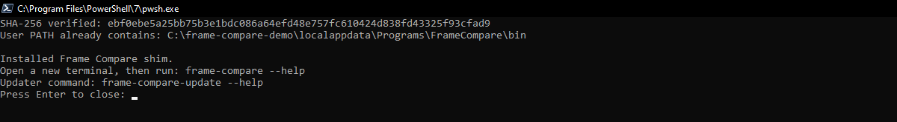

# Windows portable

The Windows portable bundle is the recommended Frame Compare distribution for Windows
10/11 x64. It includes the supported Python and media runtime, VSView 0.10.3 with its
PySide6 backend and native Frame Compare alignment panel for review, the
installer, and signed code-only update and rollback tooling.

The portable graph pins the base `vsview==0.10.3` package and the Frame Compare panel
entry point; its upstream
`recommended` and `full` extras are not bundled. BestSource and vspackrgb serve the
VSView/UI runtime. Frame Compare-generated sessions continue to load comparison media
through L-SMASH-Works and Frame Compare-owned indexes.

## Install from a published release

Download both files for the same release tag:

```text
frame-compare-portable-win-x64-<tag>.zip
frame-compare-portable-win-x64-<tag>.zip.sha256
```

Authenticate the ZIP's release provenance before extracting it. On an internet-connected
machine with the GitHub CLI installed, verify the release artifact against this
repository and the dedicated Windows build workflow:

```powershell
$tag = "<tag>"
$zip = ".\frame-compare-portable-win-x64-$tag.zip"
# Resolve the selected lightweight refs/tags/<tag> ref through GitHub.
$tagSha = @(gh api "repos/TJZine/frame-compare/git/ref/tags/$tag" --jq ".object.sha")
if ($LASTEXITCODE -ne 0) {
    throw "Could not resolve release tag $tag. Do not install this download."
}
if ($tagSha.Count -ne 1) {
    throw "Release tag $tag did not resolve to exactly one commit SHA. Do not install this download."
}
$tagSha = $tagSha[0].Trim()
if ($tagSha -notmatch "^[0-9a-f]{40}$") {
    throw "Release tag $tag resolved to an invalid commit SHA. Do not install this download."
}
gh attestation verify $zip `
  --repo TJZine/frame-compare `
  --signer-workflow TJZine/frame-compare/.github/workflows/windows-portable-build.yml `
  --source-digest $tagSha
if ($LASTEXITCODE -ne 0) {
    throw "Release provenance verification failed. Do not install this download."
}
```

Then verify the ZIP checksum before extracting it:

```powershell
$zip = ".\frame-compare-portable-win-x64-$tag.zip"
$checksumFile = "$zip.sha256"
$expected = ((Get-Content -LiteralPath $checksumFile -Raw).Trim() -split "\s+")[0].ToLowerInvariant()
$actual = (Get-FileHash -LiteralPath $zip -Algorithm SHA256).Hash.ToLowerInvariant()
if ($actual -ne $expected) {
    throw "SHA-256 mismatch. Do not install this download."
}
"SHA-256 verified: $actual"
```

The expected and actual hashes must match exactly. Delete and download both files again
if verification fails; do not bypass the mismatch.

The first native-panel bundle transition is a complete-runtime migration. Reinstall the
full portable ZIP rather than applying a code-only update to a pre-native-panel bundle.
The updater must fail closed when the installed bundle is schema 2, or when the
installed and update runtime fingerprints are missing, legacy, malformed, or different.

Extract the ZIP, open the extracted bundle folder, and run:

```powershell
.\install.cmd
```

Open a new terminal after installation so the updated user `PATH` is loaded.

<figure class="fc-doc-figure">
  
  <figcaption>Verify the release ZIP first, then install the shim and open a new terminal so the updated user PATH is available.</figcaption>
</figure>

## Build the portable bundle from a clone

Use this route only when no suitable published bundle exists or when validating the
packaging path. It requires Windows 10/11 x64, Git, PowerShell, network access to every
pinned upstream artifact, build time, and download-cache space.

From the repository root:

```powershell
.\install.cmd
```

The root command delegates to the source installer, builds
`dist\frame-compare-portable-win-x64`, and installs the same user-level shim as a
published bundle.

The source-built bundle, not the repository root, is the application workspace:

```text
dist/frame-compare-portable-win-x64/
├── config/
├── comparison_videos/
├── generated/
├── frame-compare.ps1
└── install.cmd
```

## Workspace and persistent generated data

The bundle includes empty `config/` and `comparison_videos/` directories.

- Put an existing config at `config/config.toml`.
- Put input clips in `comparison_videos/` to use the default discovery path.
- Use `frame-compare wizard` to create or review configuration.

A bundle-local `config/config.toml` takes precedence over the installed AppData fallback
configuration.

The default generated-data location is the bundle’s `generated/` directory. In the
wizard, set **Generated data location** to a normal external folder when reports,
screenshots, history, run state, and reusable caches must survive bundle replacement.
The installed fallback configuration retains that authored choice, and the updater,
rollback flow, reinstall path, and uninstaller leave the external root outside their
managed replacement boundary.

A top-level bundle `screenshots/` directory is not a runtime output root. Every executed
comparison writes its canonical `report.html`, sibling `screenshots/`, run records, and
run-local generated state beneath the selected generated-data root.

Moving the bundle or source media can change cache identity because source paths are part
of freshness and request identity. Existing run folders remain viewable when kept intact;
no cache-hit guarantee is made after a move.

## First comparison

1. Put at least two `.mkv`, `.mp4`, `.avi`, `.m2ts`, or `.ts` files in
   `comparison_videos/`.
2. Open a new PowerShell terminal.
3. Run:

```powershell
frame-compare wizard
frame-compare doctor
frame-compare run --dry-run
frame-compare run
```

The first-use configuration keeps slow.pics automatic upload disabled. Review the local
report before enabling any publication integration.

See [Your First Comparison](guides/first-comparison.md) for the expected output and
review checklist.

## Native VSView alignment review

The portable bundle includes VSView 0.10.3, PySide6, and the packaged
`frame-compare-alignment-review` panel entry point in one self-contained Python
environment. Frame Compare launches VSView through that same environment; a
PATH-only VSView executable or a separate Python installation is not supported.

When `audio_alignment.use_vsview = true` (or
`--force-interactive-alignment`) is enabled, Frame Compare generates a session under
`generated/.../vsview_sessions/`, validates bounded startup readiness, and opens the
VSView child. Open **Frame Compare Alignment Review** from VSView's Tool Panel. The
panel is inert for ordinary VSView sessions and does not take over or hide unrelated
workspaces.

The generated workspace contains each source exactly once: one `Reference` output and
one ordered `Comparison N` output per comparison. Open the panel, unlink playheads,
and visit every output. Leave each source on the same visible moment. The live source
lineup records the latest untrimmed source frame, reports `ready / total`, and previews
the signed `reference - comparison` relationship and trim direction.

Choose **Use these aligned positions** once every source is ready. It writes one
typed, atomic sibling sidecar named `vsview_*.alignment-result.json` for the complete
source set; there is no per-comparison confirmation or later completion step. **Keep
audio-derived alignment** is the secondary whole-set action and retains the alignment
Frame Compare entered with, including the no-change case when no trusted suggestion
exists.

For known values, expand **Enter alignment manually...** and choose **Source frames** or
**Known offsets**. Source frames accepts one non-negative untrimmed frame per source;
known offsets accepts one signed integer per comparison using `reference - comparison`.
Both bases use the same save action and immediately show the trim meaning. Frame Compare
checks the session UUID, ordered comparison keys, and authoritative raw source-frame
bounds before applying any saved result. Closing VSView without saving writes no result.
Missing, malformed, stale, mixed-session, duplicate, incomplete, and out-of-bounds
results fail closed.

Optional review failures retain the computed/current alignment and print an actionable
diagnostic. Forced review fails when the same-environment entry point is unavailable,
startup readiness times out, the child process fails or times out, the review is
cancelled without a complete result, or result validation fails. The former terminal
frame-entry prompt, stdin protocol, executable/PATH discovery, and viewer compatibility
fallbacks are removed. The native panel adds multi-output viewer context, current-frame
observation, markers, explicit whole-set status, and a typed trust boundary; the tradeoff
is that closing without saving does not preserve a manual decision and no external
viewer fallback is available.

## Inspect previous runs

```powershell
frame-compare history list
frame-compare history open <run-name>
```

History uses the generated-data root selected by the same effective configuration as the
normal run.

## Update behavior

Frame Compare has two Windows update boundaries:

| Update type | Replaces | Use it when |
| --- | --- | --- |
| Complete portable ZIP | Application plus Python, FFmpeg, VapourSynth, VSView/PySide6, plugins, manifests, and native license payloads | The release changes the media-runtime/dependency fingerprint or a clean reinstall is required |
| Signed code-only ZIP | Application code and packaged Python project files only | The installed complete bundle already carries the exact required media-runtime fingerprint |

Apply a code-only update:

```powershell
frame-compare-update apply .\frame-compare-update-win-x64-<tag>.zip
```

The updater verifies the signature and every payload hash before replacement. It accepts
only a native-panel-capable full bundle (`bundle_info.schema_version` 3) and refuses
pre-native-panel schema-2 bundles, as well as missing, malformed, or different
media-runtime fingerprints, before applying any change. That refusal cannot be
overridden safely because a code-only ZIP does not carry replacement native media
components; install the complete portable ZIP instead.

When the fingerprint differs, install the complete portable ZIP for that release. Keep
**Generated data location** external when reports and reusable state must survive that
replacement.

## Backup and rollback

```powershell
frame-compare-update list-backups
frame-compare-update rollback <backup-id>
frame-compare-update purge-backups --keep 5
```

Rollback restores a compatible prior application state. It is not a substitute for a
complete bundle reinstall across different media-runtime fingerprints.

## Uninstall

Run `uninstall.cmd` from the current portable bundle root. It removes the installed user
shim and managed `PATH` entry. It preserves the installed state configuration and leaves
unknown files in place. It does not silently delete the portable bundle, input clips, or
an external generated-data root.

## Bundle provenance and licenses

Each complete bundle includes:

- `bundle_info.json` with application and coordinated runtime identity;
- `bundle_inventory.json` with exact source commit, runtime artifacts, package versions,
  hashes, byte counts, and license metadata;
- `licenses/SOURCE_URLS.txt` with corresponding-source locations;
- `licenses/THIRD_PARTY_NOTICES.txt` and copied component notices.

The selected profile and compatibility policy are described in
[Supported Media Runtime](supported-media-runtime.md). Artifact-level hashes and source
revisions in the build manifest and generated inventory remain authoritative.

## Troubleshooting

| Symptom | Action |
| --- | --- |
| `frame-compare` is not found | Open a new terminal; if still unavailable, rerun `install.cmd` from the bundle’s current location |
| The shim reports a missing bundle | The portable folder moved; rerun `install.cmd` from its new location |
| Source build cannot install `uv` | Install it with `winget install --id astral-sh.uv -e --source winget` or `py -m pip install --user uv`, then rerun the installer |
| No videos are discovered | Put at least two supported clips in `comparison_videos/` or select another contained input directory in the wizard |
| Doctor reports an optional/network warning | Review it against the intended workflow; disabled integrations need no setup |
| Doctor reports a required media component failure | Reinstall the complete bundle rather than mixing unmanaged replacement DLLs into it |
| Code-only update reports a runtime mismatch | Install the complete portable ZIP for that release |
| Doctor reports the alignment panel is missing | Reinstall the complete bundle or rebuild it; the VSView runtime and `frame-compare-alignment-review` entry point must come from the same environment |
| Alignment panel is inactive | Open the Frame Compare-generated session; ordinary sessions and untrusted/mixed metadata intentionally remain inert |
| Panel closes before saving | No result sidecar was written; reopen the generated session, visit every source, and choose **Use these aligned positions** or **Keep audio-derived alignment** |
| Native review result is rejected | Generate a fresh session; Frame Compare rejects missing, malformed, stale, mixed-session, duplicate, incomplete, and out-of-bounds sidecars |
| Reports disappeared after replacing the bundle | Configure an external generated-data root and restore the prior run folders from backup if available |

For broader diagnosis, see [Troubleshooting](guides/troubleshooting.md).

## Physical Windows handoff

Hosted Windows verification is required to prove the exact package, embedded runtime,
same-environment entry-point discovery/loading, offscreen panel construction,
generated-session metadata, atomic result round trip, and fail-closed result
validation. This feature run has not executed hosted Windows proof. After that proof
passes, record these remaining interactive checks on a physical Windows 10/11 x64
system:

- open a real Frame Compare-generated session through the installed portable launcher;
- verify the panel is discoverable from VSView's Tool Panel and remains inert in an
  ordinary VSView session;
- verify one `Reference` and ordered `Comparison N` tabs, current-frame context, bounded
  suggestion markers, source-frame bounds, signed relationship, and trim-direction text;
- unlink playheads, visit every source, use the whole-set positions action, then close
  VSView and verify Frame Compare applies only the validated offsets;
- exercise the manual source-frame and known-offset bases plus the whole-set keep-audio
  action;
- close or cancel before saving and verify optional mode retains the current result
  while forced mode fails with an actionable diagnostic;
- exercise missing/malformed/stale/mixed/duplicate/incomplete/out-of-bounds sidecars,
  bounded readiness failure, child-process failure, and timeout behavior;
- use real L-SMASH-backed media to verify native decoder/index diagnostics, then inspect
  early, middle, late, and final shared-content evidence for drift or edit changes;
- on the production GPU, verify Vulkan/HDR behavior and compare report output against
  the prior supported bundle where the release changes runtime behavior.

Record exact bundle SHA, OS/GPU/driver/runtime facts, commands, logs, sidecar fixtures,
screenshots, and pass/fail results. Hosted or macOS offscreen proof must not be reported
as physical Windows desktop acceptance. Linux X11 visible-launch proof is also
unavailable until `bash tools/verify_docker_gui.sh` runs on a compatible Linux desktop;
its offscreen contract does not establish visible ergonomics. This feature run has not
completed the physical-Windows ergonomics checks above, so do not claim them from
offscreen or hosted results.
